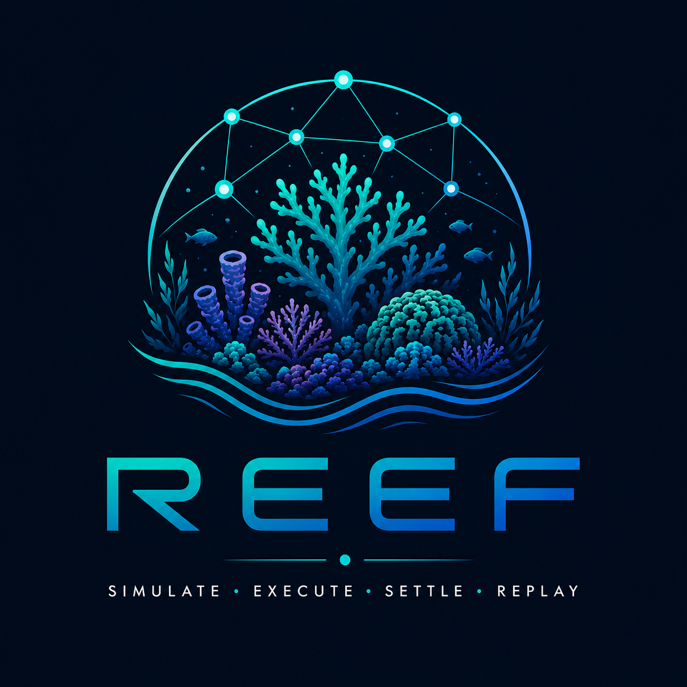

# Reef

[](https://github.com/dills122/reef/actions/workflows/ci.yml)
[](https://github.com/dills122/reef/actions/workflows/throughput-stress.yml)
[](./LICENSE)
[](./services/platform-runtime)
[](./services/matching-engine)

<p align="center">
  
</p>

Reef is a simulation-first institutional trading venue and post-trade platform. It is built to model market-infrastructure workflows locally, replay them deterministically, and measure command-intake and lifecycle behavior with evidence instead of assumptions.

The current system focuses on:

- hidden-liquidity order intake, matching, cancel, modify, fill, and reject behavior
- deterministic scenario execution, replay, and audit-friendly command/event trails
- high-throughput command ingress with explicit hot-path guardrails
- partitionable processing lanes for matching-sensitive commands
- async projections and rebuildable read models outside canonical write facts
- local-first Docker workflows for development, smoke, stress, and diagnostics

## System Shape

```text
apps/
  docs-site/                   Astro documentation surface
services/
  platform-runtime/            Kotlin API/runtime, command intake, persistence, projections, admin modules
  matching-engine/             Go matching engine, HTTP/gRPC transports, direct stream ingestion
  simulator/                   Go load, scenario, replay, and stress tooling
contracts/
  proto/                       Versionable inter-service contracts
packages/
  scenario-definitions/        Reusable simulation inputs and scenario files
scripts/
  dev/                         Local stack, smoke, stress, replay, admin, and migration automation
  ci/                          CI guardrails and coverage helpers
docs/
  steering/                    Architecture, repo, language, and boundary guidance
```

The main runtime path is API-first: manual users and simulation actors go through the same command/API surfaces. Matching-engine behavior stays isolated in Go, while the Kotlin runtime owns orchestration, persistence adapters, read models, and administrative workflows.

## Quick Start

```bash
cp .env.example .env
make dev-up
make dev-smoke
```

Common local commands:

```bash
make test
make test-go
make test-simulator
make test-platform-runtime
make check-proto-additive
make dev-reset
make dev-stress
make dev-stress-runtime-nodb
make dev-throughput-campaign
make dev-admin CMD="instrument-upsert AAPL AAPL"
```

Use `JS_RUNTIME=node` when Bun is not installed:

```bash
JS_RUNTIME=node make dev-up
```

For setup and troubleshooting details, start with [`docs/ONBOARDING.md`](./docs/ONBOARDING.md) and [`docs/DEV_ENV.md`](./docs/DEV_ENV.md).

## CI And Quality Gates

Pull requests and branch pushes run:

- proto additive compatibility checks for contract safety
- Go formatting, tests, and coverage for `services/matching-engine`
- Go formatting, tests, and coverage for `services/simulator`
- Kotlin runtime tests with Jacoco coverage for `services/platform-runtime`
- Node 22 coverage for repository dev-tooling tests under `scripts/dev`
- deterministic replay validation for the golden persona session
- container image build checks for `platform-runtime` and `matching-engine`
- Go vulnerability scans for Go services
- matching-engine benchmark guardrails
- platform-runtime performance guardrails
- Postgres schema placement and migration integration checks

Coverage reports are uploaded as GitHub Actions artifacts and summarized in the workflow run. Current baseline coverage is intentionally measured before hard thresholds are introduced; once the first CI run records stable numbers, add per-module minimums for the production packages rather than applying one repository-wide percentage.

## Throughput Stress

The [`Throughput Stress`](https://github.com/dills122/reef/actions/workflows/throughput-stress.yml) workflow can be run manually and also runs on Monday, Wednesday, and Friday. It performs two 90-second iterations for:

- the no-persistence runtime hot path (`make dev-up-runtime-nodb` plus `make dev-stress-runtime-nodb`)
- the default db-backed runtime path (`make dev-up` plus `make dev-stress`)

Each run uploads the raw stress reports, telemetry, KPI markdown, recommendation JSON, and db diagnostics when enabled. The README badge reports whether the scheduled/manual throughput gate is healthy; the current measured throughput number lives in the latest workflow summary and artifacts so the repo does not churn commits three times per week just to update a badge value.

Manual examples:

```bash
make dev-stress-runtime-nodb
make dev-stress
```

To tune a manual GitHub Actions run, use the workflow inputs for duration, target rates, and whether to include the db-backed profile.

## Canonical Docs

Read these before changing architecture, behavior, contracts, or delivery policy:

- [`REEF_PROJECT_OVERVIEW.md`](./REEF_PROJECT_OVERVIEW.md)
- [`REEF_TECHNICAL_DESIGN.md`](./REEF_TECHNICAL_DESIGN.md)
- [`docs/steering/README.md`](./docs/steering/README.md)
- [`docs/steering/repository-scope-and-priorities.md`](./docs/steering/repository-scope-and-priorities.md)
- [`docs/steering/architecture.md`](./docs/steering/architecture.md)
- [`docs/steering/repository.md`](./docs/steering/repository.md)
- [`docs/PERFORMANCE_LEARNINGS.md`](./docs/PERFORMANCE_LEARNINGS.md)
- [`docs/ENGINEERING_DELIVERY_POLICY.md`](./docs/ENGINEERING_DELIVERY_POLICY.md)
- [`docs/DECISIONS.md`](./docs/DECISIONS.md)

Surface-specific steering:

- [`docs/steering/go.md`](./docs/steering/go.md)
- [`docs/steering/kotlin.md`](./docs/steering/kotlin.md)
- [`docs/steering/astro.md`](./docs/steering/astro.md)
- [`docs/steering/data-platform.md`](./docs/steering/data-platform.md)
- [`docs/steering/inter-service-communication.md`](./docs/steering/inter-service-communication.md)
- [`docs/steering/external-api-boundary.md`](./docs/steering/external-api-boundary.md)

## Current Development Focus

The near-term execution ladder is tracked in [`docs/CURRENT_STATUS.md`](./docs/CURRENT_STATUS.md) and [`docs/WORK_PLAN.md`](./docs/WORK_PLAN.md). At a high level:

1. Keep validating hot-ingress paths with durable command-log, direct stream, and explicit partition semantics.
2. Preserve deterministic lane assignment for matching-sensitive submit/cancel/modify commands.
3. Expand lifecycle projections and query/timeline views without leaking projection concerns into canonical write logic.
4. Build simulator control-room workflows over the existing CLI/report artifacts.
5. Add post-trade workflows after replay and lifecycle assertions are stable.

## Recommended Next Gates

Good candidates for PR gates:

- OpenAPI/API boundary contract diff once the external API spec is generated.
- Broader deterministic scenario replay tests as more golden scenarios become executable.
- Dependency review after GitHub dependency graph and Advanced Security support are available for the repository.
- License scans after dependency policy is written.

Good candidates for scheduled gates:

- Non-blocking migration compatibility audits for each schema family until release guarantees exist.
- Longer throughput sweeps with warmed caches and persisted trend artifacts.
- Replay determinism campaigns over seeded scenarios.
- Soak tests that include stream workers, projectors, and materializers.
- Database bloat/index/write-amplification diagnostics after stress runs.
- Fuzz tests with extended duration for matching and simulator config parsing.
