# Reef Architecture Infrastructure Diagrams

Last aligned: 2026-07-04.

This document shows the current venue-core infrastructure shape and the target direction for the next persistence, projection, and evidence slices.

## Current Branch State

The current branch has moved the hot matching path away from runtime workers calling the engine and toward:

- durable command-log acceptance before `202`
- matching-engine direct command consumption
- in-memory hot book mutation
- durable `VenueEventBatch` publication
- asynchronous compact Postgres materialization

```mermaid
flowchart LR
  subgraph Clients["Clients And Simulation Actors"]
    UI["Platform UI / Ops"]
    Sim["Simulator / Load Tester"]
    Manual["Manual API Users"]
  end

  subgraph RuntimeAPI["Platform Runtime API"]
    API["platform-api\n/api/v1 commands"]
    Boundary["External API Boundary\nAuth, idempotency, validation"]
    Intake["Durable command intake\nstream-ack publisher"]
  end

  subgraph CommandLog["Durable Command Log"]
    KafkaCmd["Redpanda / Kafka command topic\nactive hot-ingress path"]
    JetCmd["JetStream command stream\nfallback and comparison"]
  end

  subgraph Matching["Matching Engine"]
    DirectConsumer["Direct stream consumer\npartition-owned lanes"]
    HotBook["In-memory hot book\nsession / instrument shard"]
    EventPublisher["VenueEventBatch publisher"]
  end

  subgraph EventLog["Durable Venue Event Log"]
    KafkaEvents["Redpanda / Kafka event topic\nVenueEventBatch records"]
    JetEvents["JetStream event stream\nfuture compatible source"]
  end

  subgraph Materializer["Platform Materializer"]
    MatRole["platform-materializer\nPLATFORM_RUNTIME_ROLE=materializer"]
    MatSource["KafkaVenueEventBatchSource"]
    MatLoop["VenueEventBatchMaterializer\nDB commit before event offset ack"]
  end

  subgraph Postgres["Postgres Persistence"]
    RuntimeDB["runtime Postgres"]
    CanonBatches["runtime.canonical_venue_event_batches"]
    CanonOutcomes["runtime.canonical_command_outcomes"]
    BoundaryDB["boundary Postgres\nidempotency and intake metadata"]
    CompactProj["compact projection\nsubmit_results / runtime_events"]
    ProjectionDB["projection Postgres\nnormalized read tables"]
  end

  subgraph Diagnostics["Diagnostics And Gates"]
    MatStats["/internal/venue-event-materializer/stats"]
    ReplayGate["Replay / checksum tests"]
    Smoke["make dev-smoke-venue-event-materializer"]
  end

  UI --> API
  Sim --> API
  Manual --> API

  API --> Boundary
  Boundary --> Intake
  Intake --> KafkaCmd
  Intake -. comparison .-> JetCmd
  Boundary --> BoundaryDB

  KafkaCmd --> DirectConsumer
  JetCmd -. fallback .-> DirectConsumer

  DirectConsumer --> HotBook
  HotBook --> EventPublisher
  EventPublisher --> KafkaEvents
  EventPublisher -. future compatible path .-> JetEvents

  KafkaEvents --> MatSource
  MatSource --> MatLoop
  MatLoop --> CanonBatches
  MatLoop --> CanonOutcomes
  MatLoop --> MatSource

  CanonBatches --> RuntimeDB
  CanonOutcomes --> RuntimeDB
  CanonOutcomes --> CompactProj
  CompactProj --> ProjectionDB
  ProjectionDB -. downstream projections .-> UI

  MatLoop --> MatStats
  ReplayGate --> MatLoop
  Smoke --> API
  Smoke --> MatStats
  Smoke --> CanonOutcomes
```



Current completion boundary:

```text
API 202:
  after durable command-log ack

engine processed:
  after command consumed, hot book mutated, and VenueEventBatch durably published

command offset committed:
  after durable VenueEventBatch publication

Postgres canonical materialized:
  after async materializer reads event batches and commits compact canonical rows

materializer event offset committed:
  after compact canonical Postgres commit

projection visible:
  after downstream projections catch up from canonical rows/events
```

Current important implementation pieces:

- `platform-api` owns public command intake and returns `202` only after the configured durable ingress mechanism acknowledges.
- Redpanda/Kafka-compatible command topics are the active hot-ingress promotion path; JetStream remains a comparison/fallback provider.
- Matching-engine direct consumers own ordered command partitions and mutate in-memory books.
- The matching engine publishes durable `VenueEventBatch` facts before committing command offsets.
- `platform-materializer` consumes event batches and writes compact canonical Postgres rows.
- `runtime.canonical_venue_event_batches` preserves replay-safe batch facts and checksums.
- `runtime.canonical_command_outcomes` gives command-to-batch linkage and compact engine outcome lookup.
- `/api/v1/commands/{commandId}` prefers canonical command outcomes when present and falls back to ingress/status surfaces while materialization catches up.
- Compact command-outcome projection can materialize submit results and lifecycle runtime events from event-batch outcomes without returning Postgres to the matching-engine hot path.
- Normalized orders, executions, trades, runtime events, UI views, metrics, and leaderboards remain downstream projections.
- Full order-table projection from this path needs original submit command metadata in the event batch or a deliberate durable command-payload join.

## Target Direction

The next target is to expand lifecycle projection from compact canonical rows while keeping projection writes downstream and rebuildable. The first persistence test gate is compact visibility: durable event batch, canonical rows, projected submit result/runtime event, and idempotent projector replay.

```mermaid
flowchart LR
  subgraph Actors["Clients, Control Room, And Simulators"]
    UI["Control Room UI"]
    Sim["Scenario Simulator"]
    Bots["Bot / Actor Traffic"]
    Admin["Admin / Ops"]
  end

  subgraph APIPlane["API And Ingress Plane"]
    API["platform-api"]
    Boundary["Boundary contracts\nAuth, idempotency, abuse gates"]
    RiskCheck["Account/risk pre-check\ncredit, holds, bot enabled"]
    Backpressure["Drain-aware backpressure\nstream, engine, materializer lag"]
    DurableCommands["Durable command log\nKafka-compatible primary"]
  end

  subgraph BoundaryAndAccountStores["Boundary And Account Stores"]
    BoundaryStore["boundary DB\nidempotency / intake metadata"]
    AuthStore["auth/admin DB\nroles / credentials / policy"]
    AccountLedger["account/bot ledger DB\ncredits, holds, bot state"]
    RiskProjection["account risk projection\navailable buying power"]
  end

  subgraph EnginePlane["Matching Engine Plane"]
    Router["Deterministic partition routing"]
    Shards["Engine shards\nin-memory hot books"]
    BatchPub["Durable VenueEventBatch publication"]
  end

  subgraph LedgerPlane["Durable Matching Ledger"]
    EventLedger["Retained venue event batch log\ncanonical engine handoff"]
    Replay["Replay and checksum verifier"]
  end

  subgraph CanonicalPersistence["Compact Canonical Persistence"]
    Materializers["Batch materializer workers\nidempotent replay"]
    CanonBatchStore["canonical_venue_event_batches"]
    CanonOutcomeStore["canonical_command_outcomes"]
    CanonStatus["Canonical command status lookup"]
  end

  subgraph ProjectionPlane["Async Projection Plane"]
    LifecycleProj["Venue lifecycle projector\nsubmit, cancel, modify, fill, reject"]
    Orders["orders read model"]
    Executions["executions / trades read model"]
    RuntimeEvents["runtime_events / audit timeline"]
  end

  subgraph MarketDataPlane["Market Data Plane"]
    MarketDataProj["market-data projectors\nsnapshots, depth, trades, bars"]
    MarketDataStore["market_data DB/store\nbook snapshots, depth, bars"]
    HistoricalStore["historical/archive store\nintraday and retained history"]
  end

  subgraph SettlementPlane["Settlement And Fulfillment Plane"]
    SettlementSvc["settlement workflow\nobligations, allocation, confirmation"]
    SettlementDB["settlement DB\nobligations, breaks, repairs"]
    Enforcement["final account enforcement\nblock, repair, disable bot"]
  end

  subgraph AnalyticsPlane["Analytics Plane"]
    AnalyticsProj["analytics projectors\nmirrored facts"]
    AnalyticsDB["analytics DB/warehouse\nPnL, bot performance, reports"]
  end

  subgraph Evidence["Evidence And Operations"]
    Smoke["E2E materializer smoke"]
    Stress["Remote / DO throughput proof"]
    Accounting["accepted / processed / materialized / projected accounting"]
    Artifacts["Replay packs / benchmark artifacts"]
  end

  UI --> API
  Sim --> API
  Bots --> API
  Admin --> API

  API --> Boundary
  Boundary --> BoundaryStore
  Boundary --> AuthStore
  Boundary --> RiskCheck
  RiskCheck --> RiskProjection
  RiskProjection --> AccountLedger
  Boundary --> Backpressure
  Backpressure --> DurableCommands

  DurableCommands --> Router
  Router --> Shards
  Shards --> BatchPub
  BatchPub --> EventLedger

  EventLedger --> Materializers
  Replay --> EventLedger
  Replay --> Materializers

  Materializers --> CanonBatchStore
  Materializers --> CanonOutcomeStore
  CanonOutcomeStore --> CanonStatus
  CanonStatus --> API

  CanonBatchStore --> LifecycleProj
  CanonOutcomeStore --> LifecycleProj

  LifecycleProj --> Orders
  LifecycleProj --> Executions
  LifecycleProj --> RuntimeEvents

  Orders --> UI
  Executions --> UI
  RuntimeEvents --> UI

  CanonBatchStore --> MarketDataProj
  CanonOutcomeStore --> MarketDataProj
  Executions --> MarketDataProj
  MarketDataProj --> MarketDataStore
  MarketDataProj --> HistoricalStore
  MarketDataStore --> Bots
  MarketDataStore --> UI
  HistoricalStore --> UI

  CanonOutcomeStore --> SettlementSvc
  Executions --> SettlementSvc
  SettlementSvc --> SettlementDB
  SettlementSvc --> Enforcement
  Enforcement --> AccountLedger
  Enforcement --> RiskProjection

  CanonBatchStore --> AnalyticsProj
  CanonOutcomeStore --> AnalyticsProj
  Orders --> AnalyticsProj
  Executions --> AnalyticsProj
  RuntimeEvents --> AnalyticsProj
  MarketDataStore --> AnalyticsProj
  SettlementDB --> AnalyticsProj
  AccountLedger --> AnalyticsProj
  AnalyticsProj --> AnalyticsDB
  AnalyticsDB --> UI

  Smoke --> Accounting
  Stress --> Accounting
  Accounting --> Artifacts
  Replay --> Artifacts
```



Target operating principles:

- The hot path should stay narrow: API durable command ack, engine in-memory mutation, durable event-batch publication.
- Postgres should stay out of the matching-engine hot path.
- Canonical Postgres writes should be compact, batch-oriented, idempotent, and replayable.
- Public command status should prefer canonical command outcomes when materialized and fall back to ingress/status surfaces while materialization catches up.
- Normalized read tables should be rebuildable projections, not canonical hot-path dependencies.
- Throughput claims require accounting across accepted, engine-published, materialized, projected, and replay-clean counts.

## End-To-End Target System

This diagram expands the target shape beyond venue-core persistence. It shows the intended separation between order entry, matching, canonical venue facts, operational projections, market data, settlement, account ledgers, and analytics.

```mermaid
flowchart LR
  subgraph ClientPlane["Users, Bots, Operators, And Simulators"]
    User["Manual user"]
    Bot["Trading bot"]
    Sim["Simulator / load tester"]
    Ops["Ops / admin UI"]
  end

  subgraph TradingAPI["Trading / Order Interface"]
    OrderAPI["Order API\nsubmit / modify / cancel / status"]
    Boundary["Boundary checks\nauth, idempotency, validation"]
    RiskPrecheck["Account/risk pre-check\ncredit, holds, limits, bot enabled"]
    OrderReads["Open order / recent order reads\nprojection-backed"]
  end

  subgraph BoundaryStores["Boundary Stores"]
    BoundaryDB[("boundary Postgres\nidempotency, intake metadata")]
    AuthDB[("auth/admin Postgres\nroles, credentials, policy")]
    RiskView[("account risk view\ncached or ledger-backed")]
  end

  subgraph DurableIngress["Durable Venue Ingress"]
    CommandTopic[("Redpanda / Kafka command topic\naccepted command log")]
    CommandArchive[("command payload store\nplanned replay join source")]
  end

  subgraph EnginePlane["Matching Engine Plane"]
    EngineConsumer["matching-engine direct consumer\npartition-owned lanes"]
    HotBook["engine-private hot book\nprice-time priority, open resting orders"]
    BatchPublisher["VenueEventBatch publisher"]
  end

  subgraph DurableVenueLedger["Durable Venue Ledger"]
    EventTopic[("Redpanda / Kafka event topic\nVenueEventBatch log")]
    BatchArchive[("event-batch archive\nplanned retention / replay packs")]
  end

  subgraph CanonicalPersistence["Canonical Venue Persistence"]
    Materializer["venue event materializer\ncommit DB before event offset ack"]
    CanonBatchDB[("runtime.canonical_venue_event_batches")]
    CanonOutcomeDB[("runtime.canonical_command_outcomes")]
    ReplayVerifier["replay / checksum verifier"]
  end

  subgraph OperationalProjection["Operational Projection Family"]
    LifecycleProjector["lifecycle projector\nsubmit, modify, cancel, fill, reject"]
    RuntimeDB[("runtime/projection Postgres\norders, executions, trades, runtime_events")]
    CommandStatus["command status API\ncanonical outcome preferred"]
  end

  subgraph MarketDataPlane["Market Data / History Interface"]
    MarketAPI["Market Data API\nsnapshots, depth, trades, bars, history"]
    SnapshotProjector["snapshot/depth projector\nbounded refresh first"]
    BarProjector["trade/bar projector\nintraday and historical"]
    MarketDB[("market_data store\nbook snapshots, depth, trades, bars")]
    HistoricalStore[("historical/archive store\npartitioned files or analytics DB")]
  end

  subgraph AccountPlane["Account / Bot Ledger"]
    AccountSvc["account and bot service\ncredits, holds, risk state"]
    LedgerDB[("account ledger DB\nimmutable entries, holds, bot state")]
    BalanceProjection[("account projections\nbalances, buying power, bot enabled")]
  end

  subgraph SettlementPlane["Settlement / Fulfillment"]
    SettlementSvc["settlement workflow\nobligations, allocation, confirmation"]
    Enforcement["final enforcement\nblock fulfillment, raise break, disable bot"]
    SettlementDB[("settlement DB\nobligations, breaks, repairs, workflow state")]
  end

  subgraph AnalyticsPlane["Analytics And Reporting"]
    AnalyticsProjector["analytics projectors\nmirrors and denormalized facts"]
    AnalyticsDB[("analytics DB / warehouse\nPnL, bot performance, leaderboards, audit")]
    Reports["reports, dashboards, compliance extracts"]
  end

  User --> OrderAPI
  Bot --> OrderAPI
  Sim --> OrderAPI
  Ops --> OrderAPI
  Ops --> MarketAPI
  Bot --> MarketAPI
  User --> MarketAPI

  OrderAPI --> Boundary
  Boundary --> BoundaryDB
  Boundary --> AuthDB
  Boundary --> RiskPrecheck
  RiskPrecheck --> RiskView
  RiskView --> LedgerDB

  Boundary --> CommandTopic
  Boundary -. optional durable payload join .-> CommandArchive

  CommandTopic --> EngineConsumer
  EngineConsumer --> HotBook
  HotBook --> BatchPublisher
  BatchPublisher --> EventTopic
  EventTopic -. retention/export .-> BatchArchive

  EventTopic --> Materializer
  Materializer --> CanonBatchDB
  Materializer --> CanonOutcomeDB
  ReplayVerifier --> EventTopic
  ReplayVerifier --> CanonBatchDB
  ReplayVerifier --> CanonOutcomeDB

  CanonOutcomeDB --> LifecycleProjector
  CanonBatchDB --> LifecycleProjector
  CommandArchive -. submit metadata join when needed .-> LifecycleProjector
  LifecycleProjector --> RuntimeDB
  CanonOutcomeDB --> CommandStatus
  RuntimeDB --> OrderReads
  CommandStatus --> OrderAPI
  OrderReads --> OrderAPI

  CanonBatchDB --> SnapshotProjector
  RuntimeDB --> SnapshotProjector
  RuntimeDB --> BarProjector
  SnapshotProjector --> MarketDB
  BarProjector --> MarketDB
  BarProjector --> HistoricalStore
  MarketDB --> MarketAPI
  HistoricalStore --> MarketAPI

  CanonOutcomeDB --> SettlementSvc
  RuntimeDB --> SettlementSvc
  SettlementSvc --> SettlementDB
  SettlementSvc --> Enforcement
  Enforcement --> LedgerDB
  Enforcement --> BalanceProjection
  Enforcement -. bot shutdown / admin audit .-> AuthDB

  LedgerDB --> AccountSvc
  BalanceProjection --> AccountSvc
  AccountSvc --> RiskView
  AccountSvc --> OrderAPI

  CanonBatchDB --> AnalyticsProjector
  CanonOutcomeDB --> AnalyticsProjector
  RuntimeDB --> AnalyticsProjector
  SettlementDB --> AnalyticsProjector
  LedgerDB --> AnalyticsProjector
  MarketDB --> AnalyticsProjector
  AnalyticsProjector --> AnalyticsDB
  AnalyticsDB --> Reports
  Reports --> Ops
```



End-to-end ownership rules:

- Order entry is the only public write path for trading intent. Bots and users do not write directly to runtime, market-data, settlement, account, or analytics tables.
- The matching engine owns the hot book, but the hot book is not a user-facing query store.
- Canonical venue facts are the bridge from matching to every downstream system.
- Operational order reads come from projections, with canonical command outcomes preferred for command status.
- Market data starts as projection-backed snapshots, depth, recent trades, and bars so bot reads do not load the matching engine.
- Account/risk does a bounded pre-check before durable command acceptance; settlement does final enforcement after matching facts exist.
- Settlement creates post-trade obligations, breaks, repairs, and enforcement facts without mutating matching history.
- Analytics consumes mirrored facts from canonical venue, operational, market-data, settlement, and account stores; it can lag and must be rebuildable.

## Near-Term Slice Map

1. Venue lifecycle projection.
   - Project compact submit outcomes from canonical command outcomes into `submit_results` and `runtime_events`.
   - Add full `orders` projection after event batches carry submit command metadata or the projector joins durable command payloads.
   - Expand cancel/modify/fill/reject outcomes from canonical rows into normalized read tables.
   - Keep projections downstream and rebuildable.
   - Add deterministic tests that event batch, canonical rows, projection rows, and query APIs agree.

2. Evidence promotion.
   - Run `make dev-smoke-venue-event-materializer` against Docker as the local materializer gate.
   - Extend the live gate to assert projected `submit_results` and `runtime_events` once the projector is enabled with `STREAM_ACK_PROJECTION_SOURCE=venue-event-batch`.
   - Promote the Redpanda/Kafka-compatible path to longer remote evidence only after replay/checksum and materialization smoke are clean.
   - Measure accepted, engine-published, materialized, projected, drain lag, and replay/checksum results together.

## Source Anchors

- Current status: [`CURRENT_STATUS.md`](./CURRENT_STATUS.md)
- Active work plan: [`WORK_PLAN.md`](./WORK_PLAN.md)
- Decisions: [`DECISIONS.md`](./DECISIONS.md), especially D-036 through D-043
- Local commands: [`DEV_ENV.md`](./DEV_ENV.md)
- Throughput evidence: [`ARCHITECTURE_THROUGHPUT_TRACKER.md`](./ARCHITECTURE_THROUGHPUT_TRACKER.md)
