# Bot SDK Engine Integration Plan

Bot execution must not bypass venue safety. Bots can run in a dedicated arena/runner service, but order actions must reach the same command semantics, idempotency rules, pre-trade checks, audit trails, and deterministic matching lanes as user-submitted orders.

## Current Test Harness

The pre-merge tester is:

```bash
bun scripts/dev/bot-sdk-test-bot.mjs packages/bot-sdk/examples/technical-indicator-strategy-bot.ts packages/bot-sdk/fixtures/aapl-technical-indicator.json --summary-only
```

It performs the hosted path:

1. build a hosted artifact from the bot source
2. allow only approved SDK/package imports
3. scan source and final artifact
4. load the artifact through SES
5. run the deterministic simulated market fixture
6. execute strategy hooks and tick hooks
7. enforce configured data-call, order-action, and trade-command limits
8. produce an `approved_for_merge` or `do_not_merge` report

This is the first PR gate for bot authors. It is intentionally deterministic and fixture-backed so failures can be replayed.

## Runtime Integration Shape

Production integration should keep these boundaries:

- Bot code receives only `BotContextV1` clients and returns proposed `BotActionV1` values.
- The hosted runner owns SES/container execution, wall-time limits, memory/CPU limits, log limits, and kill switches.
- The arena/orchestrator owns action expansion, per-bot policy enforcement, and conversion to venue command requests.
- The venue adapter maps approved bot actions to the same `/api/v1/orders/submit`, `/api/v1/orders/modify`, and `/api/v1/orders/cancel` command shapes used by external clients.
- The venue runtime owns idempotency, durable intake acknowledgement, pre-trade risk, account controls, instrument/session validation, sequencing, matching-engine command submission, canonical events, and projections.

The adapter may use an internal transport to avoid unnecessary HTTP overhead, but it must call the same application command handler as the external API boundary after auth/actor context has been resolved. A direct Kotlin function/port is acceptable; bypassing idempotency, risk, command logging, or deterministic lane routing is not.

`BotRuntimeOrderClient` is the first platform-runtime version of that internal transport. It accepts `VenueCommandRequestV1`-equivalent order commands, converts them to the runtime hot-path request contract, and reuses the `/api/v1/orders/*` mutation handler so client identity, idempotency, command capture, account risk, circuit breakers, price collars, and abuse controls remain in the same path. The SDK venue adapter now supplies `X-Client-Id` as `bot:<botId>` by default, with fixture/context override support for hosted deployments.

## Proposed Command Flow

```mermaid
flowchart LR
  Bot["Hosted bot artifact (SES/container)"] --> Actions["Proposed BotActionV1"]
  Actions --> Policy["Arena policy checks and action expansion"]
  Policy --> Adapter["Bot venue adapter"]
  Adapter --> Intake["Venue command intake port"]
  Intake --> Idempotency["Idempotency and durable accept"]
  Idempotency --> Risk["Pre-trade account/instrument risk"]
  Risk --> Lane["Deterministic session/instrument lane"]
  Lane --> Engine["Matching engine"]
  Engine --> Events["Canonical venue events"]
  Events --> Projections["Async projections and analytics"]
```



## Approval And Blocking Signals

The tester should mark a bot `do_not_merge` for:

- sandbox scanner failures
- unapproved imports or dynamic module loading
- hosted build/load failures
- lifecycle or tick timeout
- per-tick order action limit violations
- trade-command-per-second limit violations
- data-call rate limit violations
- unsupported order action types
- venue adapter denials
- hosted worker wall-time or output-limit failures

The current harness already covers these categories at the SDK layer except true production CPU/memory pressure, which belongs to the hosted worker/container runtime.

## Next Integration Work

Completed runtime bridge coverage:

- `BotRuntimeOrderClient` routes bot-originated order commands through the same `/api/v1/orders/*` hot-path mutation handler.
- SDK venue commands carry `X-Client-Id`, `scenarioId`, `runKind`, `botId`, `botVersion`, and `runId`.
- Command-log capture persists bot client identity and run metadata.
- Deterministic runtime tests cover stream-ack bot intake, worker processing, canonical outcome persistence, projection, and projector replay idempotency.
- Local live smoke covers adapter-owned HTTP submission into a running Reef stack with `stream-ack` acceptance.

Next non-throughput integration work:

1. Define and persist the arena control-plane source facts: bot identity, bot versions, artifact hashes, qualification reports, approval status, and operator decisions.
2. Add operator-controlled freeze, quarantine, ban, and archive workflows for bot versions.
3. Connect disabled or quarantined bot versions to the existing account-risk rejection path before durable venue acceptance.
4. Define private runtime config descriptors and OpenBao loading rules for immutable per-run config.
5. Add arena run records and policy-version references before building leaderboard/read-model projections.
