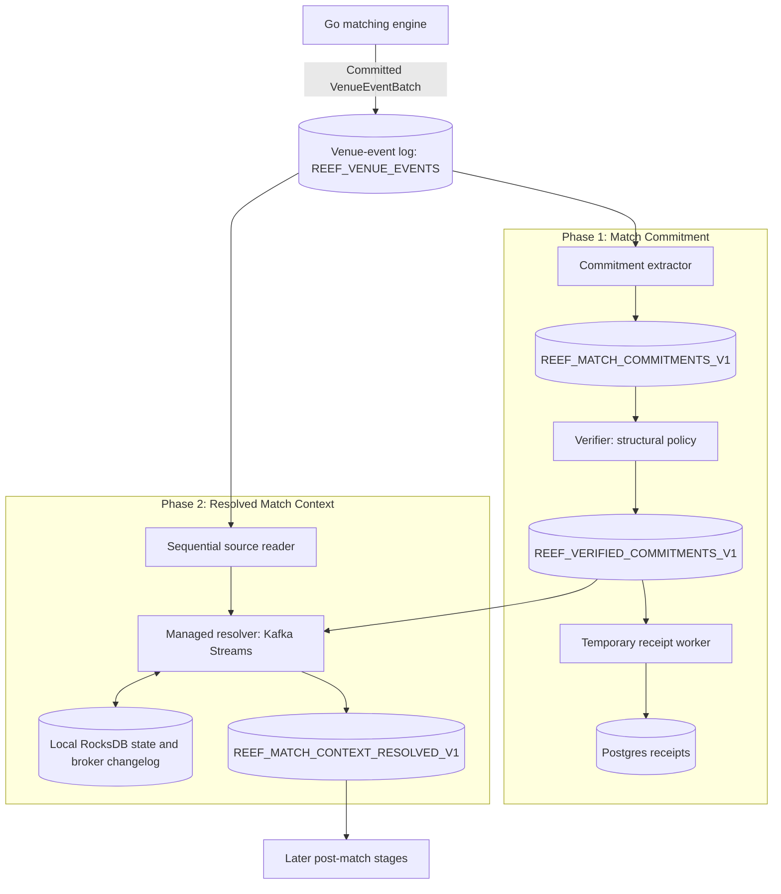

# Calcify Phases 1 and 2 — flow and wiring

Reference flow checked against merged source on 2026-10-02, base `1c8d9639`;
capacity wording reconciled October 4 against merged `a6ddafbb` and D7 artifacts.
Execution status belongs in [WORK_PLAN.md](WORK_PLAN.md); measurement and qualification belong in [throughput ledger](THROUGHPUT_BASELINES.md).

**Phase 1 makes each match durably addressable. Phase 2 assembles its complete source context for later post-match processing.**

Both phases have implementation in the repository. Calcify remains opt-in and additive; legacy post-match remains present. [D7](research/CALCIFY_DIRECT_THROUGHPUT_2026-10-02.md) qualifies local RF1 standing-liquidity flow for 300s at 10,425.19 verified trades/s and 10,440.92 resolved contexts/s. Paired/mixed workloads, RF3 resilience and financial settlement capacity remain open. This overview explains current component boundaries; scoped D7 evidence grants no production cutover.

## Combined flow



Receipt worker and resolver consume verified stream independently, with separate consumer identities. Phase 2 does not read Phase 1 Postgres receipts. Arrows represent broker consumption and publication, rather than synchronous calls between workers.

## Phase 1 — Match Commitment

### 1. Matching engine records source facts

Go matcher processes ordered commands and publishes durable `VenueEventBatch` records. Batches contain command outcomes, accepted-order facts, and resulting `TradeCreated` facts. One command can generate multiple trades; a batch can contain none.

Matching publishes venue-event output and consumed command checkpoint transactionally. Venue-event log remains authoritative source for original matching and acceptance facts.

### 2. Extractor creates compact commitment links

Extractor reads committed batches, checks checksum and source metadata, walks nested trades once, and emits one commitment per trade in source order.

Commitment is a 21-byte versioned pointer:

```text
sourceGeneration + sourcePartition + sourceOffset + tradeOrdinal
```

Tuple identifies commitment and exact source trade. Ordinal is flattened across nested trades in batch outcome order. Link avoids copying trade economics, trade ID, or whole batch into another stream.

Output is `REEF_MATCH_COMMITMENTS_V1`. Extractor publishes links and checkpoints consumed source position in one broker transaction. Zero-trade batches still advance checkpoint.

### 3. Verifier records policy pass

Verifier reads links, checks wire shape and partition, and applies versioned verification policy. Current policy 1 is structural stub. Passing does not establish economic eligibility or financial settlement.

Output is `REEF_VERIFIED_COMMITMENTS_V1`. Each 23-byte `CommitmentVerificationPassed` contains commitment pointer plus policy version. Passing output and input checkpoints commit together; verifier can group multiple links in one transaction.

### 4. Temporary receipt worker records arrival

Worker inserts `runtime.calcify_commitment_receipts`, keyed by commitment tuple. Database commit precedes broker checkpoint. Crash between them causes replay against existing row, rather than another receipt. Conflicting policy for same identity fails.

Receipt means **verified commitment recorded**. It represents no cash movement, securities movement, or financial finality. This remains temporary Phase 1 diagnostic endpoint.

## Phase 2 — Resolved Match Context

### 1. Resolver receives verified pointer

Kafka Streams owns verified input partition and managed state for corresponding logical lane. Pointer selects source generation, venue partition, batch offset, and trade ordinal.

### 2. Source reader advances sequentially

Dedicated `read_committed` source reader walks corresponding venue partition toward requested batch. Resolver indexes successful accepted orders along the way and retains target trade information for subsequent links to that batch.

Source cursor advances only as far as demanded. Normal resolution avoids per-trade SQL queries, full-history scans, and repeated backward broker reads. Startup registry checks use Postgres outside per-trade path.

### 3. Local lookups resolve trade sides

Trade carries buy and sell order IDs. Resolver obtains both accepted orders from partition-local RocksDB state, with bounded cache for repeated reads.

Rows retain complete immutable accepted-order facts and acceptance/source provenance. Old resting orders can participate in later partial fills without rereading original batch. This local index is rebuildable state, backed by managed broker changelog; original venue facts remain authoritative.

### 4. Resolver checks source relationships

Checks cover exact trade position and generation; genuine successful acceptance; buy/sell sides and order references; matching run/session/instrument/currency/lane; acceptance before or at trade outcome; and conflicting facts or commitment identities.

Rejected submissions are not indexed merely because result contains accepted-order-shaped data. Acceptance and trade in one successful submit outcome are permitted; a later outcome's acceptance cannot justify an earlier trade. Ledger, allocation, clearing, balances, and settlement remain later stages.

### 5. Resolver publishes assembled context

Output is Protobuf `MatchContextResolvedV1` to `REEF_MATCH_CONTEXT_RESOLVED_V1`, keyed by commitment identity and published explicitly to corresponding partition.

| Piece | Contents |
| --- | --- |
| Commitment | Original identity and verification policy |
| Trade | Complete immutable `TradeCreated` and source provenance |
| Buy order | Complete accepted-order fact, acceptance identity, and source provenance |
| Sell order | Complete accepted-order fact, acceptance identity, and source provenance |
| Assembly | Resolved run context and durable links between source facts |

Later consumers can use assembled record without routine source lookups. Resolved output is authoritative record of context delivered to post-match consumers; it does not replace upstream fact authority or imply later financial status.

## Wiring and ownership

All Calcify roles use platform-runtime image as separate processes. `CALCIFY_STAGE` selects role; unset leaves default platform API process. [Compose overlay](../compose.calcify.yml) supplies optional sidecars.

| Role | Stage selector | Input | Output/state |
| --- | --- | --- | --- |
| Extractor | `extractor` | Venue-event topic | Commitment topic |
| Verifier | `verifier` | Commitment topic | Verified topic |
| Receipt worker | `receipt` | Verified topic | Postgres receipts |
| Resolver | `resolver` | Verified topic plus demand-driven venue reader | Resolved topic, local state, changelog |

Topic names above are defaults; environment overrides configure deployment. Source, commitment, verified, and resolved lanes preserve corresponding partition numbers. One active owner processes each lane. More workers distribute partitions; multiple concurrent writers do not accelerate one hot book.

Matching book scope is run + venue session + instrument, aligned with command routing. Active routing must remain stable without explicit handoff controls. Source generation and registered broker topic identities prevent interpreting recreated topics as old history.

Local Compose uses `calcify-phase1` and `calcify-phase2` profiles. Resolver has named persistent state volume. Start extractor first to register source identity, then resolver. Local single-replica broker settings are diagnostics, distinct from runtime replication/durability requirements. Exact deployment settings remain in [local configuration](LOCAL_CONFIGURATION.md) and [resolver implementation reference](work/CALCIFY_PHASE2_IMPLEMENTATION.md).

## Checkpoints, recovery, and failure isolation

Phase 1 uses explicit broker transactions at stream handoffs and idempotent receipts at database boundary. Phase 2 uses Kafka Streams `exactly_once_v2` for verified checkpoints, state changelog, and resolved output.

Managed state retains accepted rows, source cursor, target batch, pending links, completed identities, and lane faults. **Input durably staged can be ahead of resolution completed.** Pending state preserves unfinished work; input checkpoint alone does not mean output exists.

Recovery restores state before publishing. Standbys prepare recovery state and remain output-silent until ownership transfer. Source reader may seek during initialization/recovery; normal resolution walks forward. A confirmed source contradiction pauses affected lane and requires explicit diagnosis/disposition. Healthy lanes continue. Infrastructure failure uses supervised restart and replay.

Active facts and completed identities have no automatic TTL. Run-close/frontier and archive pruning require separate proof. Archive remains optional; source retention must support declared availability without depending on it. Exactly-once broker processing does not automatically cover future external financial side effects; those consumers need their own idempotency boundaries.

## Capacity boundary

Goal is 10,000 resolved commitments/trades per second sustained. With one trade per pair of fresh orders, upstream needs roughly 20,000 successful order commands/s. Command throughput and resolved-trade throughput are separate measurements.

Standing liquidity needs one timed aggressor command per trade after untimed maker seeds; D7 qualifies that distinct workload. Implementation and functional checks do not establish general capacity, fault recovery under sustained load, or production readiness. Consult throughput ledger and original evidence for workload, deployment, rate, lag, reconciliation, and recovery limits.

Finite P0 matching acceptance now has separate opt-in
[source profile](../contracts/calcify/README.md#finite-p0-matching-source-profile-2026-10-07),
with retention0 and finite run/order/state envelope. This does not extend Phase1/2
wire facts or establish broker profile binding or financial authority. Separate
[Accepted O1 model](evidence/calcify-finite-p3/README.md) adds optional typed source
lifecycle facts and additive capture protobuf for bounded source-prefix model;
mode-off source bytes/P0 identity stay unchanged. Final combined review3of3 Ready
after restore/JSON/replay identity corrections; source committed `0a7df6f8` and
complete proof published. Live activation refuses pending O2 binding/ingress/isolation/history
proof. [Current work](WORK_PLAN.md#calcify-eight-hour-p3-session--october-910-2026)
owns resumed delivery and remaining P3 sequence. No financial authority or
capacity qualification follows.

## Source map

- [Phase 1 wire contract](../contracts/calcify/README.md) and [Phase 2 Protobuf](../contracts/proto/calcify.proto).
- [Phase 1 pipeline](../services/platform-runtime/src/main/kotlin/com/reef/platform/calcify/CalcifyPipeline.kt) and [receipt store](../services/platform-runtime/src/main/kotlin/com/reef/platform/calcify/CalcifyReceiptStore.kt).
- [Resolver runtime](../services/platform-runtime/src/main/kotlin/com/reef/platform/calcify/CalcifyResolverRuntime.kt): configuration, lifecycle, topic validation, Streams setup.
- [Resolver processor](../services/platform-runtime/src/main/kotlin/com/reef/platform/calcify/CalcifyResolverProcessor.kt): pending work, managed state, publication, lane faults.
- [Source reader](../services/platform-runtime/src/main/kotlin/com/reef/platform/calcify/BrokerVenueSourceReader.kt): sequential broker access.
- [Pure resolver](../services/platform-runtime/src/main/kotlin/com/reef/platform/calcify/MatchContextResolver.kt): source parsing and immutable assembly.
- [Phase 1 evidence](https://github.com/dills122/reef-records/blob/ecd00e479853bcb9fd842b33f017289f37499226/records/reef/docs/work/CALCIFY_PHASE1_IMPLEMENTATION.md), [Phase 2 implementation reference](work/CALCIFY_PHASE2_IMPLEMENTATION.md), and [initial Phase 2 design](https://github.com/dills122/reef-records/blob/ecd00e479853bcb9fd842b33f017289f37499226/records/reef/docs/work/CALCIFY_PHASE2_DISCOVERY.md). Dated design/research retains historical choices; current source determines actual wiring.
