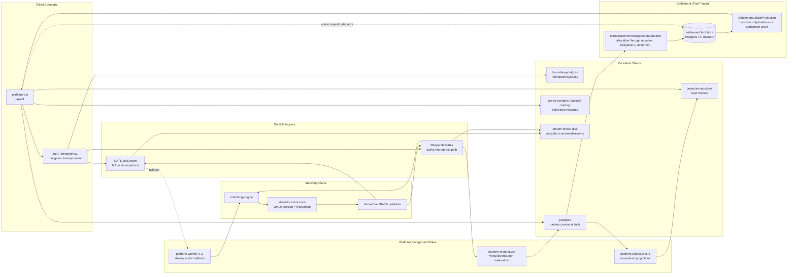

# Reef Venue Runtime Backbone Services

Last aligned: 2026-07-19.

## Purpose

This document describes the venue runtime backbone: the services and stores that
make a running Reef venue more than an in-memory matching demo. It focuses on
durability, service ownership, command completion, materialization, projection,
replay, and operator-visible state.

This is the inside of a running venue stack. It is not the always-on Hetzner
backbone server. For that, see
[`SYSTEM_INFRASTRUCTURE_BACKBONE.md`](./SYSTEM_INFRASTRUCTURE_BACKBONE.md).

## Which Layer Is This?

| Layer | This doc? | Plain meaning |
|---|---:|---|
| Infrastructure backbone | No | Always-on Hetzner control plane: OpenBao, Admin API, admin DB, analytics DB. |
| Run plane | No | Temporary DO host used to run this stack under heavier simulation load. |
| Venue runtime stack | Yes | API, matching engine, streams, Postgres stores, materializer, projectors. |

Use this together with:

- [`SYSTEM_OVERVIEW.md`](./SYSTEM_OVERVIEW.md)
- [`SYSTEM_INFRASTRUCTURE_BACKBONE.md`](./SYSTEM_INFRASTRUCTURE_BACKBONE.md)
- [`CURRENT_STATUS.md`](./CURRENT_STATUS.md)
- [`ARCHITECTURE_INFRASTRUCTURE_DIAGRAMS.md`](./ARCHITECTURE_INFRASTRUCTURE_DIAGRAMS.md)
- [`PERSISTENCE_HOT_PATH_CONFIGURATION.md`](./PERSISTENCE_HOT_PATH_CONFIGURATION.md)
- [`TRADING_MARKET_DATA_BOUNDARIES.md`](./TRADING_MARKET_DATA_BOUNDARIES.md)
- [`STREAM_ACK_ARCHITECTURE_PLAN.md`](./archive/STREAM_ACK_ARCHITECTURE_PLAN.md)

## Backbone Shape



The current direction is to keep matching hot-state private to the Go engine,
use durable command/event streams for high-throughput handoff, and materialize
compact canonical facts into Postgres after the engine has durably published
venue event batches. Settlement runs as a downstream post-trade layer: it
materializes obligations from settled trades already present in the canonical
facts and derives cash/security ledger balances with a per-settlement proof
view, with admin endpoints for obligation materialization and repair.

## Service Inventory

| Service | Runtime | Persistent? | Primary ownership |
|---|---:|---:|---|
| `platform-api` | Kotlin/JVM | Through DB/stream | Public API boundary, command intake, idempotency, risk/pre-checks, command status, query routes |
| `platform-worker-0..3` | Kotlin/JVM | Through DB/stream | Stream-ack worker fallback path, partition-scoped command processing when runtime workers own drain |
| `platform-projector-0..3` | Kotlin/JVM | Yes | Partition-scoped normalized projections from canonical facts into read models |
| `platform-materializer` | Kotlin/JVM | Yes | Redpanda/Kafka `VenueEventBatch` consumption, compact canonical Postgres materialization |
| `matching-engine` | Go | Stream-backed output | Hidden book, price-time matching, cancel/modify state, direct command consumption, durable event-batch publish |
| `postgres` | Postgres 16 | Yes | Runtime canonical facts, domain schemas, command outcomes, operational runtime state |
| `boundary-postgres` | Postgres 16 | Yes | External boundary idempotency, intake reservation, command boundary state |
| `projection-postgres` | Postgres 16 | Yes | Rebuildable read models and UI/control-room projections |
| `arena-postgres` | Postgres 16 | Yes | Bot arena metadata, run records, hosted bot result storage |
| `nats` | NATS JetStream | Yes | JetStream accepted-command fallback/comparison and local stream-ack baseline |
| `redpanda` | Redpanda/Kafka | Yes | Active Kafka-compatible hot-ingress and venue-event-batch provider when profile enabled |

`redis`, `jaeger`, and `otel-collector` are optional local profiles. They are
not required for the core durable command path.

The `venue-event-materializer-scaled` compose profile runs four materializer
instances (`platform-materializer`, `-1`, `-2`, `-3`) instead of one, for
partitioned/scaled materialization testing.

`services/stock-data` is a separate seed-time-only external stock reference
service (its own README and HTTP API) but is not wired into any compose
profile here and is not part of the core backbone inventory above.

## Runtime Roles

The Kotlin runtime is one codebase with role-specific deployments.

| Role | Compose service | Hot-path posture |
|---|---|---|
| API | `platform-api` | Accept client commands, validate, reserve idempotency, publish to configured durable ingress, return `202` only after durable append/ack. |
| Worker | `platform-worker-*` | Consume stream partitions in the older stream-ack worker shape, execute through engine transport, persist canonical facts before ack. Kept as fallback/comparison. |
| Projector | `platform-projector-*` | Consume canonical facts by partition range and build normalized read models with watermarks. |
| Materializer | `platform-materializer*` | Consume durable `VenueEventBatch` records and write compact canonical rows before committing event offsets. |

This role split lets Reef test separate bottlenecks: API intake, stream append,
engine drain, canonical materialization, and projection visibility.

## Persistent Stores

| Store | Default port | Current role |
|---|---:|---|
| `postgres` | `5432` | Primary runtime DB. Owns schemas such as `runtime`, `auth`, `admin`, `command_log`, `orchestration`, and `analytics`. Canonical event batches and command outcomes live here. |
| `boundary-postgres` | `5434` | Boundary DB. Keeps idempotency records, command captures, and intake metadata separate from runtime canonical writes. |
| `projection-postgres` | `5433` | Projection DB. Keeps normalized read-model pressure separate from canonical runtime persistence. |
| `arena-postgres` | `5435` | Arena DB. Keeps hosted bot registry/run metadata outside the trading hot path. |
| `nats` JetStream storage | `4222`, monitor `8222` | Retained accepted-command stream for stream-ack baseline and fallback. |
| `redpanda` storage | `9092`, admin `19644` | Kafka-compatible command/event topics for direct engine consume and venue event batch materialization. Enabled by the `redpanda` compose profile. |

Schema migrations are forward-only files under
[`scripts/dev/db/migrations`](../scripts/dev/db/migrations). CI validates
deterministic migration discovery and schema placement.

## Command Lifecycles

### Synchronous correctness path

```text
client
  -> platform-api
  -> boundary validation and idempotency
  -> matching-engine over HTTP/gRPC
  -> runtime Postgres writes
  -> response with result
```

Use this for deterministic correctness tests, API parity checks, and local
fallback. It is not the preferred shape for sustained high-throughput claims.

### Captured-ack fallback path

```text
client
  -> platform-api
  -> command_log append in Postgres
  -> 202 Accepted
  -> runtime worker drain
  -> matching-engine
  -> canonical result and projection writes
```

This path keeps durable command capture in Postgres. It is useful as a
correctness baseline and for A/B comparisons, but earlier performance evidence
showed write amplification and queue drain pressure.

### Stream-ack / direct engine path

```text
client
  -> platform-api
  -> durable stream/topic append
  -> 202 Accepted
  -> matching-engine direct partition consumer
  -> in-memory hot book
  -> durable VenueEventBatch publish
  -> command offset commit
  -> platform-materializer
  -> runtime.canonical_venue_event_batches
  -> runtime.canonical_command_outcomes
  -> downstream projections
```

This is the active high-throughput venue-core direction. The API acceptance
boundary, engine completion boundary, canonical materialization boundary, and
projection visibility boundary are intentionally separate.

## Completion Boundaries

| Boundary | Meaning | Must be true before advancing |
|---|---|---|
| Attempted | A client tried to send work. | Load generator emitted a request. |
| Accepted | Reef durably accepted the command. | Configured stream/log append acknowledged. |
| Engine processed | Venue applied command to ordered book state. | Matching engine consumed the assigned partition and produced an outcome. |
| Event batch durable | Engine output is recoverable. | `VenueEventBatch` publish acknowledged. |
| Command offset committed | Engine will not reprocess without replay logic. | Command ack/offset commit occurs after event batch publish. |
| Canonical materialized | Postgres can answer authoritative outcome queries. | Materializer transaction committed compact canonical rows. |
| Projected visible | UI/API read models can show the state. | Projector watermarks advanced and read tables updated. |

Do not collapse these into one metric. A run can have clean acceptance but bad
drain. A projection can lag without invalidating matching correctness, but the
lag must be visible and bounded for user-facing claims.

## Canonical Data

The current compact matching ledger centers on:

- `runtime.canonical_venue_event_batches`
- `runtime.canonical_command_outcomes`
- `runtime.projection_watermarks`
- normalized downstream tables such as `runtime.orders`, `runtime.trades`,
  `runtime.executions`, `runtime.submit_results`, `runtime.runtime_events`,
  `runtime.order_lifecycle_state`, and `runtime.market_data_snapshots`

Canonical rows answer "what did the venue decide?" Projection rows answer "what
does a user, bot, operator, or report need to query quickly?"

## Partitioning Model

Commands that can mutate the same book must be routed to the same deterministic
lane. The key is based on:

```text
runId + venueSessionId + instrumentId
```

That partition owns submit/cancel/modify ordering for the book. The Go matching
engine keeps the mutable hot book in memory inside the shard/partition owner.
Recovery is expected to come from durable command/event logs plus snapshots and
replay checks, not from external clients querying the mutable book.

## Backpressure Model

Backpressure must reject before durable acceptance when the platform cannot
safely drain. Important signals include:

- stream/topic storage utilization
- worker stream lag
- matching-engine direct consume lag
- venue event materializer lag
- projector lag when the profile requires fresh control-room visibility
- database pool pressure and commit latency
- oldest unprocessed command age

`202 Accepted` must never mean "queued somewhere volatile." It means the
configured durable ingress mechanism acknowledged the command.

## Current Evidence Posture

Current local evidence supports:

- API/no-op ceiling above the near-term target when in-memory replay retention is bounded.
- Matching-engine hot-book capacity above current durable-ingress bottlenecks.
- Redpanda direct consume plus `VenueEventBatch` materialization at `10k/sec`
  for a short local gate with command outcome counts, replay checks, and
  projection idempotency clean.
- Cancel/modify command processing on the direct matching-engine stream path
  (dispatch, outcome, ack) is implemented and covered by dedicated tests, with
  separate matching-engine unit coverage for cancel/modify book semantics.

Current proof still needed before a production-like claim:

- longer remote soak on the durable direct path
- restart/recovery proof for direct command consume and materializer offsets
- crash/restart redelivery proof exercised specifically against modify/cancel
  commands, plus expansion of cancel/modify/fill/reject outcomes from
  canonical rows into normalized downstream projections (today's redelivery
  tests and orders projection both only cover submit)
- stronger projection replay/audit coverage for full lifecycle views
- explicit operational runbook for lag, backpressure, and repair

## Operator Entry Points

Useful local commands:

```bash
make dev-up
make dev-up-stream-ack
make dev-up-stream-direct-nodb
make dev-smoke
make dev-smoke-venue-event-materializer
make dev-venue-event-replay-check
make dev-stress-stream-direct-nodb
make dev-db-migrate
```

Useful status endpoints:

```text
/health
/api/v1/commands/{commandId}
/internal/venue-event-materializer/stats
/internal/order-lifecycle/projector/status
/internal/market-data/projector/status
/internal/boundary/abuse/stats
```

## Design Rules

- Keep canonical command/event facts separate from projections.
- Keep Postgres out of the matching-engine hot book mutation path.
- Keep simulator and bots on the same API/command paths as manual users.
- Ack/commit consumed command messages only after durable event output.
- Commit materializer offsets only after compact canonical rows commit.
- Treat no-op publisher and no-DB profiles as diagnostics, not production claims.
- Keep projection lag explicit instead of hiding it behind synchronous writes.
