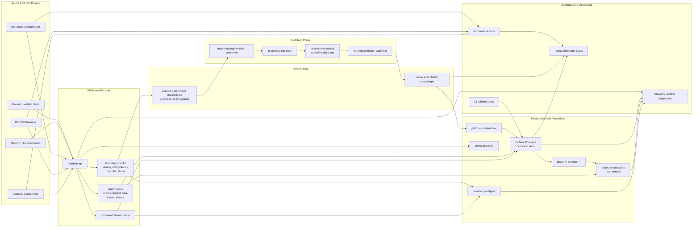
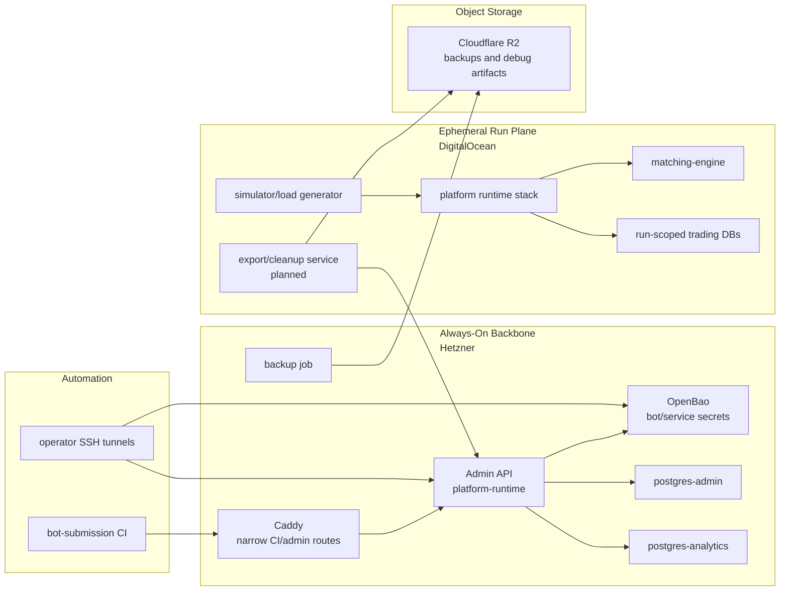

# Reef Backbone And Simulator Topology

Last aligned: 2026-07-06.

## Purpose

This document connects the layers from [`SYSTEM_OVERVIEW.md`](./SYSTEM_OVERVIEW.md)
into one system view. Read it as the "how do these boxes talk to each other?"
doc.

## First, Name The Boxes

| Box | Simple meaning |
|---|---|
| Backbone | Always-on Hetzner control plane: OpenBao, Admin API, Caddy, admin DB, analytics DB, backups. |
| Run plane | Temporary DigitalOcean compute for a simulation or soak. |
| Runtime stack | Services that run the venue: API, matching engine, streams, Postgres, materializer, projectors. |
| Simulator | Tools/bots that send commands into the runtime stack and produce evidence. |

The runtime stack can run locally, on the DO run plane, or lightly on the
backbone for admin/smoke work. The heavy sustained runs belong on DO.

Companion docs:

- [`SYSTEM_OVERVIEW.md`](./SYSTEM_OVERVIEW.md)
- [`SYSTEM_BACKBONE_SERVICES.md`](./SYSTEM_BACKBONE_SERVICES.md)
- [`SYSTEM_INFRASTRUCTURE_BACKBONE.md`](./SYSTEM_INFRASTRUCTURE_BACKBONE.md)
- [`SYSTEM_SIMULATOR_ENVIRONMENT.md`](./SYSTEM_SIMULATOR_ENVIRONMENT.md)
- [`ARCHITECTURE_INFRASTRUCTURE_DIAGRAMS.md`](./ARCHITECTURE_INFRASTRUCTURE_DIAGRAMS.md)
- [`CURRENT_STATUS.md`](./CURRENT_STATUS.md)

## Whole-System Shape



## Infrastructure Backbone And Run Plane



The backbone is durable and always addressable. The run plane is disposable and
must push results back through API/service boundaries rather than writing
directly into backbone databases.

## System Planes

| Plane | Primary owner | Data posture | Simulator interaction |
|---|---|---|---|
| API and boundary | `platform-api` | Durable acceptance starts here | All simulators and bots enter through `/api/v1`, same as users. |
| Durable ingress | JetStream or Redpanda | Retained accepted commands | Stress profiles measure append ack, lag, and backpressure. |
| Matching | `matching-engine` | Hot book is in-memory, output is durable event batch | Direct stream profile proves partition consume and event-batch publish. |
| Canonical persistence | `platform-materializer`, `postgres` | Compact authoritative facts | Replay and command-status checks prove materialization. |
| Projections | `platform-projector-*`, `projection-postgres` | Rebuildable read models | Scenario/live-read checks prove user/bot visibility. |
| Arena and bots | Bot SDK, `arena-postgres` | Metadata and run records | Bot harness maps approved actions to normal venue commands. |
| Evidence | simulator scripts, CI | Reports and gates | Load, smoke, replay, drift, and schema tests protect claims. |

## End-To-End Command Path

```text
1. Scenario, bot, load tester, UI, or manual client creates command intent.
2. Client sends /api/v1 order command with client identity and idempotency key.
3. platform-api validates shape, actor, risk/pre-checks, rate/abuse policy, and deterministic routing metadata.
4. Boundary/idempotency state is recorded in boundary storage as configured.
5. API appends the command to the configured durable ingress log/topic.
6. API returns 202 only after durable append acknowledgement.
7. matching-engine consumes the assigned command partition directly.
8. matching-engine mutates the shard-local hot book and creates deterministic command outcomes/events.
9. matching-engine publishes a durable VenueEventBatch.
10. matching-engine commits or acks consumed command offsets after event-batch publish.
11. platform-materializer consumes VenueEventBatch records and writes compact canonical rows.
12. platform-projector roles build normalized operational read models.
13. Simulators and users query command status, traces, orders, trades, market data, and reports.
14. Replay/checksum tools prove stored facts can be audited and replayed idempotently.
```

## What Each Layer Proves

| Layer | Green signal | Failure signal |
|---|---|---|
| Simulator/load generator | Attempted rate met, request mix sane, no local generator drops | Configured rate not actually attempted, worker starvation, invalid test profile |
| API boundary | Expected accepted/rejected taxonomy, low transport failures, idempotency stable | 5xx spikes, bad 409 replays, unexpected abuse/risk rejects |
| Durable ingress | Append ack latency stable, stream/topic storage healthy | publish timeout, storage full, broker lag/backpressure |
| Matching direct consume | consumed count equals accepted count after drain, no engine failures | partition lag growth, unsupported command types, event publish failures |
| Event batch durability | event batch count/checksum clean | command ack before event publish, gaps, duplicate event ranges |
| Materialization | canonical outcome count equals event-batch command count | materializer lag, failed rows, checksum mismatch, offset commit before DB commit |
| Projection | watermarks advance, read rows match canonical facts | stale UI/read models, duplicate projection inserts, replay not idempotent |
| Replay/audit | gaps zero, payload hashes match, duplicate replay zero | non-reconstructible command, overlap/gap, drift from canonical facts |

## Development Profiles In Context

| Profile | Stack shape | Best use |
|---|---|---|
| `make dev-up` | API, engine, Postgres split stores, NATS | Normal local dev and smoke. |
| `make dev-up-captured-ack` | Postgres command log plus workers/projectors | Baseline durable command capture and async drain comparisons. |
| `make dev-up-stream-ack` | JetStream accepted-command path, split runtime roles | Stream-backed acceptance and worker/projector accounting. |
| `make dev-up-stream-direct-nodb` | API durable publish plus matching-engine direct consume, DB removed from completion | API/engine/stream isolation. |
| venue-event materializer scripts | Redpanda direct consume plus materializer role | Current durable path: command topic, direct engine consume, event batch, canonical Postgres materialization, replay. |

## Data Ownership Map

```text
boundary-postgres
  -> idempotency, intake, boundary command metadata

stream broker disk
  -> accepted commands
  -> durable venue event batches

matching-engine memory
  -> hot order book and order state for owned partitions

postgres/runtime
  -> canonical venue event batches
  -> canonical command outcomes
  -> authoritative command status and audit facts

projection-postgres
  -> query/read models for orders, events, market-data snapshots

arena-postgres
  -> bot registry, arena run metadata, hosted bot results

reports/replay artifacts
  -> evidence, benchmark outputs, drift baselines
```

## Read Model Relationship

The simulator and bot environment reads from public or controlled platform
surfaces, not private stores:

```text
own orders -> runtime/projection-backed /api/v1/orders/current|history
market snapshot -> runtime.market_data_snapshots via /api/v1/market-data/snapshots
depth -> bounded lifecycle aggregation via /api/v1/market-data/depth
trade tape -> runtime.trades via /api/v1/market-data/trades
bars -> runtime.trades aggregation via /api/v1/market-data/bars
command outcome -> canonical outcomes or ingress/status fallback via /api/v1/commands/{commandId}
trace evidence -> runtime events/traces via trace endpoints
```

If a test needs private DB inspection, it should be described as an operator or
CI verification step, not as normal bot/user behavior.

## Current Strong Claims

Reef can currently claim:

- simulation actors, load tests, and bot adapters are designed to use real
  platform command paths
- the API front door and matching engine have local headroom above the current
  durable-drain proof point
- direct matching-engine consume plus durable event-batch materialization has
  short local proof at `10k/sec` with canonical counts and replay checks clean
- simulation-run export summaries can now be posted to the backbone admin API
  at `/internal/admin/analytics/run-exports`
- migration/schema placement and Node dev tooling CI are guarding the current
  DB layout and dev scripts

## Claims Still Pending

Reef should not yet claim:

- long-soak production-like durability for the direct Redpanda path
- full cancel/modify parity on the direct matching-engine stream path
- complete settlement and post-trade lifecycle proof under simulator load
- restart/recovery proof across API, broker, engine, materializer, and projector
- UI/control-room projection freshness under long remote pressure

## Recommended Reading Order

For a new engineer:

1. [`SYSTEM_OVERVIEW.md`](./SYSTEM_OVERVIEW.md)
2. [`CURRENT_STATUS.md`](./CURRENT_STATUS.md)
3. [`SYSTEM_INFRASTRUCTURE_BACKBONE.md`](./SYSTEM_INFRASTRUCTURE_BACKBONE.md)
4. [`SYSTEM_BACKBONE_SERVICES.md`](./SYSTEM_BACKBONE_SERVICES.md)
5. [`SYSTEM_SIMULATOR_ENVIRONMENT.md`](./SYSTEM_SIMULATOR_ENVIRONMENT.md)
6. [`ARCHITECTURE_INFRASTRUCTURE_DIAGRAMS.md`](./ARCHITECTURE_INFRASTRUCTURE_DIAGRAMS.md)
7. [`PERSISTENCE_HOT_PATH_CONFIGURATION.md`](./PERSISTENCE_HOT_PATH_CONFIGURATION.md)
8. [`PERFORMANCE_LEARNINGS.md`](./PERFORMANCE_LEARNINGS.md)

For a performance run:

1. Pick the profile and state what boundary it proves.
2. Run one benchmark session at a time.
3. Capture report, telemetry, and replay evidence.
4. Compare attempted, accepted, completed, materialized, and projected counts.
5. Record any gap as a layer-specific bottleneck, not a generic "TPS" result.
