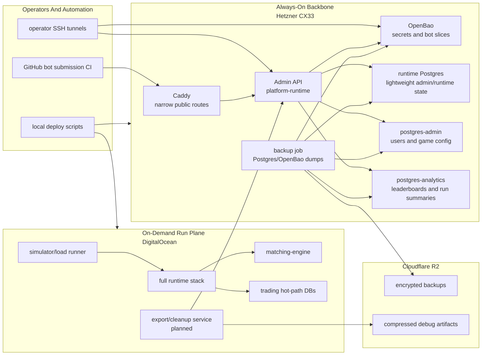

# Reef Infrastructure Backbone

Last aligned: 2026-07-07.

## Purpose

This document describes the always-on backbone server. If you only remember one
thing: this is the small Hetzner control-plane host for admin, secrets,
analytics/meta state, narrow public admin routes, and backups.

It is not the heavy simulation host. It is not the matching hot path.

For the one-page map of the whole system, start with
[`SYSTEM_OVERVIEW.md`](./SYSTEM_OVERVIEW.md).

## Which Layer Is This?

| Layer | This doc? | Plain meaning |
|---|---:|---|
| Infrastructure backbone | Yes | Always-on Hetzner host: OpenBao, Admin API, Caddy, admin DB, analytics DB, backups. |
| Run plane | No | Temporary DigitalOcean host for high-throughput simulation runs. |
| Venue runtime stack | No | API, matching engine, streams, Postgres, materializer, projectors inside a running venue. |

## What Lives Here

| Thing | Why it lives on the backbone |
|---|---|
| Admin API | Durable place for arena registry, admin workflows, and bot-submission operations. |
| OpenBao | Durable secret authority for bots and services. |
| Caddy | Narrow public entry point for CI/admin routes when explicitly enabled. |
| Admin DB | Durable user/game/meta configuration state. |
| Analytics DB | Durable leaderboards, run summaries, and aggregate results. |
| Backup job | Encrypted dumps to Cloudflare R2. |

Primary source code lives in:

- [`infra/README.md`](../infra/README.md)
- [`infra/hetzner-core/`](../infra/hetzner-core/)
- [`infra/hetzner-core/server/docker-compose.yml`](../infra/hetzner-core/server/docker-compose.yml)
- [`infra/simulation-runner/README.md`](../infra/simulation-runner/README.md)
- [`scripts/deploy/hetzner-core.mjs`](../scripts/deploy/hetzner-core.mjs)
- [`scripts/dev/do-benchmark-host.sh`](../scripts/dev/do-benchmark-host.sh)

## Deployment Split



## Backbone Host

The backbone is the low-cost always-on host. Current target:

| Item | Current shape |
|---|---|
| Provider | Hetzner |
| Default size | `cx33` |
| Region | `nbg1` |
| Provisioning | OpenTofu under `infra/hetzner-core/tofu` |
| OS | Ubuntu 24.04 |
| Access | SSH restricted by Hetzner firewall `admin_cidrs` |
| Public web | Off by default; Caddy only starts with the `public` profile |
| Runtime access | `platform-runtime` and OpenBao bind to host loopback for SSH tunnels |
| Data ownership | Docker volumes on one host, backed up to Cloudflare R2 |

This host can run smoke/admin workflows, but it is not the sustained simulation
compute tier. Expensive run-plane compute should be created for a run and then
destroyed.

## Backbone Services

| Service | Compose name | Status | Purpose |
|---|---|---|---|
| Runtime/admin API | `platform-runtime` | Present | Admin API, arena registry/control plane, bot-submission admin routes, lightweight runtime/admin workflows. |
| OpenBao | `openbao` | Present | Bot/user/service secrets, runtime AppRole reads, CI JWT provisioning backend. |
| Reverse proxy | `caddy` | Present, public profile | Publicly exposes only narrow bot-submission admin routes when enabled. |
| Runtime Postgres | `postgres` | Present | Main lightweight runtime DB plus OpenBao storage DB in the Hetzner stack. |
| Admin Postgres | `postgres-admin` | Present | Dedicated admin DB container for user accounts, game/meta config, non-runtime admin state. |
| Analytics Postgres | `postgres-analytics` | Present | Dedicated analytics DB container for leaderboard/game/run aggregate data and simulation-run export summaries. |
| Matching engine | `matching-engine` | Present | Optional smoke/admin support on backbone; not the high-throughput run plane. |
| Simulator | `simulator` | Manual profile | Operator/manual runs from backbone network when needed. |

The first analytics API slice now exists inside `platform-runtime`: public
ingestion through the versioned admin gateway at
`/admin/v1/analytics/run-exports`, with internal loopback/migration access still
available under `/internal/admin/analytics/run-exports` for local tooling. A
dedicated analytics microservice is still a future split if this surface grows
beyond backbone admin use.

## Admin API

The backbone Admin API is the `platform-runtime` container. It is not a separate
process today. It owns or will own:

- arena bot registry and version metadata
- operator/admin game configuration
- bot-submission registry checks
- OpenBao provisioning route for bot secret slices
- admin and clerical game operations
- simulation-run export ingestion and lookup for run-plane evidence

Default exposure:

```text
127.0.0.1:8080 -> platform-runtime:8080
```

Optional public Caddy exposure is intentionally narrow. It can forward only
bot-submission CI routes and `POST /admin/v1/analytics/run-exports`, each behind
bearer tokens from `/opt/reef/secrets/caddy.env`. Analytics reads remain
tunnel-only.

Operator access normally uses SSH tunneling:

```bash
ssh -L 8080:127.0.0.1:8080 ops@<backbone-ip>
curl http://127.0.0.1:8080/health
```

When public access is intentionally enabled, Caddy should expose only narrow
routes, not the full admin surface.

## OpenBao

OpenBao is the backbone secret authority.

Current posture:

- image: `openbao/openbao:2.5.5`
- binds to `127.0.0.1:8200` on the host
- stores data in the `openbao` database on the main Postgres container
- audit log writes to `openbao/logs/audit.log`
- `secret/` is a KV v2 mount
- AppRole auth is used by runtime services
- JWT auth is configured for GitHub Actions bot-submission provisioning

Auth backends:

| Auth backend | Consumer | Purpose |
|---|---|---|
| `approle/` | `reef-platform-runtime` | Runtime reads for bot/service secrets. |
| `approle/` | `reef-simulator` | Simulator reads for bot/service secrets when needed. |
| `jwt/` | GitHub Actions bot-submission CI | Narrow create/update/delete access under bot secret paths. |

Important secret paths:

```text
secret/data/bots/*
secret/metadata/bots/*
secret/data/services/platform-runtime/*
secret/data/services/simulator/*
```

Bot secret slice convention:

```text
secret/bots/<submitter-identity>/<bot-id>
```

OpenBao initialization and unseal remain manual. Unseal keys and root/admin
tokens must stay offline, not on the server and not in git.

## Public Route Policy

The backbone is private by default. Caddy is enabled only with the `public`
profile and should expose only explicit routes.

Current Caddy route intent:

```text
/admin/v1/arena/bots
/admin/v1/arena/bots/openbao-provision
```

These are bearer-token gated with `ARENA_ADMIN_API_TOKEN` and reverse-proxy to
`platform-runtime:8080`. All other requests return `404`.

This route exists for bot-submission CI. Normal operators should still prefer
SSH tunnels.

## Database Split

Backbone DB ownership:

| Database container | Data |
|---|---|
| `postgres` | runtime/lightweight platform state, OpenBao database, shared operational support data |
| `postgres-admin` | admin users, game/meta config, non-runtime/non-analytics control-plane state |
| `postgres-analytics` | leaderboard data, game results, run summaries, aggregate analytics |

This follows the accepted D-046 direction: admin and analytics are separate
Postgres containers on the same cheap backbone host, not schemas in one shared
DB and not separate managed DB services.

## Backup And Object Storage

Backbone backup uses Cloudflare R2.

The host-side backup job should dump:

- main runtime/OpenBao Postgres
- admin Postgres
- analytics Postgres
- OpenBao-related persisted state

Backups are encrypted before upload. Required server secret file:

```text
/opt/reef/secrets/backup.env
```

with:

```text
R2_ENDPOINT
R2_BUCKET
AWS_ACCESS_KEY_ID
AWS_SECRET_ACCESS_KEY
AWS_DEFAULT_REGION
AGE_RECIPIENT
```

R2 is also the chosen target for compressed/stripped debug artifacts exported
from DigitalOcean simulation runs.

## Simulation Run Plane

High-throughput simulation runs belong on ephemeral DigitalOcean compute, not
the backbone.

Run-plane direction:

- provision with OpenTofu using the DO provider
- start a dedicated compose stack for the run
- include full trading runtime, matching engine, simulator/load generator, and
  hot-path DBs
- export results back to the backbone analytics/admin API
- upload compressed debug artifacts to R2
- destroy the droplet after artifacts are safe

Current export command:

```bash
make dev-export-simulation-run \
  REPORT=reports/path/stream-ack-stress-rate-10000-workers-256.json \
  ARTIFACT_ROOT=reports/path \
  ARGS="--post --api-url=http://127.0.0.1:8080"
```

Without `--post`, the exporter prints the payload only. With `--post`, it sends
the compact run summary, counts, latency, and artifact hashes to the backbone
admin API.

Current implementation is still partly the older benchmark harness:

- `infra/do-benchmark/`
- `scripts/dev/do-benchmark-host.sh`
- `scripts/deploy/simulation-run.mjs`

That bridge starts a root local benchmark Compose profile on the disposable
DigitalOcean worker. The historical default remains `stream-ack`; set
`REEF_DO_BENCHMARK_PROFILE=materializer` for the current direct-stream plus
venue-event-materializer durable-canonical path. It should stay clearly
separate from the Hetzner backbone Compose files under `infra/hetzner-core/server/`.

Target implementation should mirror the Hetzner backbone pattern:

```text
infra/simulation-runner/tofu/
infra/simulation-runner/server/docker-compose.yml
scripts/deploy/simulation-runner-tofu.mjs
scripts/deploy/simulation-runner.mjs
```

## Bot Submission Flow

Bot-submission CI should never use an ephemeral stack for durable registry or
OpenBao provisioning decisions.

Correct flow:

```text
GitHub Actions
  -> validate manifest
  -> sandbox/security test
  -> call backbone Admin API
  -> registry diff against durable arena registry
  -> OpenBao provisioning through backbone-owned server-side route
```

Why this matters:

- an ephemeral `make dev-up` stack has an empty registry
- every bot would look new against that empty registry
- any secret created there would disappear on teardown
- CI should not hold long-lived OpenBao root/AppRole credentials

The server-side Admin API owns the OpenBao integration; CI only calls narrow
HTTP routes with scoped credentials.

## Current Gaps

- Analytics API/microservice is not complete.
- Export/cleanup service on the DO run plane is not complete.
- Simulation-runner infra still needs to fully mirror the Hetzner
  OpenTofu/compose/deploy-script pattern.
- Public admin/data must stay on `/admin/v1/...`; do not add Caddy exceptions for raw `/internal/*`.
- Remaining CI/operator scripts that still call raw `/internal/*` should migrate to `/admin/v1/...`, CLI, gRPC, or durable-message adapters when their workflows become hosted or public-facing.
- The current single-host engine gRPC posture is private-network plaintext; multi-host non-local deployment needs TLS/mTLS or service-mesh identity before it is promoted.
- `/readyz` needs deeper enabled-dependency checks for DBs, broker, engine, materializers, projectors, and admin stores before it becomes a deployment gate.
- OpenBao runtime config preflight needs continued integration with hosted bot
  runs.
- Backup restore drills need to be run and documented before treating backups
  as proven.

Control-plane hardening checklist: [`API_SURFACE_POLICY.md#api-and-control-plane-hardening-backlog`](./API_SURFACE_POLICY.md#api-and-control-plane-hardening-backlog).

## Operator Commands

Provision/deploy/status:

```bash
make hetzner-core-tofu ARGS=init
make hetzner-core-tofu ARGS="plan -out=tfplan"
make hetzner-core-tofu ARGS="apply tfplan"
make hetzner-core ARGS=deploy
make hetzner-core ARGS=status
make hetzner-core ARGS=verify
```

OpenBao tunnel:

```bash
ssh -L 8200:127.0.0.1:8200 ops@<backbone-ip>
export BAO_ADDR=http://127.0.0.1:8200
```

Admin API tunnel:

```bash
ssh -L 8080:127.0.0.1:8080 ops@<backbone-ip>
curl http://127.0.0.1:8080/health
```

Bootstrap the first web-admin user (see D-052 and
[`BOT_ARENA_AUTH_AND_PROVISIONING.md`](./BOT_ARENA_AUTH_AND_PROVISIONING.md)
Open Follow-Ups): a fresh GitHub OAuth login has no `arena.admin` permission
by default — `AdminIdentityService` (GitHub identity/trust-state) and the
`AdminApplicationService.requirePermission` role system are unconnected, and
there is no HTTP-reachable grant path. Grant it manually, once, over the
Admin API tunnel above. These are legacy internal routes
(`PLATFORM_LEGACY_MUTATION_ROUTES_ENABLED=true`, `X-Reef-Internal-Route`
marker), not Caddy-exposed — only reachable through the tunnel:

```bash
# reefUserId is "user-gh-<your numeric GitHub user id>", not your login —
# find it at https://api.github.com/users/<your-login> ("id" field).
curl -X POST http://127.0.0.1:8080/auth/roles \
  -H 'X-Reef-Internal-Route: true' -H 'content-type: application/json' \
  -d '{"roleId":"arena-operator","permissions":"arena.admin"}'

curl -X POST http://127.0.0.1:8080/auth/actor-roles \
  -H 'X-Reef-Internal-Route: true' -H 'content-type: application/json' \
  -d '{"actorId":"user-gh-<your-github-numeric-id>","roleId":"arena-operator"}'
```

Equivalent as raw SQL against the `postgres` (runtime) database, if the
tunnel/curl path isn't available:

```sql
INSERT INTO auth.auth_roles (role_id, permissions)
VALUES ('arena-operator', 'arena.admin')
ON CONFLICT (role_id) DO UPDATE SET permissions = EXCLUDED.permissions;

INSERT INTO auth.auth_actor_roles (actor_id, role_id)
VALUES ('user-gh-<your-github-numeric-id>', 'arena-operator')
ON CONFLICT DO NOTHING;
```

Backup:

```bash
/opt/reef/scripts/backup-dbs.sh
```

## Rules

- Keep OpenBao root material, unseal keys, AppRole credentials, R2 credentials,
  tfvars, state, and generated env files out of git.
- Keep the backbone small and always-on.
- Keep expensive simulation compute ephemeral.
- Keep CI provisioning routed through the real backbone Admin API.
- Do not expose the full admin API publicly.
- Do not let the run plane write directly into backbone DBs; export through an
  API/service boundary.
