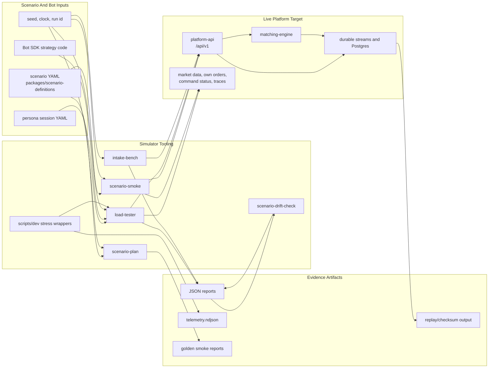

# Reef Simulator Environment

Last aligned: 2026-07-06.

## Purpose

This document describes the simulator and test environment that drives Reef. It
covers the Go simulator/load tools, scenario definitions, Bot SDK surfaces,
stress profiles, deterministic replay checks, and how simulator evidence should
be interpreted.

The simulator is not another platform. It is a driver. It sends commands into a
venue runtime stack through the same `/api/v1` paths used by users and bots.

For the deployment split, simulators have two homes:

- local/dev simulator tooling for fast iteration
- ephemeral DigitalOcean run-plane hosts for heavier simulation runs, exporting
  results back to the always-on infrastructure backbone

Use this together with:

- [`SYSTEM_OVERVIEW.md`](./SYSTEM_OVERVIEW.md)
- [`services/simulator/README.md`](../services/simulator/README.md)
- [`SIMULATOR_PERSONA_CONFIG.md`](./SIMULATOR_PERSONA_CONFIG.md)
- [`BOT_SDK_DESIGN.md`](./BOT_SDK_DESIGN.md)
- [`BOT_SDK_AUTHOR_GUIDE.md`](./BOT_SDK_AUTHOR_GUIDE.md)
- [`PERFORMANCE_LEARNINGS.md`](./PERFORMANCE_LEARNINGS.md)
- [`PERSISTENCE_HOT_PATH_CONFIGURATION.md`](./PERSISTENCE_HOT_PATH_CONFIGURATION.md)
- [`SYSTEM_INFRASTRUCTURE_BACKBONE.md`](./SYSTEM_INFRASTRUCTURE_BACKBONE.md)

## Environment Shape



## Main Tooling

| Tool | Path | Purpose |
|---|---|---|
| `load-tester` | `services/simulator/cmd/load-tester` | Mixed submit/modify/cancel load with worker personas, status breakdowns, trace checks, throughput taxonomy, and JSON reports. |
| `intake-bench` | `services/simulator/cmd/intake-bench` | Narrow raw submit intake benchmark. Useful when isolating API command intake from lifecycle behavior. |
| `scenario-plan` | `services/simulator/cmd/scenario-plan` | Compiles a scenario definition into deterministic executable steps and assertions without needing a live stack. |
| `scenario-smoke` | `services/simulator/cmd/scenario-smoke` | Dry-run or live scenario smoke that emits executable `/api/v1/orders/submit` requests. |
| `scenario-drift-check` | `scripts/dev/scenario-drift-check.mjs` | Compares reports against a stable fingerprint or replay baseline while ignoring unstable wall-clock fields. |
| `stress.mjs` wrappers | `scripts/dev/stress.mjs` and profile scripts | Compose-aware local/remote stress entry points that collect telemetry, accounting, diagnostics, and reports. |
| Bot SDK harness | `packages/bot-sdk` | Authoring and hosted-runner layer for bot strategies, qualification, venue adapter mapping, and live-read clients. |

## Scenario Inputs

The durable scenario source is under:

```text
packages/scenario-definitions/
```

Current important scenario concepts:

- scenario ID and run ID
- deterministic seed
- deterministic clock start and step
- participants, actors, accounts, instruments
- executable command steps
- replay/final-state assertions
- golden smoke report artifacts under `replay/golden`

The first locked scenario direction is:

```text
P1_GOLDEN_HIDDEN_CROSS_T1
```

The next broader lifecycle direction is settlement break/repair, but the current
strongest system evidence is still venue command intake, matching, durable event
batch output, materialization, and replay checks.

## Load Profiles

| Profile | Command | What it proves |
|---|---|---|
| Basic stack smoke | `make dev-smoke` | API/engine/runtime happy path is alive. |
| Scenario dry-run | `make dev-scenario-plan`, `make dev-scenario-smoke` | Scenario shape and deterministic request generation. |
| Live scenario smoke | `make dev-scenario-smoke ARGS="--live --base-url http://127.0.0.1:8080"` | Scenario commands can drive the live API path. |
| General stress | `make dev-stress` | Mixed API behavior with trace checks and report taxonomy. |
| Raw intake | `make dev-intake-bench` | API submit intake capacity with minimal simulator behavior. |
| Captured-ack stress | `make dev-stress-captured-ack` | Postgres command-log durable intake and async drain baseline. |
| Stream-ack stress | `make dev-stress-stream-ack` | Durable stream-backed acceptance and worker/projector accounting. |
| Stream-direct no-DB | `make dev-stress-stream-direct-nodb` | API durable append plus matching-engine direct stream consume, with DB removed from command completion. |
| Venue event materializer | `make dev-smoke-venue-event-materializer`, `make dev-stress-venue-event-materializer` | Direct engine consume, durable event batch publish, Postgres materialization, replay, and compact projection. |

No-op publisher and no-DB modes are diagnostic isolation profiles. They do not
prove durable production-like acceptance by themselves.

## Command Path Parity

Simulator actors must use the same external command routes as users:

```text
POST /api/v1/orders/submit
POST /api/v1/orders/modify
POST /api/v1/orders/cancel
GET  /api/v1/commands/{commandId}
```

The simulator may seed reference/auth data through guarded internal/admin
surfaces before a run, but it must not mutate runtime order/trade tables
directly to create trading outcomes.

## Bot SDK And Arena Environment

The Bot SDK gives strategy authors a controlled surface:

- `ReefBotV1` authoring model
- deterministic tick lifecycle
- fixture-backed qualification and hosted execution scaffolding
- venue adapter mapping from approved bot actions to `/api/v1` command requests
- live-read clients for market snapshots, bars, and own orders

Important boundary:

```text
bot code proposes actions
  -> harness validates/rates/audits
  -> venue adapter maps to normal platform commands
  -> platform-api handles durable acceptance and lifecycle
```

Hosted bots should not create direct database or network clients. Bot-visible
data must come through approved SDK clients and versioned platform routes.

## Evidence Artifacts

Simulator runs should produce files that survive the terminal session:

| Artifact | Typical content |
|---|---|
| JSON report | Attempted/accepted/completed/projected rates, latency percentiles, status codes, reject taxonomy, quality metrics. |
| `telemetry.ndjson` | Runtime, engine, stream, DB, Docker, and lag samples across a run. |
| Diagnostics CSV/JSON | Pre/post DB stats, table stats, WAL/checkpoint signals, accounting snapshots. |
| Replay output | Counts, gaps, checksum comparisons, idempotent replay results, projection watermark checks. |
| Golden report | Stable deterministic scenario output used by drift checks. |

Reports should distinguish:

- business rejects from infrastructure failures
- accepted commands from completed commands
- engine completion from Postgres materialization
- materialized canonical facts from projected UI/read-model visibility

## Determinism Controls

Use these to make runs comparable:

- fixed `--seed` / `REEF_SEED`
- fixed `--scenario-run-id`
- fixed command clock start and step
- stable action mix
- stable instrument universe
- clean reset or explicitly aged-state setup
- one benchmark session at a time when establishing capacity

For drift checks, use stable fingerprints that exclude wall-clock timestamps and
latency fields unless the point of the run is latency regression detection.

## Read Surfaces Used By Simulators And Bots

Current live read surfaces include:

```text
GET /api/v1/market-data/snapshots/{instrumentId}
GET /api/v1/market-data/depth/{instrumentId}
GET /api/v1/market-data/trades/{instrumentId}
GET /api/v1/market-data/bars/{instrumentId}
GET /api/v1/orders/current?participantId=...
GET /api/v1/orders/history?participantId=...
GET /api/v1/data/availability
GET /api/v1/commands/{commandId}
GET /traces/{traceId}/events
```

Read models may lag. Simulator reports should record whether the test asserts
projection visibility or only canonical command completion. `GET /api/v1/data/availability`
is the read-side inventory for this: it reports each bot/user data surface, its
backing source (`runtime.trades`, `runtime.market_data_snapshots`,
`runtime.order_lifecycle_state`, etc.), and the current projection lag/watermark
where a projection owns freshness.

## Local Development Flow

Common loop:

```bash
make dev-up
make dev-smoke
make dev-scenario-plan
make dev-scenario-smoke ARGS="--pretty"
make dev-stress
```

Durable materializer loop:

```bash
make dev-smoke-venue-event-materializer
make dev-venue-event-replay-check
make dev-stress-venue-event-materializer
```

Raw intake isolation:

```bash
make dev-up-stream-direct-nodb
make dev-intake-bench
make dev-stress-stream-direct-nodb
```

## Remote Run Plane

Longer or heavier simulation runs should use ephemeral DigitalOcean compute,
not the always-on Hetzner backbone.

Current/target shape:

```text
operator/deploy script
  -> provision DO droplet
  -> sync/build runtime stack
  -> run simulator/load profile on droplet network
  -> collect reports and telemetry
  -> export summarized results to backbone Admin/Analytics API
  -> upload compressed debug artifacts to R2
  -> destroy droplet
```

The export/cleanup service is planned. Until it exists, current harnesses still
fetch or push artifacts through deploy scripts. That is an implementation gap,
not the target architecture.

## What The Simulator Should Not Claim

- No-op publisher runs do not prove durable append.
- Accepted/sec alone does not prove the venue drained work.
- A green API load test does not prove projections, replay, or audit are clean.
- Fixture-backed Bot SDK runs do not prove live market-data/read integration.
- Short local tests do not replace long remote soaks for resource behavior.

## Next Simulator Improvements

- Extend hosted-runner/operator flows to choose fixture reads or injected live reads explicitly per run.
- Add scenario-level assertions that span command status, canonical outcomes,
  order projections, market-data projections, and replay output.
- Expand deterministic settlement/break/repair scenarios after the venue-core
  durable path has longer soak evidence.
- Add restart/recovery scripts for stream direct consume and materializer offset
  proof.
- Keep report taxonomy stable so old benchmark artifacts remain comparable.
