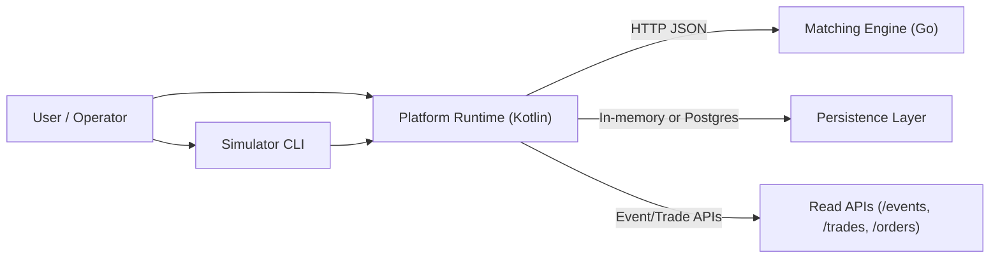
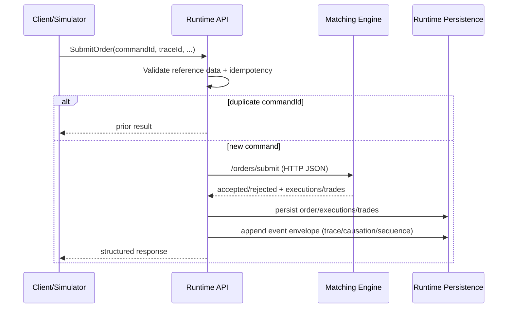
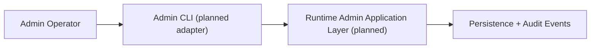
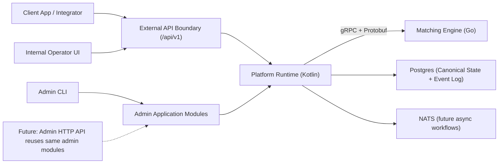
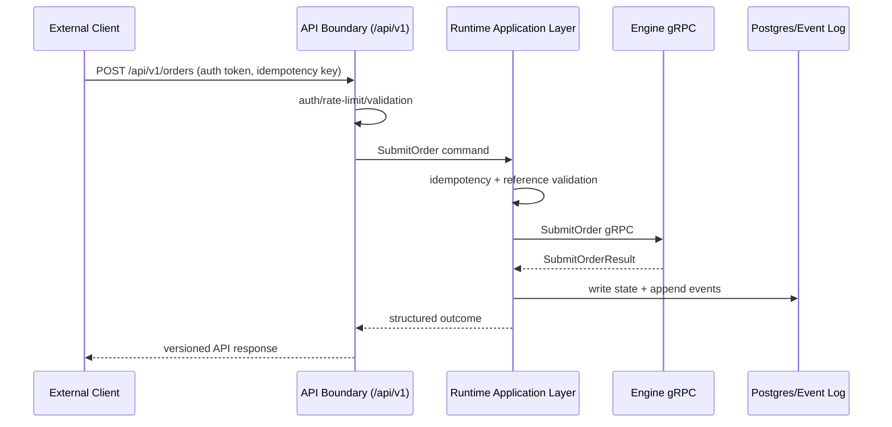
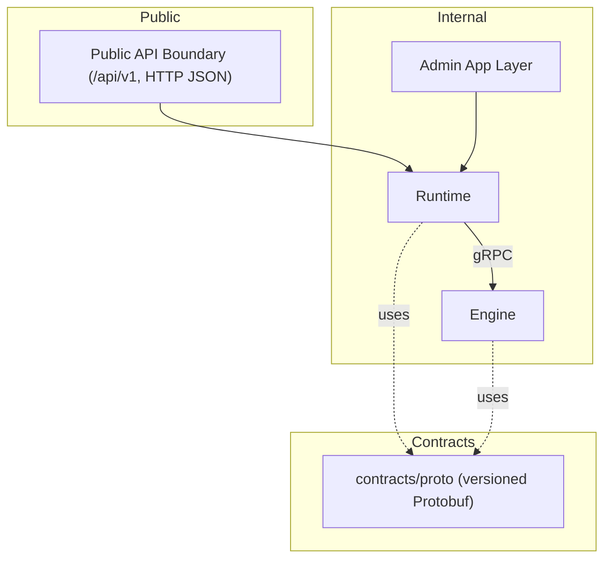

# Reef Architecture and Flow Diagrams (Historical)

Superseded by [`ARCHITECTURE_INFRASTRUCTURE_DIAGRAMS.md`](../ARCHITECTURE_INFRASTRUCTURE_DIAGRAMS.md), which reflects the current Kafka/Redpanda direct-stream shape. These diagrams describe an earlier HTTP-JSON/NATS-oriented design and are kept only as historical context.

This document visualizes an earlier setup and intended future shape, including order flow, transport paths, and admin/public boundaries.

## Current System Shape

## Current Order Flow (Implemented)

## Current Admin Surface (Direction)

## Target Future Shape

## Target Order Flow (Public Boundary + gRPC)

## Communication Layers

