# Projection Throughput System Overview

Status: independently reviewed evidence dossier; approved changes incorporated

Date: 2026-08-20

Scope: the durable venue-event path through PostgreSQL read-model freshness

## Executive Summary

Reef does not currently have one throughput number. It has at least two
materially different ones:

- **Venue-core throughput** covers durable command ingress, deterministic
  matching, durable `VenueEventBatch` publication, and compact canonical
  materialization. This path is proven near `10k outcomes/s` on the c-16
  benchmark host.
- **Full-projection throughput** additionally covers normalized command status,
  orders, executions, trades, runtime timeline/history, order lifecycle, and
  market-data read models. The current sustained ceiling is below `5k/s`: a
  `2.5k/5m` run stayed fresh, while a correctly configured `5k/5m` run accepted
  and canonically materialized all `1,500,002` outcomes but projected only
  `746,047` before the drain deadline.

The most likely primary bottleneck is projection-database work per source
outcome, especially repeated JSON expansion, temporary query work, typed-fact
conversion, multi-table and multi-index fanout, WAL generation, and downstream
lifecycle maintenance. Canonical reads and concurrent ingestion make the
combined-load rate worse, but projection-only drain observed after load was
still only about `2.8k/s`, so canonical-store contention is not the whole
explanation.

The next step should be measurement, not a speculative rewrite or more
projector replicas. Add statement- and phase-level timing, measure a fixed
backlog with intake stopped, then run stage ablations and bounded
projection-local memory/batch experiments. Only after those measurements
should Reef implement the smallest supported structural change.

The leading structural direction is a typed, parse-once batch boundary and
separate freshness lanes for order state and cold timeline/history. That split
has a correctness prerequisite: cancel and modify lifecycle state currently
depends on events written by the timeline stage. The existing command-status
stage cannot safely be promoted as an independent lifecycle-fresh lane without
adding the missing dependency or compact lifecycle facts.

## Decision Question

What is the lowest-risk way to raise full-projection freshness from the proven
`2.5k/s` soak to `5k/s`, then `7.5k/s` and `10k/s`, without weakening durable
acceptance, deterministic ordering, idempotent replay, audit facts, or explicit
freshness semantics?

## Terminology And Success Criteria

| Term | Meaning in this dossier |
| --- | --- |
| Accepted | The configured durable ingress mechanism acknowledged the command. |
| Direct acknowledged | The direct matching path produced and durably published its result. |
| Canonically materialized | Compact authoritative facts from the committed `VenueEventBatch` exist in canonical PostgreSQL storage. |
| Projected | Rebuildable read-model rows were written and their contiguous projection watermark advanced. |
| Fresh | Projected count and per-partition watermarks have caught up to the canonical source under the gate's freshness rules. |
| Drain headroom | Projection-only capacity above offered sustained load, measured from a fixed backlog with intake stopped. |

A promotion is not successful merely because command intake reaches a target
rate. A full-projection promotion requires zero final projection gap and lag,
no correctness failures, and measured drain headroom. The proposed minimum is
`20%`: at least `6k/s` drain for a `5k/s` gate, `9k/s` for `7.5k/s`, and
`12k/s` for `10k/s`.

## Current Architecture

```mermaid
flowchart LR
    Client["Clients and simulator"] --> Ingress["Durable command ingress"]
    Ingress --> Broker["Redpanda / Kafka command stream"]
    Broker --> Engine["Go matching engine<br/>deterministic partition lane"]
    Engine --> Events["Durable VenueEventBatch stream"]
    Events --> Materializers["Venue-event materializers"]
    Materializers --> Canonical["Canonical PostgreSQL<br/>compact authoritative facts"]
    Canonical --> Projectors["4 Kotlin canonical projectors<br/>4 partitions each in the gate"]
    Projectors --> ProjectionDB["Projection PostgreSQL<br/>status + timeline + watermarks"]
    ProjectionDB --> Lifecycle["Order lifecycle dirty workers"]
    Lifecycle --> Market["Market-data dirty workers"]
    ProjectionDB --> Reads["API read models / audit timeline"]
    Lifecycle --> Reads
    Market --> Reads
```

### Ownership and durability boundaries

Documented fact: commands for a venue session and instrument remain on one
deterministic processing lane. Matching-engine behavior is owned by the Go
service; orchestration, canonical materialization, and read models are owned by
the Kotlin runtime.

Documented fact: `VenueEventBatch` is the canonical matching ledger. The
materializer reads committed batches, validates identity and semantic
checksums, persists a batch atomically, and acknowledges the broker only after
database success. It bisects failed batches to isolate a bad record without
skipping committed facts.

Documented fact: canonical facts and projections are in physically separate
PostgreSQL services in the benchmark. Projection rows are rebuildable and must
not become a hidden second source of truth.

Documented fact: projection watermarks are updated in the same projection
transaction as the rows they cover. A transaction failure must leave the
watermark behind so replay is safe.

### Deployed projection topology in the sustained gate

The `materializer-projection` benchmark profile explicitly configures:

- projection source `venue-event-batch`;
- projection stage `full`;
- fills enabled;
- four projector services;
- active partitions `0-15`, split `0-3`, `4-7`, `8-11`, and `12-15`;
- canonical projector batch size `250` and empty-poll interval `50ms`;
- order-lifecycle and market-data projectors enabled;
- lifecycle and market-data batch size `500` and poll interval `250ms`;
- a `60s` post-load projection drain window.

Documented fact: one `CanonicalProjectionWorker` runs per projector service. It
processes serial batches and sleeps only when a poll returns no rows.

Documented fact: each projector process uses a `runtime` pool for canonical
PostgreSQL and a `runtime-projection` pool for projection PostgreSQL. With the
current global defaults, each pool is capped at `16` connections with `4`
minimum idle. Four projector processes can therefore expose up to `64`
projection connections, below the projection server's `160` connection cap but
still enough concurrency for per-operation memory and lock behavior to matter.

Documented fact: because the enable flags are inherited by all four projector
services, each process also starts an order-lifecycle worker and a market-data
worker. Each market-data cycle first calls `projectOrderLifecycleState` and then
projects market data. The four-process topology can therefore issue up to eight
lifecycle projection calls per polling interval. The SQL uses `FOR UPDATE SKIP
LOCKED` to divide dirty work safely.

Inference: this downstream concurrency may help drain the lifecycle queue, but
it may also consume connections and repeatedly scan/sort dirty queues. It is a
stage-ablation variable, not yet a diagnosed defect.

### Per-batch flow across the two databases

For each canonical-projector batch in the separated-store path:

1. Read the owned partition watermarks from projection PostgreSQL.
2. Query canonical PostgreSQL once per owned partition after its watermark.
3. Join the compatibility `command_log.command_payloads` side table when it
   exists.
4. Parse canonical outcome and command JSON in Kotlin.
5. Re-serialize a new `PersistableSubmitOutcome` JSON array.
6. Send that JSON array to projection PostgreSQL.
7. Run the status and timeline projection functions.
8. Advance the covered partition watermarks in the same projection
   transaction.

Observation: this path is partitioned at source selection but converges on the
same projection database, tables, indexes, dirty queues, and WAL device. More
projector JVMs do not remove shared database work.

## Projection Write And Query Fanout

### Status stage

The current status function:

- conflict-checks `submit_results` for replay mismatches;
- upserts `submit_results`;
- upserts `orders`;
- inserts `executions`;
- inserts `trades`;
- expands trade JSON again to derive buyer/seller dirty order identifiers;
- marks `order_lifecycle_dirty`.

### Timeline stage

The timeline function:

- expands the source outcome array independently from the status function;
- expands lifecycle events;
- derives deterministic event sequence numbers;
- inserts the hot typed `runtime_events` row;
- inserts full JSON in `runtime_event_payloads`;
- retains compatibility trace-allocation behavior for older payloads.

### Typed facts and indexes

Row triggers validate text with regular expressions and cast values into UUID,
numeric, and timestamp typed columns for orders, results, executions, trades,
and events. These typed columns improve read paths, but every projection insert
pays their conversion and index-maintenance cost.

Observation: in the failed `5k` run, index growth was close to or greater than
heap growth for `runtime_events`, `executions`, and `trades`. Index utility must
be measured against representative public reads and replay before changing the
index set.

### Downstream lifecycle and market data

The lifecycle function locks up to `500` dirty order IDs per call, reads orders,
aggregates executions, looks up the latest modify event, rolls up cancel/reject
events, upserts `order_lifecycle_state`, marks touched instruments dirty, and
deletes processed lifecycle dirty rows.

The market-data function first invokes lifecycle projection, locks dirty
instruments, scans active priced lifecycle rows for those instruments,
calculates top of book, upserts/deletes snapshots, and clears market-data dirty
rows.

Documented fact: dirty queues are rebuildable and unlogged. Durable status,
timeline, lifecycle, and market-data facts remain logged.

## Benchmark Truth Table

| Gate and artifact | Offered load | Venue-core outcome | Projection outcome | What it proves |
| --- | ---: | --- | --- | --- |
| Historical c-16 materializer, `do-benchmark-20260712T143401Z` | `10k/s`, two `5m` samples | About `9,999.68/s`, exact materialization | Projection intentionally disabled, `projected=0` | Venue-core capacity, not read-model freshness. |
| Current c-16 materializer, `do-benchmark-20260820T230011Z` | `10k/s`, `3 x 60s` | About `9,997.64`, `9,997.52`, `9,994.96/s`; no gaps, nacks, or deadlocks | Projection disabled | Current branch still has near-10k venue-core capacity. The first sample had cold-start latency above the latency SLO; samples 2-3 were green. |
| Full projection, `do-benchmark-20260820T220557Z` | `2.5k/s`, `5m` | `749,976` accepted and materialized | `749,976` projected; zero lag/gap | Current sustained full-projection floor is at least `2.5k/s`. |
| Full projection, `do-benchmark-20260820T222945Z` | `5k/s`, `5m` | `1,500,002` accepted and materialized at `4,999.74/s` | `746,047` projected; `753,955` count gap; `757,955` watermark lag | Correctly configured full projection cannot sustain `5k/s`. |

The `5k` failure was not an application-error failure:

- projector failures: `0`;
- projector retries: `0`;
- projection deadlocks: `0`;
- rollback/fatal gaps in venue core: `0`;
- partition skew: about `1.01`;
- lag distributed similarly across all four projector groups.

This is the signature of a shared capacity ceiling rather than one bad
partition or a retry storm.

### Work performed by projection PostgreSQL

| Counter | `2.5k/5m` | `5k/5m` | Normalized interpretation |
| --- | ---: | ---: | --- |
| Projected outcomes | `749,976` | `746,047` | Nearly identical completed projection work. |
| WAL | `4.334GB` | `4.394GB` | About `5.78-5.89KB` per projected outcome. |
| Temporary data | `15.774GB` | `16.624GB` | About `21.0-22.3KB` per projected outcome. |
| Inserted tuples | `5,044,806` | `5,107,870` | About `6.73-6.85` inserts per projected outcome. |
| Updated tuples | `89,878` | `83,243` | Similar downstream update work. |
| Deleted tuples | `718,154` | `663,207` | Mostly rebuildable dirty-queue churn. |

Observation: the two runs caused almost the same total projection work even
though the second offered twice the source traffic. The additional `~754k`
outcomes in the `5k` run remained as backlog. This is the strongest current
evidence of a projection-work ceiling.

Observation: during the `5k` load, projected count increased at roughly
`1.8k/s`. After intake stopped it drained at roughly `2.8k/s`. The report's
`projectedPerSecond=2486.69` should not be interpreted as either rate because
its numerator includes the drain window while its denominator includes only
the `300s` load window.

Observation: projection PostgreSQL averaged about four cores and peaked near
nine to ten cores in coarse Docker telemetry. The final diagnostics showed
`13` active sessions, one transaction-ID lock waiter, an active autovacuum
worker, no deadlock, and zero reported I/O timing because `track_io_timing` was
disabled.

Observation: the already-collected `pg_stat_io` deltas contain about
`37.54GiB` of client-backend and `34.78GiB` of background-worker bulk relation
reads (`72.32GiB` combined). These are backend-type aggregates, so they cannot
be assigned to a particular relation without query-level evidence.

Observation: existing table-stat deltas include `2,144` sequential scans of
`submit_results`, plus `4,923` sequential scans and `6` autovacuum runs on
`order_lifecycle_dirty`. These should be explained from existing artifacts and
local plans before buying another remote run.

Observation: `order_lifecycle_state` performed `71,237` updates with only `164`
HOT updates (`~0.23%`). Fillfactor can provide page room, but PostgreSQL also
requires that indexed columns remain unchanged; lifecycle frequently changes
indexed status, price, and remaining quantity. Treat fillfactor as a bounded
A/B, not an established fix.

### Data growth in the failed `5k` run

Largest projection relations by run growth were approximately:

| Relation | Growth |
| --- | ---: |
| `runtime_event_payloads` | `774MB` |
| `runtime_events` | `625MB`, including about `363MB` of indexes |
| `executions` | `475MB` |
| `trades` | `391MB` |
| `orders` | `357MB` |
| `submit_results` | `345MB` |
| `order_lifecycle_state` | `271MB` |

These results come from a fresh database. Long-lived table bloat, vacuum debt,
cache churn, and index maintenance on a larger existing dataset remain
underrepresented.

## Ranked Bottleneck Hypotheses

| Rank | Hypothesis | Confidence | Supporting evidence | Evidence needed to close it |
| ---: | --- | --- | --- | --- |
| 1 | Projection SQL and index/write amplification are the primary ceiling. | High | Stable `~6.8` inserts, `~5.9KB` WAL, and `~22KB` temp per projected outcome; DB CPU saturation; similar work totals across both soaks. | Per-statement WAL/temp/time and representative plans. |
| 2 | Repeated JSON expansion, typed conversion, and materialization create much of the CPU/temp cost. | Medium-high | Status and timeline separately expand top-level JSON; trades are expanded repeatedly; triggers regex/cast each row; `~16GB` temp. | `EXPLAIN (ANALYZE, BUFFERS, WAL)` and `pg_stat_statements`. |
| 3 | Canonical polling plus Kotlin parse/re-encode materially reduces combined-load capacity. | Medium | In-load rate `~1.8k/s` versus drain-only `~2.8k/s`; each batch performs per-partition canonical queries and JSON transformation. | Phase timers and a preloaded projection-only benchmark. |
| 4 | Untuned projection PostgreSQL memory causes avoidable spills/cache churn. | Medium | Server selected default `128MB shared_buffers`; default `4MB work_mem`; very high temp bytes. | Bounded projection-local A/B with host-memory telemetry and plans. |
| 5 | Lifecycle/market worker multiplicity contributes queue/lock/connection overhead. | Medium-low | Four lifecycle workers plus four market workers that also invoke lifecycle; final active sessions and a lock waiter. | Stage ablations with worker counts, function timings, and dirty-queue drain rates. |
| 6 | Batch `250` is too small for efficient set-based work. | Medium-low | Many transactions and repeated setup work are plausible; no batch A/B on current shape. | `250/500/1000` A/B after memory instrumentation. |
| 7 | Autovacuum and growing indexes will lower capacity on mature datasets. | Medium | Active autovacuum during the run; high insert/delete churn and index growth; fresh-database benchmark understates age. | Pre-aged dataset, vacuum stats, index usage, bloat and replay/read plans. |
| 8 | Partition skew or one projector is the primary bottleneck. | Low | Skew about `1.01`; all four groups accumulated similar lag. | No action unless per-worker phase metrics disagree. |
| 9 | Simply adding projector processes will solve the problem. | Low | Shared projection database already has concurrent writers and high CPU/temp/WAL; processes do not remove per-outcome work. | Consider only after work/outcome drops and DB headroom exists. |

## Correctness Hazard In The Existing Stage Split

`toPersistableSubmitOutcome` creates an accepted order for submit commands.
Cancel and modify state is carried by lifecycle events.

The current status stage writes status/order/fill/trade rows and marks lifecycle
orders dirty, but it does not write `runtime_events`. The timeline stage writes
the cancel/modify events, but it does not re-dirty the lifecycle order.
`runtime_project_order_lifecycle_state` reads `runtime_events` to derive cancel,
reject, and latest modify state.

Inference: if status and timeline are made independently advancing production
lanes without another dependency, lifecycle can consume and clear the dirty row
before the required event exists. Timeline may then add the event without
causing lifecycle to recompute. The result is a green status watermark with
stale own-order state.

Full mode is safe from this particular race because status and timeline run in
one projection transaction before their shared watermark advances. A future
split must do one of the following:

1. include compact cancel/reject/modify facts in the order-state lane and make
   lifecycle derive only from that complete lane; or
2. make timeline re-dirty affected orders and define lifecycle freshness as a
   dependency on both prerequisite watermarks.

This is why the historic `5k/60s` command-status pass is a useful performance
ablation but not proof of independent lifecycle freshness.

## External Research And Its Implications

### PostgreSQL measurement and memory

PostgreSQL 16 documents `128MB` as the typical `shared_buffers` default and
`4MB` as the `work_mem` default. It also warns that `work_mem` applies per sort
or hash operation and across concurrent sessions, so global increases can
multiply memory consumption. Reef should use transaction- or role-local
experiments and account for the fact that the c-16 host is shared by all
services, rather than copy a dedicated-database rule of thumb.

`EXPLAIN (ANALYZE, BUFFERS, WAL)` exposes shared/temp blocks and WAL, and
`pg_stat_statements` aggregates normalized statement execution, temp-block, and
WAL statistics. These directly answer the current missing evidence. Enable
`track_io_timing` with its measurement overhead recorded so zero timing values
are no longer ambiguous.

Sources:

- <https://www.postgresql.org/docs/16/runtime-config-resource.html>
- <https://www.postgresql.org/docs/16/sql-explain.html>
- <https://www.postgresql.org/docs/16/pgstatstatements.html>

### CQRS and materialized-view boundaries

Microsoft's architecture guidance describes separate write and read stores as
a way to scale independently and optimize read schemas, while explicitly
calling out synchronization, duplicates, retries, and eventual consistency.
Its materialized-view guidance treats the view as disposable and rebuildable
from source facts.

Implication for Reef: the existing canonical/projection database separation is
directionally sound. The problem is not that Reef chose asynchronous read
models; it is that the current full projection does too much coupled work for
one freshness watermark. Any lane split must make its consistency contract and
dependencies explicit.

Sources:

- <https://learn.microsoft.com/en-us/azure/architecture/patterns/cqrs>
- <https://learn.microsoft.com/en-us/azure/architecture/patterns/materialized-view>

### Kafka Streams as a comparison, not a recommendation

Apache Kafka Streams partitions processing into tasks and can keep local state
stores backed by partitioned, compacted changelog topics. Failed tasks restore
state by replaying their changelog before resuming. This is an example of how
state can scale with partition ownership instead of converging every update on
one relational writer.

Implication for Reef: a partition-local state engine could eventually reduce
central PostgreSQL write contention for selected maintained views, but it adds
state restoration, operational, query, and consistency complexity. It does not
remove the need for public SQL read models or solve the current schema fanout
automatically. It belongs behind the lower-risk PostgreSQL measurement and
typed-staging work, not in the first fix.

Source: <https://kafka.apache.org/40/streams/architecture/>

### CDC/outbox as a comparison, not a first move

Debezium's outbox pattern captures committed changes from an outbox table and
routes them to broker messages, avoiding a database-state/event-publication
split. It can also preserve a partition-routing field.

Implication for Reef: CDC could remove canonical database polling and Kotlin
re-encoding in a future transport design, but it would not reduce projection
table/index fanout. Reef already has a durable canonical event path and explicit
watermarks, so introducing CDC before quantifying the current projection SQL
would increase moving parts without addressing the strongest bottleneck
evidence.

Source:
<https://debezium.io/documentation/reference/stable/transformations/outbox-event-router.html>

## Options And Tradeoffs

| Option | Likely leverage | Correctness risk | Operational cost | Recommendation |
| --- | --- | --- | --- | --- |
| Statement/phase instrumentation plus projection-only drain | Makes the bottleneck attributable and every later result comparable | Low | Low | Do first. |
| Projection-local memory and batch A/B | Could reduce temp spill and transaction overhead | Low if bounded; OOM/latency risk if global | Low | Do immediately after instrumentation. |
| Typed parse-once staging (`jsonb_to_recordset`, typed temp/staging relation, or pgJDBC `COPY`) | Removes repeated parsing/serialization and enables shared set-based fanout | Medium | Medium | Leading implementation spike after plans. |
| Correct order-state/timeline lane split | Isolates freshness SLOs and can remove cold work from critical state | Medium-high until lifecycle dependency is solved | Medium | Target architecture; specify before coding. |
| Evidence-backed index/retention reduction | Reduces cumulative write/WAL/storage cost | Medium if a read/replay path loses support | Medium | Do table-by-table from query evidence. |
| More current projector processes | Little leverage if projection DB is the shared ceiling | Medium contention risk | Low | Defer. |
| Table partitioning | Potentially useful at large history sizes | High key/query/migration risk | High | Defer until plans and retention justify it. |
| Kafka Streams/local state or another projection engine | Can scale state with partitions | High migration/query/operations risk | High | Distant option, not current recommendation. |
| CDC/outbox transport | Can remove polling/re-encoding | Medium-high delivery/operations change | High | Revisit only if canonical-read phase proves material after DB work drops. |
| Table-local fillfactor/autovacuum A/B | May reduce lifecycle bloat/vacuum overhead, but cannot make indexed-fact changes HOT | Low if isolated | Low | Add after plans identify eligible updates and vacuum cost. |
| PgBouncer/revised pool topology | Bounds sessions at higher process counts; does not reduce write work | Medium compatibility risk for transaction pooling | Medium | Defer until all-projector pool telemetry shows pressure. |

## Recommended Investigation Sequence

### Gate 0: observability and a clean capacity measurement

- Re-mine the existing `5k/5m` CSVs first: preserve aggregate bulk reads,
  per-table scan deltas, autovacuum counts, HOT ratios, table/index growth, and
  the limits on relation attribution.
- Enable `pg_stat_statements` on canonical and projection PostgreSQL.
- Enable `track_io_timing` for the benchmark profile and record overhead.
- Capture representative status, timeline, lifecycle, and market-data plans
  with `ANALYZE`, `BUFFERS`, `WAL`, `SETTINGS`, and JSON format on a cloned
  dataset.
- Time canonical read, Kotlin parse, Kotlin serialize, projection SQL, commit,
  and watermark phases separately.
- Capture pool snapshots from every projector process, including active, idle,
  maximum, and threads-awaiting-connection counts. The current telemetry's
  `runtime.dbPools` probe targets the API service, not all projector processes.
- Report in-load rate, projection-only drain rate, maximum lag, lag area under
  curve, drain duration, and final lag separately.
- Preload a fixed canonical backlog, stop intake, reset counters, and measure a
  projection-only drain.

### Gate 1: stage ablation

Using fresh state and identical deterministic input:

1. status only; lifecycle and market data off;
2. timeline only; lifecycle and market data off;
3. status plus timeline; lifecycle and market data off;
4. full plus lifecycle; market data off;
5. current full topology with lifecycle and market data.
6. lifecycle-bearing topology with one designated lifecycle/market worker
   compared with all four projector services.

Short diagnostic runs should identify the expensive stage. Only informative
candidates need a paid `5m` run. None of the ablations should be presented as a
correctness promotion by itself.

### Gate 2: bounded configuration matrix

Hold SQL and topology constant:

1. baseline: `128MB shared_buffers`, `4MB work_mem`, batch `250`;
2. projection `shared_buffers=2GB`, then `4GB`, with total host memory watched;
3. projection-transaction `work_mem=16MB`, `32MB`, and at most `64MB`;
4. batch `500`, then `1000`, on the best safe memory setting.
5. table-local lifecycle fillfactor and autovacuum thresholds on a cloned or
   pre-aged dataset, after plans establish HOT eligibility and vacuum cost;
6. pool-limit changes, and a pooler only if projector-local telemetry exposes
   connection churn, waits, or server-process overhead.

Reject any setting that trades projection throughput for OOM risk, canonical
latency, long transactions, or a worse lag curve. Do not weaken `fsync`,
`full_page_writes`, broker acknowledgement, or canonical commit semantics.

### Gate 3: smallest supported structural fix

Preferred order if Gate 0-2 supports it:

1. create a typed, parse-once batch relation;
2. stop parsing canonical JSON only to re-encode equivalent JSON in Kotlin;
3. retain conflict detection, deterministic order, and transactional
   watermarks;
4. define a complete order-state lane with cancel/reject/modify dependencies;
5. give cold timeline/history its own watermark and worker;
6. reduce indexes only after representative read/replay evidence;
7. validate on a pre-aged dataset with public reads active.

## Required Correctness Evidence

Any accepted change must show:

- submit, reject, cancel, and modify facts remain idempotent under replay;
- conflicting replay fails instead of silently doing nothing;
- a crash after row writes but before watermark commit replays safely;
- a crash between future stages cannot publish false lifecycle freshness;
- configuration rejects or explicitly isolates status-only plus lifecycle as a
  diagnostic ablation until its dependency is implemented, with a regression
  test preventing an `own-order-fresh` claim;
- cancel and modify state remains correct when lanes run at different speeds;
- every projection can rebuild from canonical facts;
- deterministic sequence and public audit ordering remain unchanged;
- projection lag does not weaken durable command acceptance unless an explicit
  backpressure policy intentionally couples them.

## Known Unknowns

- Which exact statements and plan nodes create most temporary files?
- What fraction of time is canonical read, Kotlin transform, projection SQL,
  commit, lifecycle, and market data?
- Do eight potential lifecycle calls per poll improve or reduce total drain?
- Do projector-local pools ever exhaust, and how many projection sessions are
  active concurrently over time rather than in the final snapshot?
- Is the current batch size transaction-bound, CPU-bound, or spill-bound?
- Which projection indexes are used by representative public reads and replay?
- How does capacity change with several million pre-existing projected rows?
- How much autovacuum debt accumulates in a longer or repeated soak?
- Would typed staging remove enough work to make a lane split unnecessary for
  `5k`, even if a split remains desirable for `10k`?

## Current Assessment

- Confidence is **high** that the sustained full-projection path, not venue-core
  intake or materialization, is the immediate limiter.
- Confidence is **high** that temporary work and row/index/WAL amplification are
  material.
- Confidence is **medium** on the relative ranking of JSON expansion, memory,
  canonical polling, lifecycle concurrency, and batch size until Gate 0-1.
- Confidence is **low** that adding projector replicas or changing databases
  first would be the best next move.

The best path forward remains the measured experiment ladder in
[`PROJECTION_THROUGHPUT_SPIKE_2026-08-20.md`](./PROJECTION_THROUGHPUT_SPIKE_2026-08-20.md),
with this dossier serving as the current-system map and review baseline.

The `20%` drain margin in the ladder is a minimum promotion floor, not the
capacity-planning target. Reef should retain the D-038 preference for `2-3x`
subsystem headroom when it is achievable without unreasonable cost or hiding
write amplification.

## Repository Evidence Index

Canonical direction and decisions:

- `REEF_PROJECT_OVERVIEW.md`
- `REEF_TECHNICAL_DESIGN.md`
- `docs/steering/architecture.md`
- `docs/DECISIONS.md`, especially D-027, D-028, D-037, and D-043
- `docs/PERFORMANCE_LEARNINGS.md`
- `docs/PROJECTION_THROUGHPUT_SCALING_PLAN.md`

Implementation:

- `services/platform-runtime/src/main/kotlin/com/reef/platform/api/CanonicalProjectionWorker.kt`
- `services/platform-runtime/src/main/kotlin/com/reef/platform/api/RuntimeLoopStarter.kt`
- `services/platform-runtime/src/main/kotlin/com/reef/platform/api/OrderLifecycleProjectionWorker.kt`
- `services/platform-runtime/src/main/kotlin/com/reef/platform/api/MarketDataProjectionWorker.kt`
- `services/platform-runtime/src/main/kotlin/com/reef/platform/infrastructure/persistence/PostgresRuntimePersistence.kt`
- `services/platform-runtime/src/main/kotlin/com/reef/platform/infrastructure/persistence/RuntimeDataSources.kt`
- `scripts/dev/db/migrations/runtime/0040_split_submit_outcome_projection_stages.sql`
- `scripts/dev/db/migrations/runtime/0043_runtime_event_payload_cold_table.sql`
- `scripts/dev/db/migrations/runtime/0046_order_modified_lifecycle_index.sql`
- `scripts/dev/db/migrations/runtime/0049_execution_replay_conflicts.sql`
- `compose.base.yml`
- `compose.local.yml`
- `scripts/dev/do-benchmark-host.sh`

Benchmark artifacts:

- `reports/do-benchmark/do-benchmark-20260712T143401Z/`
- `reports/do-benchmark/do-benchmark-20260820T220557Z/`
- `reports/do-benchmark/do-benchmark-20260820T222945Z/`
- `reports/do-benchmark/do-benchmark-20260820T230011Z/`
