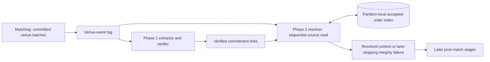

# Calcify Phase 2 architecture review

Status: research and provisional recommendation; no Phase 2 implementation or contract approved.
Decision owner: Calcify design review with project owner.
Question: how should verified match commitments become resolved trade/order context at 10,000 commitments/s sustained, without remote reads in the per-trade path or a second canonical trade store?
Scope: match and order fact resolution only. Allocation, affirmation, clearing, movements, settlement, legacy migration, and live book migration remain later work.

## Short answer

Keep source facts in `REEF_VENUE_EVENTS`. Align matching with accepted [D-042](../DECISIONS.md#d-042-shard-local-in-memory-hot-book), then let one owner per partition combine the verified-link stream with a sequential venue-log read and a compact, local accepted-order index. Publish a versioned resolved-context event with durable source links and the minimum immutable ownership fields needed by later stages. Fail the affected lane on a missing or contradictory fact. **Worker runtime and crash protocol are not yet selected:** the two viable shapes below trade custom coordination against buffering/changelog write amplification. A short failure and lag spike should choose between them before implementation.

The two input arrows do **not** mean Kafka provides a total order across topics. The source position in each verified link supplies the relationship; resolver must enforce it.

## Evidence, separated from design choices

| ID | Kind | Evidence and consequence |
| --- | --- | --- |
| R1 | External standard | [FIX post-trade specification](https://www.fixtrading.org/wp-content/uploads/download-manager-files/FIX-Latest-Specification-PostTrade.pdf) separates execution reporting, trade capture/confirmation, and later cancel/replace flows; trade and report identifiers serve distinct purposes. [DTCC](https://www.dtcc.com/-/media/Files/PDFs/T2/Accelerating-the-US-Securities-Settlement-Cycle-to-T1-December-1-2021.pdf) describes allocation, confirmation, and affirmation as subsequent institutional steps. Inference: name Phase 2 output **resolved match context**, not confirmed/settled trade. FIX does not prescribe Reef's internal message schema or storage engine. |
| R2 | Kafka guarantee | [Kafka Streams DSL](https://kafka.apache.org/43/streams/developer-guide/dsl-api/) requires co-partitioning for key joins; its merge operation preserves order within each input but gives no order between inputs. [StreamsBuilder API](https://kafka.apache.org/43/javadoc/org/apache/kafka/streams/StreamsBuilder.html) says the same for multiple topics. Same partition number alone does not establish source-before-link processing. |
| R3 | Framework precedent | [Kafka Processor API](https://kafka.apache.org/43/streams/developer-guide/processor-api/) provides RocksDB-backed local key-value state and optional fault-tolerant compacted changelog. [Kafka Streams core concepts](https://kafka.apache.org/34/streams/core-concepts/) describe atomic Kafka input offset, state, and output effects under exactly-once processing. This is a case for managed state if its buffering cost fits, not proof that an ordinary KStream join matches Reef's positional two-order lookup. |
| R4 | Alternative precedent | [Flink fault tolerance](https://nightlies.apache.org/flink/flink-docs-master/docs/learn-flink/fault_tolerance/) aligns multi-input checkpoints and requires replayable sources plus transactional or idempotent sinks for end-to-end exactly-once. It would add a distinct cluster/runtime to Reef's Kafka/Kotlin stack for this one resolver. Keep as comparison, not starting choice. |
| R5 | Retention rule | [Kafka topic configuration](https://kafka.apache.org/43/generated/topic_config.html) makes delete retention a time/size bound independent of consumer position; compacted topics keep latest values per key, not every historical source batch. Inference: the venue-event topic's exact offset-addressed history cannot be replaced by compaction alone. |
| R6 | Local fact | [Phase 1 contracts in PR #430](https://github.com/dills122/reef/pull/430) emit compact `(generation, partition, offset, trade ordinal)` links to the verified topic. Present verifier is a structural stub, not an independent order-identity proof. [Source-lane review](CALCIFY_PHASE2_SOURCE_LANE_RESEARCH_2026-09-29.md) found current Go book scope still omits run while intake routing includes it. |
| R7 | Measured boundary | [C5 evidence](../evidence/throughput-core-baseline-2026-09-24.json) is two 300-second runs near 10k **commands**/s, 16 partitions, projections disabled; [performance learnings](../PERFORMANCE_LEARNINGS.md) document aged inventory/storage pressure. Phase 1 local diagnostic reached 300 crossing pairs/s for five minutes on one hot lane. Neither proves 10k **resolved trades**/s. |

## Piece 1 — exact inputs and lane ownership

Input: one `CommitmentVerificationPassed` per verified `TradeCreated`, containing source generation, partition, batch offset and flattened trade ordinal. Require generation to match registered source topic identity; require verified partition to equal source partition. D-042 means both accepted orders referenced by a trade must belong to the same run/session/instrument book and source lane. Go matcher currently violates that requirement, so implement and prove D-042 before relying on partition-local resolution.

Check that Phase 1 extractor/verifier preserves source-relative order for normal production, but do not infer correctness from equal topic partition counts. Duplicates may repeat the same source position. A future verifier can reject a commitment, so **gaps in passing links are not automatically corruption**. Position going backward to a distinct, previously unseen trade requires explicit replay/duplicate handling; it must not silently move the source cursor backward or change a prior result. Broker/topic recreation requires a new registered generation.

## Piece 2 — source walk and local lookup

For each verified position, advance the venue-event source cursor sequentially to its batch, validating batch integrity and collecting successful accepted-order facts along the way. Decode the target batch once and reuse it for all links to its trades. Locate the trade by flattened ordinal; use its buy/sell order IDs for two local key lookups. A proposed index key is `(runId, orderId)` within the partition store; value holds accepted-fact source position plus participant ID, account ID, side, session, and instrument, encoded compactly. Order IDs are not assumed globally unique unless the contract proves that. Store source position for temporal validation; an accepted order must precede or occur earlier within the same batch than the trade referencing it. Use source `status=accepted` **and** accepted submit result to populate the index; a non-null accepted-order-shaped field alone is insufficient in current code.

Only immutable ownership/context fields belong in this index. Quantity, price, execution economics, and mutable order state remain at source. A partial fill can reference an order repeatedly; do not evict at first match. Exact index bytes/order, cache hit rate and write rate need measurement. Sequential scan is the desired normal path; a broker seek is acceptable during recovery or a diagnosed old-link replay, not once per ordinary trade.

## Piece 3 — two-topic scheduling and crash recovery

| Candidate | Normal path | Recovery model | Cost / decisive risk |
| --- | --- | --- | --- |
| **A. Verified-led partition worker** | Poll verified links, advance a separately owned source cursor only as far as needed, update local disk index, then emit. No large unverified-trade buffer. | Atomically persist order-index writes and source cursor locally; publish output and verified offset in one Kafka transaction. If crash leaves local state ahead of committed verified offset, replay link and reread its exact source batch; position-check index entries. Fencing on partition revocation and deterministic output ID required. | Smallest normal-path state, but custom consumer ownership, local/Kafka boundary, restoration and checkpoint proof are substantial. Local disk alone cannot recover after node loss; use a durable index changelog/snapshot or rebuild from a guaranteed retained source prefix. |
| **B. Kafka Streams two-input Processor topology** | Consume source batches and verified links as two co-partitioned inputs. Persist accepted-order index plus pending source-position/trade references or pending verified links until both sides are available. Emit through managed output. | `exactly_once_v2` and fault-tolerant state stores coordinate Kafka offsets, state changelogs and output; recovery restores state. | Simpler transaction and rebalance story, but source can run far ahead of verifier; pending trade state may grow with verifier outage. Must size/bound it and prove no unbounded source lead or silent loss. A stock stream-table join does not automatically solve positional trade selection plus two order lookups. |

**Provisional preference:** A, because it reads only source prefix demanded by verified links and avoids a second retained trade-per-commitment buffer. Do not select it on aesthetics. First demonstrate its crash matrix (before/after local write, output transaction, offset commit, rebalance, node loss) and measured restart time. If custom recovery/fencing is larger or less reliable than bounded pending state, choose B. Do not build A's own ad hoc changelog protocol merely to mimic Streams. Avoid adding Flink, remote SQL, or a compacted global order table for this first slice.

No claim of end-to-end exactly-once covers a later SQL side effect by itself. Downstream consumers must use the stable commitment identity as idempotency key. A resolved Kafka event is a newly derived fact with a deterministic ID, not a claim that its economic content supersedes matching's source fact.

## Piece 4 — output contract and failure policy

Proposed output name: `MatchContextResolvedV1`. Preserve original commitment ID and source generation/partition/offset/ordinal; include trade ID, execution ID, buy/sell order IDs, run/session/instrument, and both participant/account IDs. Include accepted-order source links so consumers can audit/rebuild ownership. Copy trade economics only if a measured later-stage access pattern justifies it; otherwise retain source link and avoid duplicate authoritative payload. Version encoding and validate field relationships. A later stage must still decide its own approval/settlement semantics.

Reject as **lane-stopping integrity faults**: source generation mismatch, missing/expired source batch, bad checksum, ordinal out of range, missing accepted side, wrong side, run/session/instrument mismatch, trade ID conflict, or same stable commitment ID producing different output. Do not route such records to a best-effort success stream. Duplicates with identical identity/content are replay no-ops. Failure output/operations contract can be a small diagnostic record plus blocked lane and alert; no business rejection or settlement exception is implied. Exact enum and topic need review with the contract slice.

## Piece 5 — lifetime, replay, and archive

Run-scoped availability is the accepted rule, with shared physical topics and conservative retention. Configure source and verified topic retention so the earliest still-replayable verified link and any full-prefix rebuild/snapshot requirement remain satisfiable for the run. Check actual topic start offsets against required cursor on startup and during lag; fail closed before consuming a link whose batch is gone. Kafka time retention alone is not a run guarantee; size caps can expire data earlier. Optional archive can extend recovery/audit availability later, but Phase 2 first slice must work without it.

For first slice, keep accepted-order entries through run activity rather than inventing per-fill deletion. Later compact at an explicit run-close and verified/output frontier after proving no pending commitment references that order, with retained source/changelog sufficient for replay. Wall-clock TTL by itself risks deleting a still-needed order, especially after verifier lag. Record index bytes per accepted order and highest active run age; revise lifetime only from those measurements.

## Piece 6 — capacity proof, stated in right units

Target: sustained `>=10,000` **resolved verified commitments/s** on an explicitly sized deployment and workload, with correct identities, bounded lag and a measured restart objective. At one trade per two new submissions, generator needs roughly `20,000` successful order commands/s; C5's 10k command/s profile cannot feed that shape. A single hot lane cannot be made faster by adding owners; report max-lane rate and distribution separately from total rate. Estimate initial state from actual accepted orders, not trades: `10,000/s × 3,600s = 36 million` trades/hour, while order-index growth depends on distinct accepted orders and their lifetime. At an illustrative **100 bytes/entry**, 36 million retained entries would be **3.6 GB raw** before RocksDB/changelog/index overhead; this is a sizing illustration, not measurement.

Measure: verified input/s, source batches and bytes scanned/s, source-to-verified fanout, decoded batches/commitment, local gets/commitment, cache miss and disk-read rates, index and pending-state bytes, changelog/write amplification, per-lane skew, output parity, lag slope, and restart catch-up. Run hot-lane and spread-lane cohorts, one and many trades/batch, long-lived partially filled orders, aged runs, verifier pause/backlog recovery, and node crash/reassignment. First prove a small exact fixture; then a single-lane capacity knee; then a 300-second aggregate run and aged-state/recovery runs. Record unsuccessful attempts and config. Current ledger's C5/H1 and projection failure C2/C10/C38–C43 are different stages and cannot be promoted as Phase 2 results.

## Narrow decisions for next review

1. Confirm `MatchContextResolvedV1` fields and whether later stages truly need copied economics or only immutable identity/context plus links.
2. Choose A versus B after a small crash/lag spike, explicitly comparing source lead, state bytes, rebalance correctness, and restart time. This is the main unresolved architecture choice.
3. Specify source/verified availability and run-close frontier before enabling deletion or claiming run-scoped recovery.

These are design gates, not a request to build every future post-match capability in Phase 2.
