# End-to-End 10k/s Throughput Research

Status: research complete; independent-review instance 1 findings incorporated;
historical research; September reconciliation and current gate status are in
PROJECTION_THROUGHPUT_SCALING_PLAN.md

Date: 2026-08-23

Decision owner: Reef maintainers

Repository under review: `1b978ad553e03649a476dd33ca6b7c1476899c64`
on `codex/projection-batch-claim-slice-1a`, based on `origin/master` at
`29fb9993c5af74680ab9e0d1a576b5079db590c5`

## Decision Question

What currently prevents Reef from sustaining a trustworthy `10,000` accepted,
matched, canonically materialized, and projection-fresh outcomes per second from
HTTP intake through own-order, timeline, lifecycle, and market-data reads; and
what is the lowest-risk, evidence-backed sequence for closing that gap without
weakening durable acceptance, deterministic ordering, replay, idempotency, or
auditability?

## Executive Verdict

Reef has demonstrated a near-`10k/s` **venue core**, but it has not demonstrated
a near-`10k/s` **fully fresh end-to-end read-model path**.

- **Documented fact:** in the benchmarked `stream-ack` processing mode, the API
  does not return `202 Accepted` until the configured Kafka-compatible producer
  acknowledges the command. Matching is partition-owned and deterministic, and
  the Go engine publishes its event batch and consumed offsets in one Kafka
  transaction.
- **Documented fact:** Reef also contains a pre-existing `accepted-async` mode
  that returns `202` after an in-memory lane enqueue and publishes to the broker
  later. That mode is outside all six named benchmark artifacts and does not
  satisfy this report's durable-intake promotion invariant.
- **Observation:** c-16 venue-core runs reached about `9,995-9,998/s` in three
  current `60s` samples and `9,999.68/s` across two historical `5m` samples,
  with accepted, direct-acked, and canonically materialized counts equal.
- **Observation:** the best sustained full-projection evidence is `2.5k/s` for
  `5m`. At `5k/s` for `5m`, venue-core completed all `1,500,002` outcomes but
  projection completed only `746,047`, leaving a `753,955` count gap and
  `757,955` watermark lag.
- **Inference, high confidence:** the immediate runtime capacity knee is the
  projection PostgreSQL work performed per outcome: repeated JSON expansion,
  multi-table and multi-index fanout, temporary work, WAL, lifecycle/dirty-queue
  churn, and coupled freshness responsibilities.
- **Observation:** projection SQL dominated the measured canonical projector
  loop locally (`38.62s` summed SQL time versus `2.15s` transform, `2.05s`
  canonical read, `1.59s` commit, and `0.20s` watermark work). Pools had no
  waiters, and canonical read/serialization were not the primary local limit.
- **Inference, high confidence:** adding projector replicas, PgBouncer, CDC, or
  a new stream-processing system before reducing per-outcome projection work
  would add concurrency or machinery around the shared limit, not remove it.
- **Unknown:** whether the current batch-`2000`, single-maintainer profile can
  sustain `5k/s` for `5m`. It closed canonical counts in a `5k/60s` diagnostic but failed downstream
  drain checks on the
  `29fb9993` ancestor, but the current `1b978ad` claim-guard code has no remote
  performance result and short freshness is not sustained headroom.

The measurement gate before tuning is strict: finish accepted-source and
downstream residence instrumentation in Scaling Plan slices 1B and 1C, then
complete Task 2's isolated lifecycle and market-data capacity benchmarks before
Checkpoint A. Slice 1A makes projection batch retries safe, but it intentionally
does not make timing attribution authoritative. A new paid tuning run before
Checkpoint A would risk producing another number that cannot identify where
time was spent.

## Scope, Method, And Stop Condition

In scope:

- the current simulator/client-to-read-model implementation;
- exact local and DigitalOcean benchmark artifacts already in the repository;
- PostgreSQL 16, Apache Kafka, Redpanda, PgBouncer, HikariCP, Debezium, and
  Microsoft architecture primary documentation;
- capacity, latency, durability, recovery, and data-growth implications;
- a ranked option set and measurable next gates.

Out of scope:

- changing architecture or implementation in this research change;
- weakening the benchmarked `stream-ack` `202`, Kafka transaction, database
  commit, replay, or audit rules;
- treating the pre-existing `accepted-async` path as part of the durable-intake
  benchmark or promotion claim;
- treating local benchmarks as DigitalOcean promotion evidence;
- paying for another remote run before the current measurement checkpoint;
- selecting a new database, broker, CDC system, or projection engine without a
  comparative experiment.

Source hierarchy:

1. current code, migrations, canonical repository docs, and raw artifacts;
2. official product/project documentation;
3. inference only where direct evidence is absent.

Evidence labels used below:

- **Documented fact:** guaranteed or described by current code/contracts/docs.
- **Observation:** measured in a named artifact or bounded local experiment.
- **Inference:** the most likely explanation supported by facts/observations.
- **Unknown:** not distinguishable from current evidence.

Success means a ranked end-to-end model, a decision-ready sequence, explicit
correctness gates, and a clear stop/go condition for the next paid run. This
report does not claim the target is already met.

## What `10k/s End To End` Must Mean

Reef should not collapse different capacity claims into one throughput number.

| Boundary | Required `10k/s` evidence |
| --- | --- |
| Durable intake | For the promoted `stream-ack` path, `202` only after broker acknowledgement; accepted rate near target; no producer error/retry exhaustion/buffer starvation; bounded queue and publish-ack latency. `accepted-async` is excluded unless redesigned to acknowledge durable ingress. |
| Deterministic matching | Each session/instrument lane remains ordered; processed/published/acked counts agree; no NAK, term, fatal, or deterministic replay divergence. |
| Event durability | Event batches and consumed offsets commit atomically; `read_committed` consumers never observe aborted work. |
| Canonical materialization | Accepted/direct-acked/materialized counts agree; zero materializer lag and checksum/replay failures; bounded WAL/checkpoint/storage growth. |
| Status and order state | Exact source cohort projected; submit/reject/cancel/modify/fill semantics correct; contiguous watermarks; zero final lag. |
| Timeline/audit | Deterministic event ordering and complete rebuildable payload history; its own stated freshness SLO if split from order state. |
| Lifecycle and market data | Required prerequisite facts covered before freshness is declared; dirty queues drain; no false-green state. |
| Sustained operation | `5m` minimum promotion window plus warm/aged and bounded-working-set runs; no unbounded lag area, memory growth, vacuum debt, or recovery-time surprise. |
| Headroom | At least `12k/s` projection-only drain for a `10k/s` promotion. Prefer Reef's documented `2-3x` subsystem headroom where practical. |

The `20%` drain margin is a minimum gate, not the desired production capacity
plan. A path that barely drains `10k/s` has no room for retries, rebalances,
vacuum, checkpoints, failover, rebuild, or traffic variance.

## Current Implementation From Start To End

```mermaid
flowchart LR
    C["Clients / simulator"] --> A["Kotlin HTTP API<br/>stream-ack benchmark profile"]
    A -->|"durable producer ack, then 202"| R["Redpanda command topic"]
    R --> G["Go matching engine<br/>one deterministic lane per partition"]
    G -->|"Kafka transaction:<br/>VenueEventBatch + input offsets"| E["Venue event topic"]
    E -->|"read_committed"| M["Kotlin materializers"]
    M --> CP["Canonical PostgreSQL<br/>authoritative compact facts"]
    CP --> P["4 partition-owning Kotlin projectors"]
    P --> PP["Projection PostgreSQL<br/>status + timeline + watermarks"]
    PP --> L["One designated lifecycle maintainer<br/>in current gate profile"]
    L --> MD["One designated market-data maintainer"]
    PP --> Q["Status / timeline reads"]
    L --> Q
    MD --> Q
```

### Intake and acknowledgement

**Documented fact:** `KafkaStreamCommandTransport` configures a small producer
linger and exposes publish acknowledgement, batching, request, retry, buffer,
and queue measurements. In `stream-ack` mode, the HTTP boundary records the
publish-ack phase and does not acknowledge acceptance before the configured
durable producer does. All six named benchmark artifacts used `stream-ack`.

**Documented fact:** the separate `accepted-async` intake returns an accepted
receipt after an in-memory queue insertion, and the HTTP server then emits
`202`; broker publication occurs asynchronously. This report does not treat
that mode as durable-intake evidence or as eligible for the promotion ladder.

**Observation:** in the current `5k/60s` artifact, API publish acknowledgement
averaged about `13.86ms` and application backpressure about `2.54ms`. The
producer reported no retry/error/buffer-wait failure signal, averaged about
`26.63` records per request, and averaged about `6.52ms` request latency.

**Inference:** the API/broker ingress is a latency/headroom watch item, not the
known aggregate `10k/s` capacity limit. It must still be revalidated with a
production-like replicated broker topology; the benchmark's single-broker,
replication-factor-one shape does not establish failure tolerance.

### Deterministic matching and durable events

**Documented fact:** matching-sensitive commands for one run, venue session,
and instrument share a deterministic partition key. The Go processor owns one
serial processing loop per assigned partition and does no synchronous database
work in matching. It publishes results and consumed offsets in a Kafka
transaction. Downstream materializers use `read_committed`.

**Observation:** focused matching evidence is well above the `10k/s` aggregate
target: about `30k/s` for one hot book and `100k/s` across ten books in local
engine tests. End-to-end venue-core c-16 results, not those microbenchmarks, are
the stronger promotion evidence and also reach the target.

**Inference:** changing the Go matching algorithm or adding match workers is
not supported as the next `10k/s` end-to-end move. Long-run live-book memory is
a separate concern described below.

### Canonical materialization

**Documented fact:** a materializer validates committed event-batch identity
and semantic checksum, persists canonical batches atomically, and acknowledges
the source only after database success. Bad batches are bisected to isolate a
bad record without skipping committed facts.

**Observation:** both current and historical c-16 venue-core gates kept
accepted, direct-acked, and materialized counts equal near `10k/s`.

**Observation:** the corrected aged local `10k/s` run generated about `2,147`
canonical WAL bytes per command, `14.58GB` of outcome-table growth, `2.96GB` of
batch-table growth, `2.83GB` of temporary data, `136,026` WAL-buffer-full
events, and a `381s` WAL-triggered checkpoint.

**Inference:** canonical materialization is not the current `10k/s` rate knee,
but duplicate full payload retention and WAL/checkpoint behavior threaten aged
headroom, storage economics, recovery time, and any later `20k+` target. The
planned compact-storage A/B remains necessary after the projection checkpoint.

### Canonical-to-projection handoff

For each separated-store projector batch, the current implementation:

1. obtains a database-clock retry deadline and reads projection watermarks;
2. queries the canonical database after each owned partition watermark;
3. joins compatibility command payloads where required;
4. parses canonical result and command JSON in Kotlin;
5. serializes a new `PersistableSubmitOutcome` JSON array;
6. claims the exact source batch identity in projection PostgreSQL;
7. executes the status and timeline SQL in one transaction;
8. advances watermarks and completes the claim in that transaction.

**Documented fact:** Slice 1A at the reviewed commit adds deterministic batch
identity, exact membership claims, retry fencing, ambiguous-commit handling,
database-clock deadlines, and safe retention. It is a correctness boundary,
not a throughput optimization or new capacity result.

### Projection write fanout

The status stage conflict-checks and/or writes:

- `submit_results`;
- `orders`;
- `executions`;
- `trades`;
- buyer/seller lifecycle dirty identifiers.

The timeline stage independently expands the batch and writes:

- typed `runtime_events`;
- cold JSON `runtime_event_payloads`;
- compatibility trace facts for older payloads.

Triggers validate/cast typed UUID, numeric, and timestamp facts and maintain
the associated indexes. The lifecycle worker then aggregates orders,
executions, and runtime events into `order_lifecycle_state`, marks instruments
dirty, and clears lifecycle dirt. Market-data maintenance calls lifecycle
first, derives snapshots from active lifecycle rows, and clears instrument
dirt.

**Observation:** local fixed-backlog timing assigned the overwhelming share of
the canonical loop to projection SQL. A one-maintainer local run subsequently
completed `100,002` outcomes within `10.383s` of container start, a conservative
lower bound of `9,631.32/s`; this is encouraging but not an exact or portable
rate because the normal sampler missed the initial backlog and the database
shape differed.

**Observation:** the same one-maintainer run attributed `22.66s` and
`504,289,511` WAL bytes to `runtime_persist_submit_outcomes` across `408`
calls. The nested status work used `11.72s` and `286,794,987` WAL bytes; the
timeline body used `6.17s` and `217,494,524` WAL bytes. Parent/nested statistics
overlap and must not be summed.

## Benchmark Truth Table

| Artifact | Commit/configuration | Load | Result | Valid conclusion |
| --- | --- | ---: | --- | --- |
| `do-benchmark-20260712T143401Z` | historical c-16 materializer gate; projections disabled | `10k/s`, `2 x 5m` | average `9,999.68/s`; exact accepted/direct/materialized; zero lag | Sustained venue-core baseline only. `projected=0` is not projection evidence. |
| `do-benchmark-20260820T230011Z` | `bd92423`; c-16 materializer gate; projections disabled | `10k/s`, `3 x 60s` | `599,950`, `599,956`, `599,950`; `9,997.64`, `9,997.52`, `9,994.96/s`; exact venue-core accounting | Recent venue-core confirmation. First sample was cold-latency red; warm samples were green. |
| `do-benchmark-20260820T220557Z` | `bd92423`; four canonical projectors; full projection | `2.5k/s`, `5m` | `749,976` accepted/materialized/projected; zero gap/lag | Sustained full-projection floor is at least `2.5k/s`. |
| `do-benchmark-20260820T222945Z` | `bd92423`; same sustained full-projection family | `5k/s`, `5m` | `1,500,002` accepted/materialized; `746,047` projected; gap `753,955`; lag `757,955` | Full projection cannot sustain `5k/s` in this configuration. |
| `do-benchmark-20260821T202554Z` | `29fb9993`; batch `2000`; single lifecycle/market maintainer | `2.5k/s`, `60s` | `149,975` exact fresh; p95 `101.63ms`, p99 `248.33ms` | Current profile's short correctness diagnostic, not sustained capacity. |
| `do-benchmark-20260821T204347Z` | `29fb9993`; batch `2000`; single lifecycle/market maintainer | `5k/s`, `60s` | `299,959` exact canonical/projected counts at `4,998.50/s`; downstream drain failed (lifecycle `500`, market `32`); p95 `104.54ms`, p99 `204.72ms`; no projection errors | Canonical count equality did not prove downstream freshness; no sustained `5m` promotion. |
| No artifact | current `1b978ad` Slice 1A claim guard | — | not remotely benchmarked | Current branch performance remains unknown. Correctness tests cannot substitute for the run. |

The failed sustained `5k` run had zero projector failures, retries, and
deadlocks. Partition skew was about `1.01`, and lag accumulated across every
projector group. That is the signature of a shared capacity ceiling, not one
bad partition or error storm.

## Resource Budget Implied By Existing Evidence

The sustained `2.5k` and failed `5k` runs performed almost identical completed
projection work:

| Counter | `2.5k/5m` | `5k/5m` | Per projected outcome |
| --- | ---: | ---: | ---: |
| Projected | `749,976` | `746,047` | — |
| Projection WAL | `4.334GB` | `4.394GB` | about `5.78-5.89KB` |
| Temporary data | `15.774GB` | `16.624GB` | about `21.0-22.3KB` |
| Inserts | `5,044,806` | `5,107,870` | about `6.73-6.85` |
| Updates | `89,878` | `83,243` | downstream state work |
| Deletes | `718,154` | `663,207` | mostly rebuildable dirty-queue churn |

**Inference, not a capacity claim:** if those ratios remained linear at a
fully projected `10k/s`, the current shape would imply approximately:

- canonical WAL: `21.47MB/s`, or `1.86TB/day`;
- projection WAL: `57.79-58.90MB/s`, or `4.99-5.09TB/day`;
- combined database WAL: `79.26-80.37MB/s`, or `6.85-6.94TB/day`;
- projection temporary-file traffic: `210.33-222.83MB/s`, or
  `18.17-19.25TB/day` of cumulative writes;
- projection inserts: about `67,300-68,500 rows/s`;
- commands/outcomes: `864 million/day` before retention or archival.

These are decimal-unit linearizations from different existing runs, not a
prediction that one host can sustain them. They show why a short zero-lag pass
is insufficient and why reducing work per outcome matters more than raising a
worker count.

Largest projection relation growth in the failed sustained `5k` run included
about `774MB` for event payloads, `625MB` for runtime events (about `363MB`
indexes), `475MB` executions, `391MB` trades, `357MB` orders, `345MB`
submit-results, and `271MB` lifecycle state.

## Ranked Bottlenecks And Risks

### 0. Measurement authority blocks safe tuning

Confidence: high.

**Documented fact:** Scaling Plan 1B and 1C are not complete. The system still
needs an exclusive accepted-source frontier, materializer membership/work
timing, durable-intake joins, downstream residence timing, covering markers,
clock guards, and reconciliation. Task 2 must then measure isolated lifecycle
capacity with exactly one caller and market-data capacity with controlled
repeated-redirty cycles before Checkpoint A is trustworthy.

**Inference:** this is not the runtime throughput ceiling, but it is the first
delivery blocker. Without exact cohorts and residence times, an apparently
faster run can hide startup work, drain work, different source membership, or
instrumentation overhead.

### 1. Projection SQL, row/index fanout, WAL, and temporary work

Confidence: high.

Evidence includes nearly invariant completed-work totals across `2.5k` and
`5k` soaks, SQL-dominant local timing, about `6.8` inserts/outcome, about
`5.9KB` projection WAL/outcome, about `22KB` temp/outcome, and central database
convergence despite partitioned source ownership.

**Inference:** the most valuable structural spike is a typed parse-once batch
boundary, followed by shared set-based fanout. Candidates include a typed
staging relation populated once with `jsonb_to_recordset` or pgJDBC `COPY`, then
status/timeline/lifecycle derivation from those rows without repeated JSON
expansion. Exact conflict detection, batch identity, deterministic ordering,
transactional watermarks, and replay behavior must remain intact.

### 2. Coupled status, timeline, lifecycle, and market-data freshness

Confidence: high on coupling; medium on its exact throughput share.

The status stage marks lifecycle work but does not persist the runtime events
used for cancel/reject/modify state. Timeline persists those events but does
not re-dirty lifecycle. Full mode is correct because both stages and the
watermark share a transaction.

**Inference:** a naive independent status lane can produce and clear stale
lifecycle state before timeline writes the prerequisite event, then falsely
appear fresh. A safe split requires either:

1. complete compact lifecycle facts in the order-state lane; or
2. timeline re-dirty plus an explicit lifecycle covering watermark over both
   prerequisite lanes.

Market-data should remain downstream of complete order state. Cold timeline
payload/history can receive a different SLO only after the dependency contract
is explicit and tested.

### 3. Lifecycle/status polling and mature-table maintenance

Confidence: medium-high that work is avoidable; unknown exact share remotely.

The failed `5k` run recorded `2,144` sequential scans of `submit_results` and
`4,923` sequential scans plus `6` autovacuums on
`order_lifecycle_dirty`. Local statement tracking exposed
`SELECT COUNT(*) FROM runtime.submit_results` running `2,591` times and reading
`119,557` shared blocks during an excluded idle/fail window; the query is real,
but that window is not throughput evidence.

The current gate correctly designates one lifecycle/market maintainer instead
of inheriting those loops in all four projectors. Next, replace or amortize the
exact status count with an exact maintained counter/frontier or a safely cached
diagnostic path while retaining final reconciliation. Capture plans for dirty
queue claims and tune table-local autovacuum only from measured churn.

### 4. Poor HOT eligibility and index growth

Confidence: medium.

`order_lifecycle_state` recorded `71,237` updates but only `164` HOT updates,
about `0.23%`. PostgreSQL permits HOT only when updated columns are not
referenced by indexes and the page has room; lower fillfactor can help only the
second condition. Lifecycle commonly changes indexed status, price, and
remaining-quantity facts.

**Inference:** run a table-local fillfactor/index-shape A/B after capturing
representative read plans. Fillfactor alone is not an established fix. Remove
or change an index only with public-read, rebuild, replay, and audit evidence.

### 5. Canonical payload duplication, WAL, checkpoints, and retention

Confidence: high that it is a scaling cost; low that it is today's `10k` rate
knee.

The canonical log, venue-event batch payload, and per-command result payload
retain overlapping full data. The aged run's WAL-buffer-full and long
checkpoint observations show an operational limit that short fresh-database
runs understate.

**Recommendation:** preserve the compact-storage A/B, retention, partitioning,
and recovery-time work as the next canonical track after projection
attribution. PostgreSQL partition detach/drop can make age-based archival much
cheaper than mass delete, but partition design must follow actual retention
and query predicates.

### 6. Workload state growth and matching-engine memory

Confidence: high for the measured workload; unknown for production traffic.

Correcting price ticks kept level cardinality bounded, yet a `68/24/8`
submit/modify/cancel mix still ended with about `34k` live orders on `STK001`
and about `4.14GB` matcher RSS. This is growing live inventory, not simply a
price-level leak.

**Recommendation:** separate gates:

- bounded-working-set steady-state rate capacity;
- aged deep-book/live-inventory pressure with orders, price levels, RSS, GC,
  snapshot/recovery time, and replay duration recorded.

### 7. API publish-ack latency and broker production topology

Confidence: medium as a later headroom risk, low as the current aggregate knee.

The API already batches effectively under load and reports no buffer starvation
in the current `5k` artifact. Kafka's official producer documentation confirms
that `batch.size` and `linger.ms` trade request efficiency against memory and
latency; this should remain a bounded A/B, not an arbitrary larger-buffer
change.

The single-broker RF1 benchmark proves a performance ceiling, not production
availability. Redpanda's production guidance calls for at least three brokers,
and RF3 adds replication network and disk work. A later operational promotion
must repeat the gate on the intended replicated topology.

### 8. Connection pools and PgBouncer

Confidence: high that they are not the current local bottleneck.

The measured local projector pools had zero waiters, with at most `3/16`
projection and `2/16` canonical connections active per projector. HikariCP's
official guidance warns that oversized pools can reduce database throughput;
more connections are not automatically more capacity.

PgBouncer becomes relevant if more processes, HA, or mixed workloads create
connection churn or too many server backends. Transaction pooling has
session-feature compatibility constraints and requires an explicit prepared
statement configuration. It cannot reduce Reef's rows, indexes, WAL, JSON
processing, or temporary work per outcome.

### 9. CDC, logical decoding, or Kafka Streams

Confidence: high that these are deferred options.

CDC could remove canonical polling latency and some Kotlin re-encoding, but it
does not remove downstream projection fanout. PostgreSQL logical slots can
re-deliver changes after crash and retain required WAL while consumers lag;
consumers must remain idempotent and slots must be monitored. Reef already has
a durable event stream plus explicit canonical facts, so adding another log
transport before measuring/removing projection SQL is not the smallest move.

Kafka Streams demonstrates partition-local state and Kafka-integrated
exactly-once processing, but public SQL projections, state restoration,
operational ownership, and consistency contracts remain. It is an architectural
comparison if central PostgreSQL remains limiting after lower-risk work, not a
first fix.

## Option Comparison

| Option | Expected leverage | Correctness/operational risk | Decision |
| --- | --- | --- | --- |
| Finish 1B/1C exact cohort and residence instrumentation, then Task 2 isolated lifecycle/market-data capacity | Supplies the required measurement and isolated-capacity evidence for Checkpoint A | Low; instrumentation overhead and caller cardinality must be measured | **Do first** |
| Sustain-test batch `2000` + one maintainer on exact head | Establishes whether current profile reaches `5k/5m` | Low after Checkpoint A; paid run | **First remote gate after Checkpoint A** |
| Replace/amortize exact status counts; plan dirty queues | Removes known repeated scans | Low-medium; final exact reconciliation must remain | **Early targeted fix after attribution** |
| Typed parse-once staging and shared set-based fanout | Directly attacks repeated parsing, temp work, function setup, and write shape | Medium; must preserve replay/conflict/claim/watermark semantics | **Leading structural spike** |
| Complete order-state lane plus separate timeline lane | Gives critical state and cold audit history independent, explicit SLOs | Medium-high until dependency is specified | **Target architecture after measurement** |
| Table-local fillfactor/autovacuum/index A/B | May reduce update/vacuum/index cost on eligible tables | Low-medium; index removal can harm reads | **Bounded experiment, not assumed fix** |
| Compact canonical storage and retention partitions | Reduces WAL/storage/recovery debt | Medium; audit/replay contract sensitive | **Parallel later track** |
| More projector replicas | More concurrency against the same projection DB | Medium contention and memory risk | **Defer** |
| Larger global `work_mem` | May reduce spills | High multiplicative memory/OOM risk under concurrent operations | **Only role/transaction-local bounded A/B** |
| PgBouncer / larger pools | Bounds or raises connections | Medium compatibility risk; no work reduction | **Defer until pool pressure exists** |
| CDC/logical decoding | Removes polling and may reduce handoff latency | High operational and WAL-slot cost; fanout unchanged | **Defer** |
| Kafka Streams/local state | Can partition selected maintained state | High migration/query/recovery complexity | **Distant fallback option** |

## Recommended Delivery Sequence

### Gate A — make attribution and isolated downstream capacity authoritative

Complete Scaling Plan slices 1B and 1C:

- exclusive accepted-source frontier and durable-intake membership joins;
- source batch fetch/work-finished/commit-observed timing;
- exact offsets and database/monotonic clock guards;
- downstream residence, source and covering-marker timestamps;
- lifecycle/market marker identity and reconciliation;
- startup-loss, ambiguous-commit, rollback, and sampler tests;
- instrumentation A/B with an explicit acceptable overhead threshold.

Then complete Scaling Plan Task 2 before Checkpoint A:

- measure lifecycle capacity with exactly one visible caller;
- measure market-data capacity with controlled repeated-redirty cycles;
- keep local capacity results directional rather than promotional;
- reconcile caller counts, covering markers, dirty-queue drain, final state,
  and zero-lag agreement with the Task 1 cohort.

Checkpoint A passes only when source membership, stage residence, final counts,
and watermarks agree exactly; lifecycle caller counts are visible; sustained
freshness thresholds are frozen; the instrumentation A/B stays within the
operative plan's `1%` perturbation limit; and timing cannot silently omit
startup or drain work.

### Gate B — re-mine and reproduce before changing architecture

Use the existing `5k/5m` artifacts as the baseline. Capture, at minimum:

- top statements by elapsed time, calls, WAL, shared reads, and temp writes;
- `EXPLAIN (ANALYZE, BUFFERS, WAL, SETTINGS, FORMAT JSON)` on a cloned aged
  dataset for status, timeline, lifecycle, market-data, and status-count paths;
- per-projector pool activity and waiting;
- per-table inserts/updates/HOT/deletes/scans/vacuum and table/index growth;
- lag curve, lag area, in-load throughput, fixed-backlog drain, and final exact
  reconciliation.

Then run the exact current-head short diagnostic followed by `5k/5m` only if
preflight correctness and instrumentation overhead are green. Hold four
canonical partition owners, batch `2000`, and exactly one lifecycle/market
maintainer constant.

### Gate C — isolate the expensive responsibilities

With identical deterministic input and pre-aged state, measure:

1. status only, downstream maintainers off;
2. timeline only, downstream maintainers off;
3. status plus timeline, maintainers off;
4. full plus lifecycle, market off;
5. full plus one lifecycle and one market maintainer.

These are capacity ablations, not independent correctness promotions. Do not
declare own-order freshness from status-only until lifecycle has complete
prerequisite facts.

### Gate D — one-lever reversible matrix

After attribution, change one lever at a time:

- batch `250/500/1000/2000` if current plans show setup/transaction overhead;
- transaction- or role-local `work_mem` if the named plan spills, with total
  memory budgeted per operation, session, and parallel worker;
- projection `shared_buffers`/checkpoint settings only with host-wide memory,
  WAL, and latency telemetry;
- table-local fillfactor/autovacuum only for identified update/vacuum paths;
- exact maintained status counters/frontiers instead of busy-loop full counts;
- index changes only from representative read/replay plan evidence.

Reject any arm that improves final rate by increasing lag area, tail latency,
memory risk, recovery time, write amplification, or correctness uncertainty.

### Gate E — smallest supported structural change

The likely order is:

1. materialize a typed batch once;
2. derive status, executions, trades, and timeline facts set-wise without
   reparsing the same envelope;
3. retain Slice 1A batch claims, exact conflict detection, deterministic
   ordering, and atomic covered watermarks;
4. define complete compact order-state facts;
5. split cold timeline/history behind its own watermark;
6. keep lifecycle and market data explicitly downstream of their covering
   facts;
7. validate rebuild and ambiguous-failure behavior before any throughput claim.

### Gate F — promotion ladder

Run on DigitalOcean or the explicitly chosen production-like host/topology:

1. `2.5k/s` instrumentation/control run;
2. `5k/s` for `5m`, exact and zero-lag;
3. fixed-backlog drain at least `6k/s`;
4. `7.5k/s` for `5m`, drain at least `9k/s`;
5. `10k/s` for `5m`, drain at least `12k/s`;
6. warm/aged `15m`, bounded-working-set, public-read-concurrent, restart, and
   rebuild/recovery gates;
7. repeat the operational gate with intended broker replication and failure
   tolerance.

Prefer `20-30k/s` isolated subsystem capacity for a production `10k/s` target
where it is economically reasonable. If only the `20%` minimum is attainable,
record the reduced operational margin explicitly.

## Correctness Requirements For Any Accepted Change

- In the benchmarked and promoted `stream-ack` path, `202` remains behind
  configured durable ingress acknowledgement. The pre-existing
  `accepted-async` path remains excluded unless its acknowledgement boundary is
  redesigned to meet that invariant.
- Matching lane key, sequence, and deterministic replay semantics do not
  change accidentally.
- Event batches and input offsets remain atomically published.
- Canonical checksums, idempotency, and bad-record isolation remain intact.
- Projection retries cannot double-apply effects or advance a false watermark.
- Conflicting replay fails visibly rather than silently succeeding.
- Submit, reject, cancel, modify, partial fill, full fill, and trade facts remain
  complete and deterministically ordered.
- Lifecycle never clears work before all prerequisite facts are covered.
- Timeline and order-state lanes, if split, expose separate watermarks and
  dependency/covering markers.
- Market data cannot claim freshness ahead of complete lifecycle state.
- Every read model remains rebuildable from canonical facts.
- Unlogged dirty queues remain reconstructible and are not promoted to truth.
- Crash, ambiguous commit, restart, replay, rebuild, and aged-data tests pass.
- Performance instrumentation reports its own overhead and cannot manufacture
  an empty or truncated measurement window.

## External Research Findings Applied To Reef

### PostgreSQL

- PostgreSQL documents that `work_mem` applies per sort/hash operation and can
  be consumed multiple times per complex query and across concurrent sessions.
  Therefore Reef should use bounded role/transaction-local experiments, not a
  large global setting.
- `pg_stat_statements` exposes statement execution, temp, and WAL statistics;
  `pg_stat_io` and `pg_stat_wal` expose backend/context I/O and WAL-buffer
  behavior. These directly match Reef's missing attribution.
- HOT updates require both unchanged indexed columns and page space; fillfactor
  only improves the page-space condition. Reef must inspect index/update shape
  before expecting fillfactor to solve lifecycle write cost.
- JSON-to-recordset functions can expand a batch into typed rows once. `COPY`
  provides a bulk ingestion boundary. These support, but do not by themselves
  prove, the typed staging option.
- Unlogged tables avoid WAL but are truncated after crash and are not
  replicated. Reef's use is appropriate only for rebuildable dirty/staging
  state, never canonical or audit facts.
- Partition detach/drop can avoid the row-by-row and vacuum cost of large
  deletes. This supports age-based canonical/timeline retention after query and
  retention contracts are defined.

### Kafka and Redpanda

- Kafka transactions can atomically publish records and consumed offsets;
  `read_committed` hides aborted records. This supports keeping Reef's current
  engine durability boundary.
- Producer `batch.size`, `linger.ms`, and compression improve request/batch
  efficiency with latency and memory tradeoffs. Reef already batches under
  load, so any change needs an API latency A/B.
- Redpanda production guidance requires at least three brokers for production
  fault tolerance and shows RF3 replication multiplies network/disk work. RF1
  benchmark capacity is not an HA claim.

### Read models, pooling, and CDC

- CQRS/materialized-view guidance treats read models as rebuildable,
  denormalized, eventually consistent views and warns that synchronization,
  duplicates, retries, and staleness require explicit handling. Reef's
  canonical/projection separation is sound; its freshness dependencies need
  finer contracts.
- HikariCP recommends small, measured pools rather than assuming more
  connections produce more throughput. This agrees with Reef's zero-waiter
  evidence.
- PgBouncer transaction pooling reuses server connections per transaction but
  breaks or constrains session features. It is a topology tool, not a
  projection-work optimization.
- PostgreSQL logical decoding and Debezium rely on replication slots that can
  retain WAL during consumer outages and can redeliver around crash/restart.
  CDC can improve handoff latency but does not eliminate downstream fanout.

## Confidence, Limitations, And Unresolved Questions

High confidence:

- venue-core versus full-projection capacity must remain separate;
- projection SQL/write amplification is the current sustained knee;
- partition skew, matching compute, and pool starvation are not the primary
  explanation in the measured shapes;
- more projectors, pooling, or CDC are not the first move;
- status/timeline lane separation has a real lifecycle correctness dependency.

Medium confidence:

- typed parse-once staging is the best first structural optimization;
- single-maintainer and batch `2000` will materially improve sustained remote
  capacity;
- exact count removal, HOT/index shape, and autovacuum tuning will be useful
  secondary wins.

Unknown until the Task 1/Task 2 prerequisites, Checkpoint A, and the next
controlled experiments:

- the exact current-head `5m` ceiling;
- which remote plan nodes generated most of the `~16GB` temporary data;
- the isolated remote cost of status, timeline, lifecycle, and market data;
- how much batch `2000` contributes versus single-maintainer cardinality;
- performance on a mature dataset with concurrent representative reads;
- the cost of production-like Redpanda RF3 and failover;
- rebuild, snapshot, replay, and recovery time at hundreds of millions of daily
  facts;
- whether typed staging alone reaches `10k/s` or a freshness-lane split is also
  required.

## Decision And Next Gate

Proceed with the existing Scaling Plan, incorporating this end-to-end ranking:

1. preserve Slice 1A correctness and measure its overhead;
2. complete slices 1B and 1C;
3. complete Task 2's isolated one-caller lifecycle and controlled-redirty
   market-data capacity benchmarks;
4. pass Checkpoint A only after its full reconciliation, caller-cardinality,
   threshold, and instrumentation-perturbation requirements are satisfied;
5. re-mine existing statement/I/O/table evidence and capture aged plans;
6. validate exact-head batch-`2000`, single-maintainer sustained behavior;
7. remove known repeated status/queue scans where exact reconciliation remains;
8. spike typed parse-once staging as the leading work-reduction change;
9. specify complete order-state and timeline freshness lanes before splitting;
10. promote through `5k`, `7.5k`, and `10k` with drain headroom, aged state,
   concurrent reads, recovery, and production-like broker topology.

Do **not** start another paid tuning run until Checkpoint A passes. Do **not**
interpret the current short `5k` canonical-count closure or historical `10k projected=0` run as a
full end-to-end `10k/s` claim.

## Repository Evidence Index

Architecture, policy, and decisions:

- [`REEF_PROJECT_OVERVIEW.md`](../../REEF_PROJECT_OVERVIEW.md)
- [`REEF_TECHNICAL_DESIGN.md`](../../REEF_TECHNICAL_DESIGN.md)
- [`docs/steering/architecture.md`](../steering/architecture.md)
- [`docs/PERFORMANCE_LEARNINGS.md`](../PERFORMANCE_LEARNINGS.md)
- [`docs/DECISIONS.md`](../DECISIONS.md)
- [`docs/PROJECTION_THROUGHPUT_SCALING_PLAN.md`](../PROJECTION_THROUGHPUT_SCALING_PLAN.md)

Current projection dossiers:

- [`PROJECTION_THROUGHPUT_SYSTEM_OVERVIEW_2026-08-20.md`](./PROJECTION_THROUGHPUT_SYSTEM_OVERVIEW_2026-08-20.md)
- [`PROJECTION_THROUGHPUT_SPIKE_2026-08-20.md`](./PROJECTION_THROUGHPUT_SPIKE_2026-08-20.md)
- [`PROJECTION_DRAIN_LOCAL_VALIDATION_2026-08-20.md`](./PROJECTION_DRAIN_LOCAL_VALIDATION_2026-08-20.md)
- [`PROJECTION_MAINTAINER_CARDINALITY_LOCAL_VALIDATION_2026-08-20.md`](./PROJECTION_MAINTAINER_CARDINALITY_LOCAL_VALIDATION_2026-08-20.md)

Named raw benchmark artifacts:

- `reports/do-benchmark/do-benchmark-20260712T143401Z/`
- `reports/do-benchmark/do-benchmark-20260820T220557Z/`
- `reports/do-benchmark/do-benchmark-20260820T222945Z/`
- `reports/do-benchmark/do-benchmark-20260820T230011Z/`
- `reports/do-benchmark/do-benchmark-20260821T202554Z/`
- `reports/do-benchmark/do-benchmark-20260821T204347Z/`

## External Primary Source Index

PostgreSQL 16:

- <https://www.postgresql.org/docs/16/runtime-config-resource.html>
- <https://www.postgresql.org/docs/16/pgstatstatements.html>
- <https://www.postgresql.org/docs/16/monitoring-stats.html>
- <https://www.postgresql.org/docs/16/using-explain.html>
- <https://www.postgresql.org/docs/16/storage-hot.html>
- <https://www.postgresql.org/docs/16/runtime-config-autovacuum.html>
- <https://www.postgresql.org/docs/16/functions-json.html>
- <https://www.postgresql.org/docs/16/datatype-json.html>
- <https://www.postgresql.org/docs/16/sql-copy.html>
- <https://www.postgresql.org/docs/16/sql-createtable.html>
- <https://www.postgresql.org/docs/16/ddl-partitioning.html>
- <https://www.postgresql.org/docs/16/logicaldecoding-explanation.html>

Kafka and Redpanda:

- <https://kafka.apache.org/43/design/design/>
- <https://kafka.apache.org/43/configuration/producer-configs/>
- <https://docs.redpanda.com/streaming/current/deploy/redpanda/manual/sizing/>
- <https://docs.redpanda.com/streaming/current/deploy/redpanda/kubernetes/k-production-readiness/>

Read models, connection management, and CDC:

- <https://learn.microsoft.com/en-us/azure/architecture/patterns/cqrs>
- <https://learn.microsoft.com/en-us/azure/architecture/patterns/materialized-view>
- <https://github.com/brettwooldridge/HikariCP/wiki/About-Pool-Sizing>
- <https://www.pgbouncer.org/features.html>
- <https://www.pgbouncer.org/config.html>
- <https://debezium.io/documentation/reference/stable/connectors/postgresql.html>
