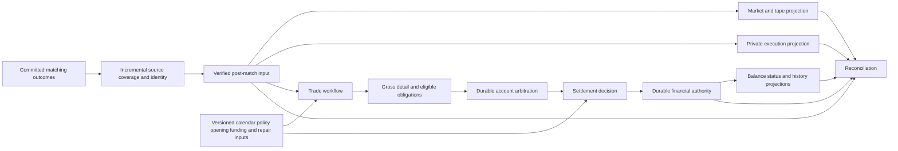

# Calcify — post-match redesign discovery

Status: discovery in progress; Phase 1 outline and match-commitment meaning agreed, implementation details open.
Recorded: 2026-09-28 America/Toronto (2026-09-29 UTC).
Base: `origin/master` at `368a9247b31c8997c5dd9f51aeb88a911adebfe7` (rollback PR #428 merged).
Branch: `codex/calcify-discovery`.

## Purpose and working assumptions

Calcify names Reef's fresh, full post-matching design effort. This is a working assumption to confirm. Goal: work through post-match product semantics, authority, data flow, failure behavior, read contracts, restore, and capacity proof while validating small, independently testable implementations. This document records questions and a proposed logical flow; it is not an instruction to resume the retired implementation.

Existing Reef invariants remain in force unless a later explicit decision amends them: deterministic execution and replay; durable acceptance before `202`; same-lane matching order; immutable matching facts separate from rebuildable reads; auditability and idempotency; simulator use of normal command paths. Earlier redesign scope held Go matching, ingress, pretrade, and matching-outcome format fixed. Confirm those boundaries during Calcify discovery instead of silently expanding them.

## Starting state and evidence

- Rollback PR #428 removed the redesign merged through #406. Active baseline again uses committed venue outcomes, existing Kotlin runtime/lifecycle/market projections, and the trade-to-settlement materializer with normalized lifecycle and ledger facts. `docs/WORK_PLAN.md` is a dated execution snapshot, not Calcify approval.
- C5 qualified venue-core accepted/direct-acked/materialized throughput near 10,000 commands/s in two 300-second samples with projections off. C2 failed sustained 5,000/s full projection, while historical 2,500/s full projection closed. These are different stages and versions; see [`docs/THROUGHPUT_BASELINES.md`](../THROUGHPUT_BASELINES.md).
- PM-S3 treatment accepted/direct-acked 2,776,548 commands in 300 seconds (9,254.07/s) but post-match completion lagged; control/treatment were not a matched comparison. Approximate stage samples do not establish exact final correctness or a single root cause.
- Retired journal candidate had no measured hosted 10,000/s run. One local 50/s, 60-second run accepted/materialized 2,999/2,999 and matched 1,044 first trades only after drain. An instrumented repeat spent 42.66/59.83 loaded writer seconds in synchronous broker-gap checks and 8.66 seconds in repeated full-prefix controls; source-to-journal lag grew in load. Market API's growing replay/proof failed read latency/availability. These observations identify that implementation's hot spots, not a general limit on journals or PostgreSQL.
- Prior synthetic 640-result append timing tested only a write shape. Neither it nor stopped-source drain proves complete, concurrent capacity. Preserve failed-run records and compare matched code/config/workload/host/observer in future tests.

Historical evidence: [projection review](https://github.com/dills122/reef/blob/26efef7bf8c2ad30908fff76dc07b30e0e757924/docs/research/POST_MATCH_PROJECTION_ARCHITECTURE_REVIEW_2026-09-26.md), [institutional research](https://github.com/dills122/reef/blob/26efef7bf8c2ad30908fff76dc07b30e0e757924/docs/research/POST_MATCH_INSTITUTIONAL_SETTLEMENT_DESIGN_RESEARCH_2026-09-28.md), [account arbitration spike](https://github.com/dills122/reef/blob/26efef7bf8c2ad30908fff76dc07b30e0e757924/docs/research/POST_MATCH_ACCOUNT_ARBITRATION_SPIKE_2026-09-27.md), [journal trial postmortem](https://github.com/dills122/reef/blob/26efef7bf8c2ad30908fff76dc07b30e0e757924/docs/research/evidence/post-match-ledger-trial-postmortem-2026-09-29.md), [retirement handoff](https://github.com/dills122/reef/blob/26efef7bf8c2ad30908fff76dc07b30e0e757924/docs/work/handoffs/2026-09-29-post-match-redesign-retirement.md). These are evidence archives, not accepted Calcify design.

## Proposed logical flow for review

Proposal, not decision: source reader proves contiguous partition coverage and exact bytes once, then independently checkpointed consumers process verified input. Routine API reads use indexed projections, never full-prefix replay. Market tape follows committed execution even while settlement is pending or failed. Workflow records each visible allocation/confirmation/affirmation/clearing/novation/obligation transition under versioned policy. Gross execution detail survives any netting. Settlement fixes scarce-account order durably, evaluates both DvP sides against authoritative account state, and atomically records settled effects or typed pending/failure result. Financial commit defines finality; projection arrival does not. Combined reads expose distinct matching and financial as-of positions. Repair/retry adds facts; it does not rewrite execution or prior failure.

## Phase 1 — match commitment

Agreed high-level path: matching engine publishes `VenueEventBatch` to its durable venue-event log; a commitment extractor reads those batches and publishes one `MatchCommitment` per `TradeCreated` to a new durable commitment log; a verifier publishes verified commitments to a durable inbox; a temporary settlement worker consumes inbox records and writes idempotent PostgreSQL receipts. Exact contracts, verification rules, inbox form, and worker failure behavior remain to be designed. Receipt is not financial settlement.

Agreed meaning: `MatchCommitment` states that, according to the matching engine's current facts, a match was made and durably committed. It does not assert verification, participant acceptance, or settlement. Matching output remains `VenueEventBatch`; the extracted commitment is a post-match representation of one trade fact. The source event retains authority for what matching decided.

Agreed extractor handoff: read a committed `VenueEventBatch`, emit one `MatchCommitment` per `TradeCreated` in source order, and publish those records plus the extractor's consumed source offset in one Redpanda transaction. A batch with no trades advances the source offset without a commitment. This follows the existing matching-engine pattern of atomically publishing `VenueEventBatch` and committing its command offset. The transaction covers this broker handoff only; downstream idempotency still needs design.

Agreed identity boundary: commitment identity denotes one exact committed source trade fact, derived from its venue-log record position plus outcome and trade positions within the batch. Matching `tradeId` remains a separate business identifier at the source; its current construction alone does not establish global uniqueness. Exact ID encoding, source generation, provenance fields, and collision/conflict rules remain open.

Agreed storage principle: each stage owns its facts once and downstream stages persist durable links rather than repeat the matching payload or source metadata. Commitment identity should encode enough source location to find the original trade fact; batch ID and checksum stay with the venue event batch instead of being copied into every commitment. Verification and temporary settlement outputs should likewise refer to commitment identity, with only facts they themselves own. Link-only records require source retention or an authoritative archive for as long as replay/audit needs them; exact encoding, retrieval path, retention, and archive policy remain open.

Agreed archive direction: design source references and resolution so an optional, configurable archive can serve original venue-event facts later. Archive is not required to build or run Phase 1. Without archive, broker retention and the declared replay/audit window must remain consistent with downstream links; expiry must not be treated as successful replay. With archive enabled, source batches must be durably copied and verified before their broker copies may expire. Archive format, retention periods, operational controls, and proof gates remain open.

Agreed no-archive scope: replay promise is run-scoped, with a configurable window rather than indefinite source retention. This defines logical availability, not per-run physical deletion: current venue-event topic is shared, and `VenueEventBatch` has no top-level run ID. Exact run-close definition, window start/end, retention safety margin, and how broker-wide retention meets all active run promises remain open.

Agreed retention constraint: no-archive Phase 1 needs an enforced maximum run duration and a configured post-close replay window; broker retention must cover the oldest source fact through run duration, replay window, processing lag, and safety margin. Topic-wide time/size retention cannot delete one run's interleaved records independently. A per-run source manifest is not required for this conservative fixed-window guarantee; it may later support exact run proof, archive indexing, or tighter reclamation. Actual limits and monitoring remain open. If those bounds cannot be met economically, optional archive must be enabled for the longer replay promise.

Agreed extractor scaling and order: source partitions are independently owned by extractor instances in a consumer group, with one active owner per partition. Extractor emits each partition's commitments to the corresponding output partition in source order and checkpoints that partition transactionally. Instances may own multiple partitions; adding instances redistributes partition ownership. Cross-partition order is not asserted. Concurrent preparation within one partition may be considered later only if output and checkpoint order remain intact. This does not decide future cross-partition settlement arbitration.

Agreed Phase 1 fast-path direction: extractor already reads the source batch, so it checks source integrity and trade positions once per batch before emitting thin commitment links. Verifier does not reread each source trade during Phase 1; it checks the commitment contract and applies an explicitly versioned, initially stubbed business-eligibility rule. Inbox carries verified commitment links. Temporary settlement worker records processing receipts without claiming financial settlement. Independent source-to-commitment reconciliation should run outside this latency path at a controlled rate; exact proof and resource budget remain open.

Next Phase 1 decisions, in order: exact link encoding and source generation; extractor validation and conflict behavior; verifier outcomes and inbox semantics; temporary worker receipt and atomic checkpoint; run-close/retention guard; replay, reconciliation, and load/failure acceptance gates. Optional archive mechanics can follow without blocking Phase 1.

### Phase 1 delivery rule

Build one small capability at a time. Test each against fixtures and its own failure boundary, then test the assembled path. A slice must be correct for the behavior it claims; it does not need the later product model, archive, operational hardening, or production capacity before the next slice can begin. Keep unfinished stages stubbed or disabled and label their semantics explicitly. The broader CAL decision register is a future design map, not a Phase 1 release gate.

1. **Contract fixture:** choose thin commitment identity and representative zero-, one-, and many-trade source batches. Check byte footprint and deterministic mapping without running the pipeline.
2. **Extractor:** source batch to commitment log with transactional source checkpoint. Test alone, including retry and a small local load.
3. **Verifier and inbox:** start with explicit stubbed business policy. Test using seeded commitment records, then connect extractor output.
4. **Temporary receipt worker:** consume seeded inbox records and write idempotent PostgreSQL receipts. Then run the three stages together.
5. **Incremental stress:** add restart/fault checks and increase rate/duration while measuring each stage's lag and storage growth. Record limits and failures; do not treat an early passing slice as production qualification.

Logical authority and physical storage are separate decisions. Evaluate compact relational transactions, durable ordered log/state-machine designs, and a specialist ledger plus explicit cross-store protocol. PostgreSQL journal is neither presumed nor excluded. A single shared account may impose a real ordered decision floor; batch preparation and durable output must be measured without changing scarce-resource winners.

## Decision register — all open

| ID | Decision to make | Acceptance question |
| --- | --- | --- |
| CAL-01 | Product profiles and obligation semantics | Gross instant DvP, scheduled/netted obligations, partial settlement, pending/fails, repair, and actor permissions: which are required now? |
| CAL-02 | Scope at matching boundary | Can source outcome/coverage contract change, or must Calcify add a sidecar without touching matching output? |
| CAL-03 | Canonical source and control inputs | How are empty ranges, source generations, policy/calendar versions, opening balances, funding, and repair durably ordered and authenticated? |
| CAL-04 | Scarce-account winner and replay | Must matching source alone reproduce cross-partition winners, or is retained post-match admission order canonical? |
| CAL-05 | Financial finality and idempotency | Which commit acknowledges settlement; what exact identity makes ambiguous retry safe; how are four effects or typed breaks atomic? |
| CAL-06 | Read contracts | Required market, participant, financial, and audit fields, access controls, as-of meaning, freshness, response latency, and cross-store presentation? |
| CAL-07 | Recovery and trust | How do crash, stale owner, tamper, missing source, source-only restore, target-only restore, and retention changes fail or recover? |
| CAL-08 | Physical authority | Which storage/runtime topology meets correctness and capacity at fixed resource cost? What falsifies each candidate? |
| CAL-09 | Capacity envelope | Required commands/s, trades/s, hot-account skew, instrument mix, run age, read traffic, failure mix, duration, and headroom? |
| CAL-10 | Cutover and compatibility | What API/storage compatibility, shadow parity, rollback, and migration evidence must precede traffic switch? |

Decision status changes only through reviewed Calcify specification and relevant Reef decisions/contracts. Record alternatives, rationale, and tests with each choice.

## Longer-horizon discovery and delivery topics

These topics are a backlog for the complete redesign, not an ordered prerequisite list for Phase 1 slices.

1. **Product model:** write state machine for both profiles, obligations, netting, partial/fail/repair, and finality. Gate: signed examples and counterexamples for executed-but-unsettled trade.
2. **Authority and order:** specify source/control provenance, exact coverage, cross-partition arbitration, idempotency, and retention. Gate: deterministic scarce-winner and changed-input replay fixtures.
3. **Read and recovery:** define as-of APIs, private/market/audit views, rebuild, fencing, tamper, and independent restore policy. Gate: complete failure matrix and bounded-read design.
4. **Candidate selection:** compare storage/runtime options with same logical contract and fixed workload. Gate: choose small, falsifiable vertical proofs; record rejected alternatives.
5. **First vertical slice:** one source cohort through authority, DvP or typed failure, one market view, one financial view, and reconciliation. Gate: exact values and fault/replay parity before rate claims.
6. **Incremental scale ladder:** local hot/diverse cohorts; aged history; sustained load; mixed reads; fault/restart under load; then matched disposable hosted run. Gate at each step: accepted, materialized, source-covered, workflow-admitted, financially final, and projected rates/frontiers plus in-load backlog slope, API freshness/latency, WAL/rows/CPU/I/O, and complete closed-cohort parity.
7. **Cutover design:** contract migration, shadow comparisons, operator runbook, rollback, and qualification. No production switch implied by discovery or diagnostic pass.

Every executed run gets code/config/workload/host/observer/artifact identity, success and failure record, and explicit correction history per throughput ledger. Numeric targets and exact commands remain open until CAL-09 and candidate topology are agreed. No benchmark has been run for Calcify.

## Next discussion

Resolve only the contracts needed for the next Phase 1 slice, build and test that slice, then continue discovery alongside the following slice. This document should evolve as decisions are reviewed; the longer-horizon flow remains a hypothesis.
