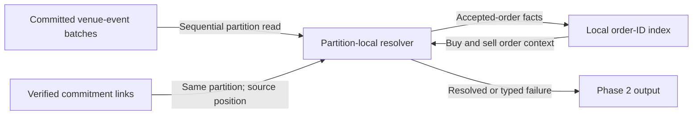

# Calcify Phase 2 — match context resolution

Status: initial planning skeleton; run-scoped book/lane direction accepted under D-042, matching implementation alignment pending. No Phase 2 implementation approved.
Recorded: 2026-09-29 America/Toronto.
Branch: `codex/calcify-phase2-planning`.

## Purpose and boundary

Phase 2 starts with a `CommitmentVerificationPassed` link from the Phase 1 verified commitment stream. Its first useful result is a resolved match context: the exact `TradeCreated` source fact connected to both accepted order facts and their participant/account identities. This is fact resolution, not trade approval, allocation, clearing, balance checking, or settlement. The Phase 1 PostgreSQL receipt worker remains a temporary diagnostic endpoint; Phase 2 consumes the verified stream directly.

**Research gate:** [source-lane review](../research/CALCIFY_PHASE2_SOURCE_LANE_RESEARCH_2026-09-29.md) found present intake routing includes run ID while matching book scope does not. A cross-run trade can reference an order accepted on another source partition. [D-042](../DECISIONS.md#d-042-shard-local-in-memory-hot-book) already requires run-scoped book ownership aligned with routing; user reaffirmed this direction on 2026-09-29. The one-lane diagram below remains conditional on implementing and proving that existing decision.

**Architecture research:** [Phase 2 architecture review](../research/CALCIFY_PHASE2_ARCHITECTURE_REVIEW_2026-09-29.md) compares primary FIX/DTCC and Apache Kafka/Flink guidance with Reef contracts. It recommends a verified-led, sequential source walk provisionally, but leaves runtime choice pending a narrow crash/lag experiment; this document remains the working skeleton.

Matching facts remain authoritative in the venue-event log. Phase 2 may keep a rebuildable lookup index and short-lived decoded batch data, but should not copy trade economics into a second canonical store. Later stages should receive durable source links and only the context fields justified by their access needs.

## Accepted matching prerequisite

- Match scope and routing key are `(runId, venueSessionId, instrumentId)`. Orders from different runs do not trade in one book. Matching book ownership, command lane, venue-event partition, and resolver lane must agree for that scope.
- One active owner orders each book's commands. Physical lane assignment remains stable until an explicit, durable routing epoch and drain/fencing/snapshot/replay handoff; changing partition count must not silently remap an active book. D-042 already defers live migration until those controls exist.
- Current Go matching book key omits run ID despite D-042. Correct this upstream with focused matching, source-partition, and replay fixtures before Phase 2 depends on a local-only order index. A Phase 2 cross-partition lookup is not the fix for this invariant.
- This prerequisite is a narrow matching-boundary alignment, not Phase 2 settlement or a mandate to build live migration now.

## Initial flow

1. Own one source partition and its corresponding verified-commitment partition as one logical lane. Advance a source cursor toward each verified link's `(sourceGeneration, sourcePartition, sourceOffset, tradeOrdinal)`; decode each source batch once and index accepted-order facts encountered along the way.
2. At target batch, select exact `TradeCreated` by flattened ordinal. Reuse decoded batch for subsequent verified links to that batch. Resolve buy and sell order IDs through two local key lookups.
3. Check identity relationships and provenance before emitting a resolved result: trade/order IDs, sides, run, venue session, instrument, source generation, and source position as applicable. A link is never treated as settlement authority.
4. Publish an idempotently identified result with enough durable links for later stages and audit. Exact output event, fields, topic, and atomic checkpoint protocol remain design decisions.

The intended normal path has **no per-match PostgreSQL read, full-prefix scan, or random broker seek**. A source batch is read sequentially once per lane, and each trade needs two local order-ID lookups. Source recovery may require a seek, but repeated seeks per trade are outside this design.

## Lookup state direction

- A compact order-ID index is a **rebuildable projection**, not a second accepted-order authority. Candidate value: source order-fact link plus only immutable fields needed to resolve ownership and validate the trade. Exact key scope, value fields, encoding, and byte budget are open.
- Use partition-local, disk-backed key-value state with a bounded memory cache; do not depend on an unbounded JVM map or remote SQL reads at target rate. Choose the concrete state-store library and changelog/snapshot protocol only after defining replay and failure semantics.
- Keep an order entry while it may match again, including partial fills. Define terminal-state and verified-frontier conditions before eviction; deleting after its first trade is incorrect.
- Index only a successful `SubmitOrder` outcome (`status=accepted` and `result.accepted` present). Current matching code can populate `result.acceptedOrder` from command fields even when submission was rejected; that field's presence alone does not prove acceptance. If accepted-order facts are not available in source order on the same lane before a referencing trade, this flow needs a routing or source-contract change. Verify that precondition against contracts and fixtures before choosing the store.

## Correctness and recovery questions to close

| Area | Required answer before implementation of that slice |
| --- | --- |
| Two-log order | Does Phase 1 guarantee verified links in source order within each partition, including many trades in one batch and restarts? How are duplicates and gaps distinguished? |
| Source coverage | Can every accepted order needed by a trade be recovered by this lane's forward venue-log scan? What happens when source generation changes? |
| Catch-up | If verified link arrives before resolver's source frontier, wait and advance. If source record is absent, corrupt, or expired, stop affected lane with typed failure; never emit a fabricated context. |
| Checkpoint | How do local index updates, source cursor, verified offset, and output survive a crash without losing context or creating a distinct duplicate result? Define replay and idempotency before choosing transaction mechanics. |
| State lifetime | What terminal-order signal and downstream frontier permit safe deletion? What run-close and retention rules bound local state and its recovery source? |
| Capacity | Which rate unit, trade fanout, hot-lane skew, run age, duration, resource envelope, backlog/freshness limit, and recovery time form the Phase 2 gate? |
| Output contract | Which identifiers must be copied for efficient later use, and which should remain durable links to matching facts? What is the exact conflict/mismatch policy? |

## Delivery sequence — small, independently checked slices

1. **Matching alignment and source/ordering fixture.** Enforce D-042's run-scoped book/lane key. Prove cross-run same-session non-match, accepted-order and trade facts, flattened ordinals, partition relationship, and repeated references to one batch. Include resting order accepted in an earlier batch, partial fill, malformed and missing source, duplicate verified link, and restart ordering.
2. **Resolver core.** Sequential source cursor, batch reuse, small local order index, deterministic context resolution. Test with seeded verified links; no settlement behavior.
3. **Durability boundary.** Durable/rebuildable state and idempotent output/checkpoint. Test crashes at index update, output, and checkpoint boundaries, plus stale ownership and source-generation change.
4. **Measured capacity.** Capture source batches decoded, local lookup latency, index bytes/order, cache misses, lag slope, output count/identity parity, CPU, memory, disk I/O, and recovery time. Run hot and spread-lane cohorts, high-fanout batches, aged state, and sustained load. Do not infer Phase 2 capacity from Phase 1 or venue-core results.

Target: **near 10,000 verified commitments resolved per second, sustained**. Preserve incoming command rate separately in every workload report; a one-trade-per-crossing-pair fixture would require about 20,000 submitted order commands/s to create 10,000 trades/s. Current C5 proof covers venue-core commands/s with projections disabled; Phase 1 Calcify's local five-minute diagnostic covers 300 crossing pairs/s on one hot lane. Neither qualifies this Phase 2 resolver. See [throughput ledger](../THROUGHPUT_BASELINES.md) and [Phase 1 implementation evidence in PR #430](https://github.com/dills122/reef/pull/430).

## Evidence and design status

Apache Kafka documents local stream-table joins as a way to avoid a remote database request per record, and disk-backed local state with compacted changelog recovery. These are architectural precedents, not a decision to adopt Kafka Streams: [joins](https://kafka.apache.org/43/streams/developer-guide/dsl-api/), [state stores](https://kafka.apache.org/43/streams/developer-guide/processor-api/). LMAX describes in-memory, single-writer exchange processing, but does not document this specific post-match join: [Disruptor paper](https://github.com/LMAX-Exchange/disruptor/blob/master/src/docs/asciidoc/en/disruptor.adoc).

Agreed performance direction: sequential source consumption and local order lookups, with no SQL reads in normal per-trade path. Strict partition locality depends on implementing and proving D-042's matching scope. Proposed resolver details remain open until checked against source contracts and a reviewed Phase 2 output/recovery design. No Phase 2 benchmark has been run.

## Next discussion

Discuss the recovery trade-off in the [architecture review](../research/CALCIFY_PHASE2_ARCHITECTURE_REVIEW_2026-09-29.md): verified-led worker with custom local/Kafka checkpoint versus managed two-input Processor topology with bounded pending state. D-042 alignment remains the implementation prerequisite. Settle output field budget and availability rule before choosing a store or enabling deletion.

Initial source check: current direct matching builds each `VenueEventBatch` from ordered command outcomes; `SubmitOrder` attaches `AcceptedOrderFact` to its result, and a trade carries buy/sell order IDs but no participant/account IDs. The acceptance guard above is required. Intake hashes `runId|venueSessionId|instrumentId` to choose a command partition, so same-context submissions route together. We still need to prove both trade sides always share that context, venue-event partition follows it, and verified links preserve source order under replay. See [`processor.go`](../../services/matching-engine/internal/streamdirect/processor.go), [`order.go`](../../services/matching-engine/internal/domain/order.go), [`StreamCommandContracts.kt`](../../services/platform-runtime/src/main/kotlin/com/reef/platform/api/StreamCommandContracts.kt), and [Phase 1 contracts in PR #430](https://github.com/dills122/reef/pull/430).
