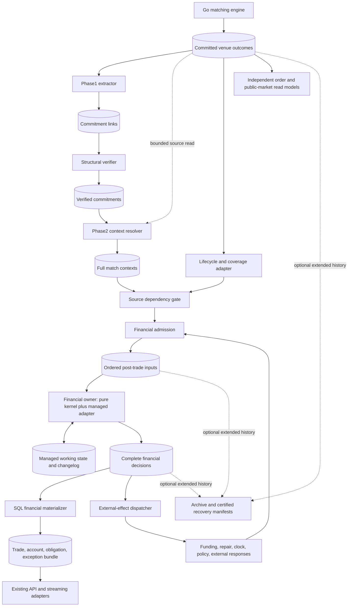
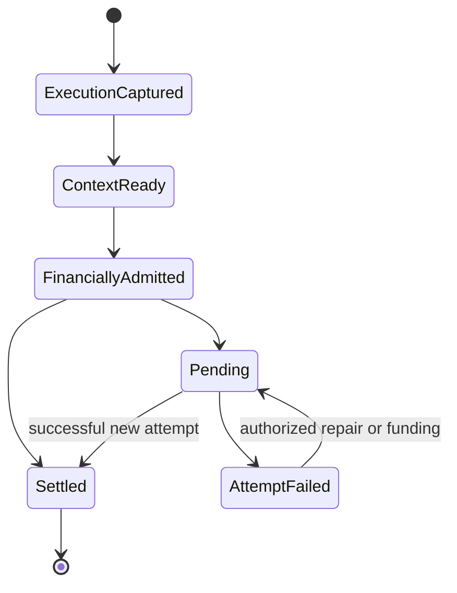
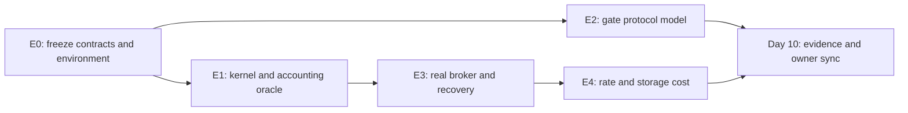

# Calcify — proposed system architecture and proof plan

Date: October 2, 2026. Status: **proposed, awaiting proofs and owner decisions**.
Source baseline: `16e15340919bc9330afbbfec0f9b089115f3e57f` (master after #461).
No runtime implementation or accepted ADR change accompanies this RFC.

Companions: [research / review reconciliation](../research/CALCIFY_SYSTEM_ARCHITECTURE_RESEARCH_2026-10-02.md),
[supplied proposals](../research/calcify-system-architecture-inputs/README.md),
[current Phase1/2 wiring](../CALCIFY_PHASES_OVERVIEW.md),
[accepted decisions](../DECISIONS.md), [throughput evidence](../THROUGHPUT_BASELINES.md).

## 1. Decision and scope

**Recommended candidate:** preserve source capture/resolution; build one small,
deterministic financial kernel per closed financial domain; use managed Kafka
Streams state/transactions and complete financial result records; project SQL
independently. Prove it before expanding workflows. Diagnose failed proofs by stage;
compare a Postgres-authoritative adapter when financial mutation/commit/recovery or
total operational cost is the demonstrated limitation.

This proposal covers execution capture through workflow, obligations, settlement,
account bookkeeping, reads, effects and recovery. Matching algorithms stay in Go;
financial orchestration stays in Kotlin. Source identity, lifecycle coverage and
ingress health are explicit interfaces with matching and simulation.

Adoption would amend D-009 / technical design's relational authority boundary.
Until owner selects that boundary, existing PostgreSQL authority is unchanged.
Prototype results do not permit two financial authorities or a legacy cutover.

Target from supplied RFC: 10,000 **trades**/s for600s and7,500/s for900s with declared
replay contract. Reconfirm workload and latency/freshness/recovery limits before
qualification; proposed p95 values in older RFC are not accepted SLOs. Trade capture
rate, decisions/s, postings/s, settlement rate and commands/s remain distinct.

## 2. Flow: short physical path, explicit business steps



New boxes are responsibilities, not mandatory services/topics per business step.
Initial source gate and admission can share one role. Financial kernel modules
share a serialized owner. SQL projector/effect dispatcher run independently.
Reuse platform-runtime packaging, API auth/entitlements and existing Go load paths.
No deployment per allocation, affirmation, clearing or settlement stage.

| Piece | Owns | Does not establish |
| --- | --- | --- |
| Matching / venue history | Immutable executed/accepted/rejected/amended/cancelled outcomes | Account settlement |
| Phase1 | Durable trade locator; structural verification policy | Trade eligibility or financial finality |
| Phase2 | Assembled immutable source context and provenance | Mutable balances, net obligations or clearing |
| Lifecycle / coverage adapter | Non-trade source facts and explicit membership | Financial effects by itself |
| Gate / admission | Dependencies, routing, business input identity and durable order | Successful business outcome |
| Financial owner | Workflow/obligation/reservation/journal/attempt decisions | External legal finality |
| SQL materializer | Relational business bundle plus progress | New financial decisions |
| Effect dispatcher | Delivery/reconciliation of committed intent | Exactly-once external effects without provider protocol |
| Archive | Availability/integrity of promised history | A new editable authority |

## 3. Authority, identity and completion

### 3.1 Authority contract

Candidate authority is committed `PostTradeCommitV1` plus published immutable
policy/reference versions. Managed state is its efficient working representation.
`evolve` must reconstruct **all** future-decision-relevant state. SQL may mirror it;
SQL operators cannot alter balances/workflow behind the kernel. Repair, funding,
policy activation and account changes enter ordered input.

The alternative is explicit DB authority: one Postgres transaction owns financial
state, journal, dedup, domain sequence and outbox; broker results are published
copies. Never call both authorities primary. [Research comparison](../research/CALCIFY_SYSTEM_ARCHITECTURE_RESEARCH_2026-10-02.md#3-compare-credible-financial-authorities).

### 3.2 Identities

| Identity | Scope / lifetime |
| --- | --- |
| Source locator | Generation + topic UUID + partition + offset + ordinal; exact physical provenance |
| Internal order | Run + order ID, immutable for entire run in first Calcify-enabled slice; lane/generation validate provenance |
| Execution | Authoritative matcher business execution ID plus run/session/instrument scope; independent of transport batch cuts |
| Business action | Execution namespace + domain + command/action ID; request digest is stored value, never part of unique key |
| Attempt | Obligation/instruction + attempt ordinal; retry same attempt is dedup, authorized repair starts new attempt |
| History record | Domain + monotonic `historySeq`; orders every durable record, including technical staging |
| Business decision | Domain + stable action/attempt/continuation identity; canonical `businessSeq` and preceding business sequence |
| Journal / effect | Stable business decision ID + local ordinal; never derived from history sequence, broker batching or CPU yields |

Action dedup stores original normalized request digest, pending/completed status,
selected evaluation context and original disposition reference. Same key/digest
returns prior result or pending status; same key with different digest conflicts
without financial change. Normalize caller request before resolving policy defaults;
retry retains first action's selected policy/reference versions rather than evaluating
under newly activated defaults. Execution namespace is stable across worker takeover.

Economic uniqueness is separate: one execution creates its obligations once; every
settlement consumes only obligation's remaining quantity/amount. New action ID,
attempt ordinal or policy version cannot discharge an already settled obligation
again. Corrections/reversals are distinct authorized actions with explicit semantics.

PR #461 already supplies authoritative run to resolver lookups. Remaining first
slice recommendation: prohibit internal order reuse during run, enforce upstream
before engine acceptance, and test restore/terminal eviction. If owner needs same-
run reuse, introduce explicit acceptance incarnation in authoritative outcomes and
trade references, with temporal/sequential resolution. No guessing from latest row.

Audit matcher execution ID construction before promising batch-invariant seed
reconstruction. E0 verified current `matching-fact-v2` construction length-frames
run/session/instrument/order IDs, incoming book sequence and match ordinal before
hashing; delimiter and snapshot/rollback regressions pass. Earlier concatenation
concern is superseded by existing matcher implementation, not a sprint source fix.
Keep repeated-fill/modify, acceptance-lifetime and publication-grouping checks explicit.
Existing locator stays provenance;
financial action dedup must not be derived only from a Kafka offset or random UUID.

Do not use Protobuf bytes as a cross-version canonical business digest. Specify
field order, exact units, normalized enums, absent/default rules and sorted repeated
sets; exclude transport timestamps/locators. Keep exact-byte checksums separately.
[Protobuf guidance](https://protobuf.dev/programming-guides/serialization-not-canonical/).

### 3.3 Completion vocabulary



Capture/verification failure is a separate technical disposition. Valid execution
always persists as execution plus pending/exception/obligation. Unsupported routing
or insufficient resources cannot erase it. `RESOLVED` means exception closure;
`SETTLED` requires financial proof. SQL visibility is another progress dimension.

Broker checkpoint can mean staged input, not completed work. Track staged inputs,
completed coverage and archived coverage separately. Frontier is a verified prefix
or manifest, never simply highest seen offset. Kafka offsets may legitimately skip
integers; use explicit application membership.

## 4. Ownership and scale

First financial domain: **one isolated simulation run**, all its accounts/assets,
reservations, obligations and policies. No resources shared between those domains.
Preflight declares membership. Admission checks every referenced resource against
that registry; cross-domain execution remains durably pending/unsupported, with no
partial account change. Do not silently create/merge domains after execution.

Domain must be transitively closed over operations requiring atomic financial
change. A↔B and B↔C trades can connect all three accounts. Shared settlement/cash
accounts or clearing resources can connect instruments. Instrument/account sharding
does not preserve invariants merely because Kafka can atomically write records to
multiple partitions. One broad market may remain one hot owner.

Map domain to fixed partition in registered input/result namespace. Domain
sequence is managed state, committed with results. One approved Streams
application ID and exclusive write permissions fence owners through managed task
assignment; an unrelated application ID must not gain writer access. Takeover
uses framework fencing plus registration/version checks. No manual process races.

Partition count, routing version and namespace cannot change under active domains.
Reshard later via quiesced certified cut and explicit epoch activation. Test stale
worker expiry/resume; registry epoch alone is not Kafka producer fencing.

Logical domain, broker partition, Streams task, thread and process differ. Threads
can couple latency/fault recovery across tasks. First version may stop whole source
lane on unknown corruption. Offer stronger isolation only after known-domain routing
and recovery tests. Dedicated process/task for a hot domain is an operational option.

Scale independent domains horizontally. For shared market, measure maximum hot-
domain workload/state age first. Diagnose failed workload by stage before choosing
runtime/authority comparison. Candidate SQL alternative can
serialize resources transactionally; single process owner is not a universal rule.

## 5. Source dependencies and admission

### 5.1 Source extension

Phase1/2 remain source-only foundation. Add versioned lifecycle envelope for relevant
acceptance, amendment, cancellation and source progress, and versioned coverage
manifest for resolved trade contexts. Reservations based on order lifecycle require
these facts even for zero-trade batches. Preserve original facts and links; full
context carries common immutable facts once so financial kernel needs no per-trade
broker seek or SQL join.

Manifest identifies exact source-slice members, logical outcome sequence, trade
ordinals, order identities, run/domain, required revisions and terminal technical
dispositions. Coverage closes only when each declared member has its disposition.
Policy-defined dependency scope includes prior fills/reservation changes for same
order and applicable revisions; do not rely solely on shared batch membership.

Existing verified-led source reader can remain for trade resolution initially.
Non-trade/coverage capture is new explicit responsibility, not an assumption that
existing resolver emits every lifecycle fact. Optimize source prefetch or extractor
micro-batches separately only when measured; preserve output/checkpoint atomicity.

### 5.2 Bounded gate with a closure path

Gate persists pending dependency state and admits only complete eligible actions.
For known valid routing, domain B may advance while A waits only when chosen source
access protocol can reach B with bounded resources and satisfy its dependencies and
arbitration. A source-ordered baseline can block B behind A; declare that isolation
limit. Unknown coverage/routing corruption blocks whole lane in V1.

Proposed liveness mechanism:

1. Closure traffic remains reachable while new admission is paused: either proven
   bounded source-prefix processing or independently serviced completion/dependency
   channel for admission-ahead. Completions cannot sit exclusively behind paused
   headers. Channels can be co-partitioned inputs, not separate deployments.
2. Before opening window, validated header declares bounded member count/bytes and
   reserves pending plus completion capacity. Bound maximum source fanout, context
   bytes, active windows and already-fetched poll suffix. Limits are preflight
   workload contract; a violated executed workload is retained and stops safely.
3. At high watermark, pause opening new windows; keep servicing completions for
   already admitted windows. Progress/closure records have reserved capacity and
   cannot depend on reading another new-work header first.
4. Persist every staged member and window frontier transactionally. Crash/restore
   must retain incomplete windows and exact input resume positions.

Compare **source-ordered bounded slices** with **durable window credits** before
choosing gateway implementation. Source-ordered baseline opens only reachable
source-prefix windows, reserves full closure budget, and drains their completions
before admitting more slices; manifest/dependency closure must still be proved.
It accepts head-of-line blocking. Credits are a protocol candidate, not a required
new subsystem. Select additional coordination only for a measured fit gap.

Credit candidate: gate grants completion adapters
permission for exact opened window/membership/byte budget. Grant shares gate's
state transaction, carries stable namespace/window/grant ID plus separate current
owner epoch, and is read committed;
duplicates do not grant extra capacity. Adapters keep uncredited work in retained
upstream history and emit only granted members, with reserved seal/control bytes.
Every admitted window's full completion budget remains available until closure.
Existing context output can remain upstream; credit-aware adapter belongs to source
gateway role and need not copy full facts into another persistent payload.

No valid unopened-window burst may consume admitted completion capacity. Credit
protocol must also cover already-fetched suffix and dependencies needed for closure;
opening a window whose required dependency cannot be serviced is forbidden. Restore
reissues same outstanding grants from certified state, not fresh capacity. Alternative
source-ordered implementation requires equivalent bounded-closure proof.
Deliberate credit violation takes controlled integrity-fault path preserving source
executions; it does not carry a healthy-lane progress promise.

Permission does not establish data reachability. Before implementing credits,
choose source-prefix grants, bounded recoverable bypass staging/index with reserved
capacity, or selective reads with certified checkpoints and measured I/O. FIFO
`A1,A2,A3` ungranted before granted `B1` must either be excluded by grant policy or
have a finite bounded path to B1. Required completions/dependencies cannot require
blocked new-work capacity. Prove this for every allowed upstream ordering.

Reassignment preserves grant identity and consumed-member accounting. Account for
already-produced/in-flight completions and release capacity only on certified closure
or explicitly fenced delivery. Wall-clock expiry cannot reclaim a grant while old
completions can still arrive. Test gate/adapter crashes at each grant lifecycle edge.

This is a candidate algorithm with mandatory adversarial liveness proof, not a
ready-made Streams property. If upstream cannot identify/bound completion traffic
without reading paused headers, redesign the gate before live implementation.

Budget whole process: client fetch/decompression, decoded objects, managed state,
producer buffers and in-flight work. `max.poll.records` does not bound underlying
fetching; fetch byte limits can admit an oversized first batch. Pin broker record
limits and measure memory amplification. [Kafka consumer configuration](https://kafka.apache.org/43/configuration/consumer-configs/).

Consumer pause alone does not throttle intake. Export lag/headroom health with
hysteresis and a measured reaction budget; front door stops new durable admission
when backlog approaches retained-capacity bounds. Reserve room/drain path for
already accepted/matched work. Never drop an execution to reduce lag.

### 5.3 Durable input and arbitration

`PostTradeInputV1` carries domain, business action ID/digest, immutable payload or
durable content reference, source causation/dependencies, policy/control identity
and logical tick where relevant. Financial input log is the one canonical order
per domain. Its actual committed ordering is authority in live interactive mode.
All state-changing inputs pass this boundary, including funding/repair/clock and
external responses. Durable acceptance acknowledgement precedes HTTP202.

Business execution accepts only `KernelReadyInput`: every calculation fact and
selected immutable policy/reference version is locally available and validated.
Initial candidate embeds compact financially sufficient facts in admitted payload,
with source links for provenance; no repeated full accepted-order payload required.
References used only for lineage need not be dereferenced by `decide`. A calculation
dependency cannot hide a synchronous broker/SQL/network read inside kernel.
Reference-only calculation payload is a later option requiring bounded managed
preparation, digest/identity checks and certified ordering/recovery before execution.
Retain required payload/policy through active obligations, staged inputs and declared
replay promise. Missing content stops readiness; a digest cannot reconstruct it.

Live admission merges ready source actions and authorized controls; later unseen
source facts are not assumed to have won arbitration. Controls targeting a trade
declare its execution dependency. A live funding race is resolved by recorded
admission order, not by reconstructing wall-clock arrival after the fact.

Deterministic simulation mode instead uses declared tick closure and stable producer
membership, then a versioned tuple order (tick, phase, producer ordinal, logical
source/action sequence). Missing participant/source coverage stalls that tick.
Bot observation barrier pins an immutable tick snapshot, exact as-of business view,
or frozen observation/action cut for all participants, including valuations and other
strategy inputs. Minimum `businessSeq >= N` is only freshness, not an exact snapshot;
it cannot establish seed reproducibility. Record or exclude nondeterministic inputs.
A seed alone is insufficient if strategies see arbitrary SQL states. Do not claim this
mode implemented by introducing a deterministic reducer alone.

No total order across unrelated domains required. Multi-source delivery to gate can
vary; legal interleavings must yield same admission sequence in deterministic mode.

## 6. Financial kernel and managed adapter

### 6.1 Pure decision and reconstruction

```text
decision = decide(state, orderedInput, immutablePolicy)
validate(decision, state, policy)
encodedDecision = encodeBounded(decision)
nextState = evolve(state, decision)
commit(managed nextState, decision output, staged input position)
```

Kernel performs no network/SQL calls, system-clock reads or uncontrolled random
draws. Use exact integer asset units, checked wide intermediate multiplication,
explicit price/quantity scales and versioned rounding/fee rules. Cash balances
and security quantities never share a ledger unit. State access is indexed by
known IDs; due work uses `(logicalDueTick, priority, stableWorkId)` index, not a
full obligation scan every tick. Pure functions use indexed read view and bounded
mutation delta; no full-domain copy per trade. Measure touched keys/rows.

Business decision read view excludes future staged inputs, delivery cursors and
history sequence. Executor uses those only to preserve canonical readiness/order;
financial rules cannot inspect them to change economics. Complete owner state has
business state plus delivery state, both reconstructible by `evolve`.

`PostTradeCommitV1` has:

- Domain/history sequence and prior history sequence; record kind and input causation.
- For business records: stable decision ID, business sequence/prior business sequence,
  action/attempt/continuation identity and source causation.
- Kernel/schema/policy/reference versions, logical time and input disposition.
- Complete semantic workflow, obligation/instruction/attempt and exception changes.
- Exact journal groups/legs and reservation acquire/release/consume changes.
- Due-work enqueue/dequeue and continuation phase/cursor changes.
- Account/entity version transitions, dedup result and external intent/status changes.
- Business semantic digest excluding delivery-only fields; separate exact-history
  integrity checksum including staging and original bytes where stored.

Events/deltas must let `evolve` reconstruct balances, reservations, outstanding
obligations, workflow waits, attempts, policy activation, logical clock, due queue,
dedup/effect state and staged-but-unfinished input. Do not duplicate opaque RocksDB
bytes in every result or repeat full source history. If semantic deltas are not
sufficient, fix the contract before calling results reconstructible authority.

Keep accepted source facts in source/context area; financial state references
execution/context identities and stores only mutable economics it owns. Account
images for SQL may be derived from same decision; any optional acceleration images
must be validated against `evolve`, never an independent mutable truth.

### 6.2 Small first business model

Proof uses constrained run, published opening resources, one cash currency and
one security asset per trade, gross simulated DvP, no credit/fees/netting/external
finality. Seed funding is journaled against an explicit opening-resource account;
conservation checked per asset and journal group. No implicit infinite funding.

Example: buyer cash100, seller shares10; trade5 shares at10 cash/share. Decision
records execution/workflow, obligation and instruction, attempt, cash buyer−50 /
seller+50, shares seller−5 / buyer+5, and settlement. Both resource checks pass
before any mutation. Insufficient cash **or** shares produces pending obligation
and failed attempt, no one-leg debit, then an authorized funding/repair action can
start a distinct attempt. A duplicate execution/action repeats no effects.

Keep P1 incremental: **P1a** proves unreserved gross DvP; **P1b** adds reservations
only after fixture policy is frozen. P1a resource competition is not reservation
proof. Before P1b, specify owner/creation authority, deterministic priority, which
operation can consume own hold, partial-fill residual, release on lifecycle closure,
failed-attempt behavior and withdrawals, separately for cash/security units.
Proposed no-credit rule: available balance excludes holds operation cannot consume;
own-hold consumption stays within reservation and obligation residuals. Fixture:
cash100, A hold80, A settles50 → cash50, A hold30, unrelated available20. This rule
is a proposed fixture contract, not an accepted venue-wide reservation policy.
Live lifecycle reservations cannot activate until P1b and source dependencies pass.

Instant profile may emit several semantic stages in one committed decision. Same
kernel later supports delayed/realistic profiles through policy and durable waits.
Allocation/affirmation/clearing semantics are not claimed complete by naming events.
Gross journal proof precedes netting. [FIX](https://www.fixtrading.org/online-specification/),
[exchange-of-value principle](https://www.bis.org/committees/cpmi/pfmi/overview).

### 6.3 Business atomicity and transaction failures

Validate complete decision before managed mutations/forwarding: resource sufficiency,
per-asset conservation, balanced posting groups, legal transitions, identities,
versions, amounts/overflow, policy and envelope limits. Expected failure is typed
decision with only allowed changes (e.g. pending obligation/attempt).

Unexpected mutation/storage/serde/forward failure propagates to runtime, aborts
entire uncommitted transaction and stops/reinitializes affected processing. Never
catch it into a completed fault record after partial financial changes. Rebuild
in-memory caches after rollback; cache cannot remain source of truth for aborted
state. Test several decisions in one transaction, since all must replay after abort.

Pin permitted deserialization, processing and production exception handlers for
actual client version; startup rejects configurations that skip financial inputs or
outputs. Fault tests must prove unexpected failure cannot advance committed state
without its complete decision. A `context.commit()` request is not transaction
completion. [Kafka Streams handlers](https://kafka.apache.org/43/streams/developer-guide/config-streams/).

Commit interval bounds visibility/cost, not business action identity. Independent
read-committed observer checks state effects and complete result agreement.
Broker atomicity is limited to its resources/failure model.
[Kafka EOS](https://kafka.apache.org/43/streams/core-concepts/).

### 6.4 Logical time and continuations

`ClockAdvanced` opens a logical work phase. Process due items in fixed tuple order;
complete that phase before later state-changing input takes effect. Wall-clock
punctuation can request CPU work, never choose financial order. Yield records durable
phase/cursor and stages subsequent inputs in bounded managed queue. A large phase
can span transactions; each continuation is a complete decision with stable ID.

Whenever transaction advances input checkpoint past unfinished input, emit complete
nonterminal `InputStaged` authority delta in same transaction. It records envelope
or retained content reference/digest, canonical queue position, dependencies and
phase context. `evolve` restores that queue from results. Staged action dedup means
pending, not completed: later `InputDequeued` plus business decision atomically
removes queue item and records terminal disposition/effects. Identical retry cannot
queue twice or suppress eventual execution. `historySeq` identifies each durable
history record; stable business identity identifies eventual
financial effect. Staging/dequeue transport records do not advance `businessSeq`
or account/workflow versions merely because delivery schedule changed. Ordinary
immediate inputs need no separate staging record.

Each logical due-work item/attempt has canonical business decision identity, e.g.
`(domain, clockActionId, phaseId, dueWorkId, attemptOrdinal)`, with journal/effect
ordinals within it. Phase start/completion identities are fixed logical transitions.
CPU yields cannot regroup business decisions or allocate new IDs; transactions may
batch several unchanged decisions. `businessSeq` advances only in canonical logical
action order, independent of technical staging/cursor records. Duplicate delivery
adds no new financial effect or business version.

Recovery of existing history reproduces its exact history order and full owner
state. Recompute from same ordered admissions may have different optional staging
records/history sequences, but must preserve canonical business decision sequence,
IDs, semantic digests, journal/effect IDs and business state at equivalent business
frontiers. Delivery queues/cursors are compared for correct reconstruction within
each history, not byte equality between different schedules. Seed-only comparison
also excludes physical locators; source business identity contract still applies.

For clock→two settlements→funding, funding cannot overtake second settlement because
CPU budget changed. Zero-delay self-rescheduling must terminate or move to later
declared phase/tick; policy validation rejects unbounded recurrence. Bound due work
per tick/pending admissions in preflight. Capacity exhaustion suspends new staging
while draining due work; it cannot prevent the phase's own continuation from running.

Keep pending input staging replayable and covered by restore cut. If phase completion
cannot fit required liveness/latency bound, candidate/profile fails proof; do not
quietly change order to gain rate. Future API commands can declare cancellation or
repair at an explicit phase boundary rather than bypass ordering.

## 7. SQL reads, APIs, public data and external effects

Financial SQL materializer consumes committed decisions. In one PostgreSQL
transaction: validate projection owner epoch, insert unique journal/decision rows,
apply expected entity versions, update trade/account/obligation/exception bundle,
and persist exact input checkpoint. SQL checkpoint governs restart; broker group
position is delivery hint. Crash after SQL commit before broker acknowledgement
replays idempotently. Conflicting existing identity/digest fails; no silent overwrite.

Use bounded batches, prepared writes and minimal indexes. COPY/staging/coalesced
account images are candidates only with exact journal/version/checkpoint equivalence.
No broad dirty-queue rebuild, per-trade history scan or SQL lookup in financial
decision path. Partition projector work without splitting one consistent financial
bundle; measure account-row contention and WAL.

API reads one committed bundle snapshot for coupled financial view. Return progress
token `(namespace,epoch,domainBusinessSeq)`; cross-domain views return vector.
Projector separately checkpoints history position, including staging-only records;
technical progress alone cannot imply new financial bundle/version. A
request requiring fresher result waits bounded time or reports pending/stale status;
it never silently joins incompatible trade/account versions. Separate public
order/market-data projections can consume source history independently. Public
data cannot expose private allocation/account facts. Reuse API adapters and auth.

Coupled reads use one SQL statement or a shared transaction snapshot, e.g. a read-only
REPEATABLE READ transaction. Multiple statements in default READ COMMITTED can see
different committed cuts even inside one transaction; read bundle and progress token
from same snapshot. This provides consistency, not exact seed-mode observations.
[PostgreSQL isolation](https://www.postgresql.org/docs/current/transaction-iso.html).

Effect intent is part of financial decision; dispatcher calls external provider
using stable effect ID. Response/timeout/reconciliation re-enters durable input.
Unknown acknowledgement is a state requiring query/reconcile, not a reason to make
new transfer ID. Financial runtime cannot promise atomic external cash/security
movement from local Kafka commit. Offline reconstruction/audit never dispatches
effects. After certified operational activation, reconcile all committed nonterminal
intents under original stable effect IDs; use safe idempotent delivery where provider
protocol permits it. Missing recorded acknowledgement does not prove never sent;
preserve unknown outcome, query/reconcile, and never bypass it with replacement ID.
Before activation, test crash before send, after send/before reply, and after reply
before recording outcome. External effects stay outside initial P1 model.
Real-money integrations require separate finality/DvP contract and proof.

## 8. Recovery, retention and state retirement

### 8.1 Registered history and bootstrap

Manifest records every required source, context, lifecycle/coverage, credit/control,
financial input/result and changelog namespace/topic UUID, routing
and schema/kernel versions, domain membership, application ID, genesis/restore
mode, exact start/resume positions, policy versions and required history coverage.
Credit namespaces are required only if selected gate uses credits.
Registration must distinguish brand-new empty histories from partial retained
history. Missing checkpoint does not authorize starting at today's earliest offset.

No auto recreation/reset of active authoritative topics. Ordinary UUID checks
detect mismatch but do not prevent in-flight deletion; restrict administrative
permissions and coordinate stop/cut/restore. Current Streaming transaction page
labelled v26.2 describes deletion narrowing in-flight transaction scope and warns
remote recovery may lack transaction atomicity. Retrievals have differed; retain
Cloud/legacy sources and require deployed-version proof, not current-page inference.
[Current Streaming transactions](https://docs.redpanda.com/streaming/current/develop/transactions/),
[Cloud transactions](https://docs.redpanda.com/cloud-data-platform/develop/transactions/),
[Streaming23.3 transactions](https://docs.redpanda.com/streaming/23.3/develop/transactions/).

| Failure | Continuation rule |
| --- | --- |
| Worker loss, histories intact | Managed fencing, promote standby or restore; resume committed positions |
| Local RocksDB loss, compatible changelog intact | Framework restore plus exact catch-up; existing result history retained |
| Changelog unavailable, certified result/snapshot coverage intact | Offline isolated reconstruction, compare authoritative decisions/state; certified cut then coordinated activation |
| Cluster/topic restoration | Coordinated cut of all required histories/state/policies; prove sequences and staged work consistent before promotion |
| Missing required source/decision/control history | Refuse continuation; surface unavailable scope, do not relabel latest available data genesis |

Reconstruction cut certifies domain history and business frontiers, corresponding input resume
positions, pending staged envelopes/dependencies/continuation phase, logical clock,
policy activation, reservations, due/effect/dedup state, gate windows/outstanding
credits and adapter resume positions, plus checksums. Inspect SQL
progress and rebuild/wait if incompatible. Build in isolated namespace with effects
disabled; never reset live app then re-emit old settlements to existing outputs.
Archive chunks copied at unrelated instants are not a certified consistent cut.

Physical resume positions form a topic/partition vector, not per-domain sequences.
For every resumed partition position, all earlier application records must be
represented exactly once in completed outcomes, explicit terminal dispositions,
active phase state or durable pending work. All colocated domains and relevant
transaction boundaries must be compatible with that cut. Numeric offsets across
different partitions need not match. Mixed-age domain snapshots require certified
catch-up/replay suppression before activation; choosing latest snapshot per domain
is not a resume protocol. Managed task/changelog restore and offline result rebuild
each must establish this invariant. [Streams tasks](https://kafka.apache.org/43/streams/architecture/).

### 8.2 Optional archive, mandatory availability

First bounded run may use broker history only. Before starting, set maximum run
age, unresolved lifetime, replay-after-close window, outage/catch-up allowance,
time **and byte** retention plus margin. Admission must reject an unsupported
retention contract, not wait until history expires. Shared topics cover oldest
required dependency across active domains; compacted current state is not audit
history. Long-lived acceptance may outlive recent trade rate.

Beyond broker guarantee, require verified archive/other complete authority before
promising extended retention. Store original sources, inputs, results and immutable
policy/reference artifacts with range/membership/digest manifests. Optional sealed
semantic snapshots speed recovery. Provider retention/WORM settings must be verified;
S3 compatibility alone is not proof. [Object Lock](https://docs.aws.amazon.com/AmazonS3/latest/userguide/object-lock.html).

Retire working state only after run closure, completed source/financial coverage,
zero unresolved obligations/effects/continuations or explicit transferred ownership,
expired allowed retry window and sufficient recovery history. Business IDs stay
deduplicable throughout retry promise. Historical deletion is separate policy.
Do not replace per-commitment done keys with max offset until explicit membership
proves every earlier item terminal; delete acceptance rows only when dependencies
cannot reference them. Keep growth budget per run/attempt, not infinite append-only
working state.

## 9. Future capabilities within same boundaries

| Capability | Contract before implementation |
| --- | --- |
| Allocation / confirmation / affirmation | Party roles, revision identity, quantities, rejection/correction, wait state and deadline policy; distinct from capture |
| Clearing / novation | Explicit accepted obligations/party substitution; credit/default rules before calling it CCP behavior |
| Netting | Closed eligible membership, period/cutoff and key; retain gross trades, sealed manifest and exact allocation to net obligations |
| Large netting sets | Bounded chunks staged before validated seal; activation cannot expose partial economic set; consistent recovery and archive coverage |
| Deferred / partial settlement | Stable obligations/instructions/attempts, reservation priority and remaining units; each partial DvP unit conserves assets |
| Fees / calendars / rounding | Published versions and activation order; exact remainder handling, DST/calendar edge cases |
| Exceptions / repair | Authorized recorded actions, new attempts, immutable corrections/reversals; no direct DB balance editing |
| External integrations | Intent, idempotent provider protocol, reconciliation/unknown result, simulated vs external finality |
| Operations | Read progress, pending reason, repair history, lag/headroom and history coverage; promote only against certified cut |

Separate capability slices after first useful path; no requirement to complete this
table before kernel proof. Netting reduces eligible obligations, not executed-trade
history. [DTCC CNS](https://www.dtcc.com/products-and-services/clearing-settlement-services/equities-clearing/cns).

## 10. Proof plan and stop conditions

Proofs below are **unrun** for new financial kernel. Earlier resolver tests are
prerequisite evidence, not substitute. Each proof is a small reviewable delivery;
agree its fixtures/bounds before implementing, retain failed attempts, then decide
next slice. Pure kernel work can use complete fixtures while source contracts close.

| Gate | Build / measure | Acceptance / stop condition |
| --- | --- | --- |
| P0: current contracts | Recognize #461; enforce run-lifetime IDs or approved incarnation; audit execution IDs; genesis/history/routing contracts | Real source fixtures submit/modify/zero-trade, collocated runs, terminal reuse, delimiter-collision execution IDs and restore. No claimed live financial correctness until these pass. |
| P1: pure kernel | P1a unreserved gross DvP, then P1b explicit reservation policy; complete decisions/evolve; independent simple accounting oracle | Both insufficiencies, overflow, same-key changed payload, obligation residual/duplicate guards, retry across policy activation, repair/new attempt, readiness, reconstruction and clock continuation invariant. P1b additionally own/other-hold competition, residual/release/failure/withdrawal cases. Stop on missing future state or partial effects. |
| Gate model, alongside P1 | Compare source-ordered bounded slices and credit candidate using identical adverse delivery traces | Prove access to granted data, dependency/seal closure, bounded whole-process resources, restore and grant lifetime. Include ungranted FIFO prefix before granted member. Choose simplest mechanism meeting declared isolation/progress needs before P3. |
| P2: real broker adapter | Pinned production adapter/client/Redpanda, RF3 durability; managed state/input/output and read-committed observer; early core-rate/size measurement | Explicit fail-handler/startup checks; inject after each store mutation, serialization/forward boundary, before/after commit and ambiguous ack; several decisions/transaction and domains/partition; stale owner, local/changelog loss; restore staging without suppressing funding. Certified physical cut, exact authority/state agreement and no re-emitted old results. |
| P3: first useful path | Real venue→source/lifecycle gate→admission→kernel→one SQL bundle→existing API; one funding/repair path | Chosen gate high-water closure under future-window burst and restore, zero-trade cancel/amend dependency, offsets with gaps, projection crash after SQL commit, stale projector, common SQL read snapshot and finite retention preflight. Preserve every execution; exact business rows/API progress. |
| P4: capacity decision | One hot shared-account domain, then independent spread/skew domains; aged state, real payload/journal/API reads; injected failure/catch-up | Freeze objectives/topology; meet hot-domain required rate and recovery headroom. Diagnose binding stage; compare financial authority only for demonstrated financial commit/state/recovery limitation or unfavorable total operational cost. |
| Qualification | Unchanged candidate, declared10k/600s and7.5k/900s workload; real upstream path and required observers | No loss/duplicate effect, all stages reconcile, no growing lag, fixed latency/freshness/drain/recovery limits. Distinguish component diagnostic from full-system pass. |

P1 proves `evolve(genesis, historyRecords)` equals that history's full live owner
state. Across same-admission recomputations, compare business state/decisions at
equivalent business frontiers as defined in6.4, including reservations/due work.
Test different commit batch sizes, CPU yield budgets and restore points. Seed-only
simulation additionally proves producer closure/observations/source behavior; defer
that promise if simulator does not meet it.

P1 fixtures include repeated execution capture, new action/attempt against discharged
obligation and exhausted residual, retry after policy activation, and missing required
payload/policy after checkpoint advanced. Partial-settlement residual arithmetic can
be fixture-tested without claiming full deferred/partial lifecycle implementation.
Gate comparison is separate finite model, not a prerequisite for fixture-driven P1.

P2 recovery tests retain original result topics; compare semantic state/journal/
pending queues, not counts only. Admission/continuation states also need certified
cut proof. Same-run no-reuse is tested at upstream boundary, not only resolver fault.

Shared-partition fixture: input `A+10,B+20,A+5,B+7`; restore A at10 and B at27.
Activation must refuse incompatible scalar resume, or certify catch-up/suppression
yielding A15/B27 with each effect once. Preserve transaction boundaries and pending
work across colocated domains. Restore must not emit old decisions into live outputs.
P2 early capacity/record-size diagnostic includes real durability and bounded deltas;
it detects an inadequate core before gateway build and is not full-path qualification.

Explicit staging fixture: commit clock phase, stage funding and its consumed offset,
lose local/changelog state, reconstruct from certified result cut, finish phase,
then apply funding exactly once. Explicit gate fixture: pause headers at high water,
offer unopened-window burst upstream while admitted seal is due, restore gate and
adapters mid-grant, and prove bounded seal progress without duplicate capacity.
Also bypass credits to verify controlled fault preserves all executed-source facts.

P1 identity fixture uses same admitted clock→funding history with two due settlements:
finish phase before consuming funding, versus stage funding between settlements.
Business sequences, decisions/digests, journal/effect IDs and financial state must
match despite different history sequences. Repeat with duplicate funding and restore
between staging/dequeue; eventual funding effect occurs once. Include different
yield budgets that attempt to regroup due items into transactions.

P4 reports offered trades, durably admitted trades, captured/decided/settled/pending
counts, journal legs, source/context/admission/result and physical changelog bytes,
business/technical records per useful trade, touched state keys/operations, SQL rows/WAL,
CPU/heap/native RSS/disk, gate/phase/commit/projection delays, source and projection
lag, business latency and recovery work/time. Include client buffering and required
SQL/API cost; compare conservative minimal staging against admission-ahead without
omitting pending history after advanced checkpoints. Document actual pipelined and
serial commit path; credits must not assume a free per-trade round trip.
Measure one hot domain separately
from aggregate. After outage backlog B, catch-up time is at least `B/(mu-lambda)`
when service rate mu exceeds arrival lambda; no catch-up promise when mu<=lambda.
Choose required headroom from outage/SLO, not arbitrary linear partition scaling.

Use existing throughput ledger and harnesses where possible. Source-injected tests
can isolate financial bottleneck; paired orders need roughly20k commands/s for10k
trades/s but actual fanout varies. A producer that misses target duration does not
qualify by draining later. Historical10.16k resolver run failed frozen gate; no new
financial rate measured. [Research baseline](../research/CALCIFY_SYSTEM_ARCHITECTURE_RESEARCH_2026-10-02.md#4-honest-capacity-baseline).

If diagnosed financial commit/state/recovery or total operational cost warrants
authority comparison, compare same P1 semantics/ordered inputs with Postgres transaction
holding account locks in stable order and committing financial state/dedup/journal/
outbox/checkpoint. Retain WAL, contention and API cost. TigerBeetle is conditional
next comparison if ledger assurance/performance warrants bridge proof. Aeron/Flink/
Temporal require a measured fit gap; none is automatic next dependency.

### 10.1 First experiment sprint

**Proposed timebox:** ten working days; sequence estimate, not a delivery guarantee.
**Status:** [E0 preparation checkpoint recorded](../evidence/calcify-financial-sprint1/README.md);
successful language-server gate and broker prerequisites remain blocked. E1–E4 unrun.
Decision owner: Reef project owner. Planning checkpoint:
`0edbfa31055235fe196cc1949e3443fd75ffb41b`; execution must pin actual code/config.
Goal: earn a decision on smallest financial kernel, gate protocol, reservation
fixture policy, recovery contract and useful-work cost before system implementation.

Scope: isolated fixtures/models and thin test adapters using existing Kotlin/JVM,
Kafka Streams, RocksDB, Redpanda and PostgreSQL dependencies. Experiments leave
current post-match behavior and financial authority unchanged. P1a is required;
P1b remains a small policy model until owner accepts its fixture contract. Full
source gateway, API rollout, archive service, netting/CCP, external provider delivery
and seed-only bot reproducibility follow their own gates after this sprint.



E2 can proceed independently once E0 fixtures are frozen. Unsettled gate selection
does not block E1/E3 synthetic ordered inputs. Every task produces a rerunnable
command, manifest, exact assertions and bounded conclusion; no new platform choice
or broad workflow is a prerequisite.

| Slot | Experiment / question | Output / decision |
| --- | --- | --- |
| Day1 | E0: are tools, input contracts, runtime and measurement ready? | Frozen fixtures/config and explicit missing prerequisites |
| Days1–3 | E1: can complete decisions preserve economics and reconstruct owner state? | P1a kernel/oracle results; proposed P1b reservation rules |
| Days4–5 | E2: which gate can close bounded windows under adverse delivery? | Counterexample traces, access/progress/resource comparison |
| Days6–8 | E3: does managed adapter preserve that contract through real failures? | Transaction/fencing/restore matrix and certified-cut evidence |
| Day9 | E4: where is useful work expensive, and is core rate credible? | Hot-domain rate/cost diagnostic; thin SQL bundle cost if ready |
| Day10 | Consolidate and sync | Keep/change/defer decision per concern and one next implementation slice |

**E0 — entry and bounded research (half-day target).** Activate execution checkout
in Serena, verify all six configured language servers with relevant source queries,
and index/check Codebase Memory against that exact checkout. Compiler/build and
focused existing Calcify tests must work. Planning lookup used older graph whose
checkout had disappeared; harness/config references below were verified by direct
source reads, not a claim of current graph coverage.

Freeze action key/request normalization/evaluation context, execution/obligation
identities, exact units, kernel-ready fields, business-vs-delivery comparison and
genesis/history coverage. Spot-check actual source fixtures for run lifetime,
delimiter collisions, repeated fills and zero-trade lifecycle; unresolved P0 issue
blocks live source claims, not complete synthetic P1 fixtures. Avoid speculative
source repairs during planning.

Research only decision-critical boundaries: pinned client exception/EOS/restore
behavior, broker transaction failure scope, reservation ownership, gate access and
SQL read snapshots. Prefer repository source and official maintainer documentation;
stop when documented behavior plus remaining experiment question is explicit.
Record facts, observations, inference and unknowns separately. No framework survey.

Reuse existing probe orchestration/fixtures, adapting assertion and record model:
[broker probe](../../services/platform-runtime/src/test/kotlin/com/reef/platform/calcify/CalcifyResolverBrokerProbe.kt),
[broker runner](../../scripts/dev/calcify-resolver/broker-check.mjs),
[capacity runner](../../scripts/dev/calcify-resolver/capacity-check.mjs),
[recovery runner](../../scripts/dev/calcify-resolver/recovery-check.mjs),
[paced runner](../../scripts/dev/calcify-resolver/sustained-check.mjs) and
[RF3 Compose](../../scripts/dev/calcify-resolver/broker.compose.yml).
Existing probe/oracle is resolver-specific and shares resolver calculation; new
financial oracle must independently implement accounting expectations. Use test-only
Kotlin package for kernel/adapter fixtures and small Bun runner/model scripts; freeze
exact filenames/commands before each task rather than presenting unbuilt commands.

Baseline currently pins Kafka clients/Streams4.3.1 and Redpanda26.2.3; recheck actual
runtime/image digest before execution. Gradle targets JVM21 while some prior probes
ran Java25; record actual runtime rather than silently mixing them. Isolated named
topics/apps/volumes and disk/retention budgets are mandatory after prior ENOSPC.
Verify actual RF3/backend durability/changelog settings; preserve unrelated volumes.
Each destructive fault targets only explicitly registered experiment resources.

**E1a — pure financial proof (2 days target, after E0).** Build smallest gross-DvP
`decide → validate → encodeBounded → evolve` model with journaled opening resources,
indexed state and bounded deltas. Independent simple oracle uses separate accounting
logic and wide arithmetic, not kernel validation or `evolve`. Compare business state
after every business prefix: balances/asset conservation, obligations/residuals,
attempts, due phase/work, dedup and selected policies. Within each exact history,
also compare full reconstructed owner state, including pending delivery state.

Fixtures: successful two-asset exchange; insufficient cash/shares; checked overflow;
identical retry, same key/changed request, new action against paid obligation,
repeated execution capture and retry after policy activation; funding/new attempt;
missing required payload/policy; clock→two due settlements→funding with different
yield budgets, staging schedules and transaction grouping. Rebuild from genesis
and checkpoint-plus-history. Exact same history restores full owner state; different
delivery schedules preserve business decisions/IDs/digests at equal business cuts.
Generated seeded traces retain seed and smallest failing trace; freeze trace count,
length and crash points before run. Tests must detect deliberately injected duplicate
discharge, one-leg mutation and missing staging delta.

Acceptance: independent oracle agreement; complete reconstruction; no partial or
duplicate economic effect in frozen fixtures. Failure produces minimal counterexample
and targeted contract correction before E3. Unit/topology test success does not prove
broker EOS; [Kafka test driver](https://kafka.apache.org/43/streams/developer-guide/testing/)
simulates runtime rather than exercising real failure/transaction boundaries.

**E1b — reservation policy model (half-day target).** Model §6.2 own-hold example,
competing operation, cash/security units, partial-fill residual and release separately.
Show proposed creation/consumption priority, funding insufficiency and withdrawal
rules. Cancellation releases unmatched order remainder without silently releasing
resources still owned by captured obligation; test required ownership transfer.
Acceptance: owner can accept or amend one short policy table with worked cases.
Unsettled product rule remains labelled unknown and prevents live hold activation;
E1a/E3 proceed with explicitly unreserved model. No full lifecycle implementation.

**E2 — gate comparison (2 days target, after E0).** Implement small executable state
models for source-prefix slices and durable credits with same manifests, capacities
and adverse traces. Track source read position, bypass spool, admitted membership,
completion/seal capacity, stable grant ID/owner epoch and every retained byte/item.
Make explicit fairness assumption: available channel/owner eventually gets serviced;
missing genuine source fact may remain waiting and is not an algorithmic deadlock.

Cases: ungranted FIFO A-prefix before granted B; admitted seal behind future-window
burst; unresolved prior-fill dependency; zero-trade amendment/cancel; high water and
already-fetched suffix; duplicate/out-of-order completion; reassignment mid-grant;
closure then late old completion; timeout without fencing; declared fanout overflow.
Explore small finite state space and larger seeded traces; retain explored bounds.
Finite testing supports model only, not an unqualified universal liveness proof.

Acceptance: allowed admitted work has bounded reachable closure without new-work
capacity; no lost/duplicated membership or minted/reclaimed capacity; resources stay
within declared envelope. Compare head-of-line blocking, independent-domain progress,
persistent records and recovery state. Prefer source-prefix baseline if it meets
required isolation/progress; choose credits only with proven access and concrete need.
If neither works, stop gateway build and bring precise access/closure gap to owner.

**E3 — real managed adapter (3 days target, after E1a passes).** Put same kernel and
encoded decisions behind real Streams persistent state/EOS on isolated RF3 broker.
Use explicit failure handlers/startup configuration and independent read-committed
observer; retain input/result topics across worker restart. Test multiple decisions
per transaction and two domains sharing one partition. Minimal admission-ahead plus
one bounded staging case is sufficient; gate production implementation stays deferred.

Fault matrix: crash after each semantic store mutation, after forward/before commit,
after committed output/before acknowledgement; serialization/production failure;
one broker unavailable with majority intact; stale owner resumed after takeover;
local state loss/changelog restore; committed
phase plus staged funding; isolated reconstruction when local/changelog unavailable;
mixed-age A10/B27 snapshots for A+10,B+20,A+5,B+7 partition; missing required history.
No administrative cluster/power-loss guarantee follows from worker crash tests.

Acceptance: exact committed history/state/oracle agreement, once-only financial IDs,
and certified partition cut including pending/phase state. Abort preserves no partial
financial result; unavailable coverage refuses activation. Restore does not republish
old decisions into original result log. Inject faults deterministically; repeat only
timing-sensitive takeover/ambiguous boundaries under same frozen build/config.
Measure process start, framework RUNNING, certified catch-up and first fresh result
separately. Start rough core-rate/record-size measurement as soon as happy path works.

**E4 — useful-rate and cost diagnostic (1 day target, after E3 correctness).** First
calibrate producer/observer at proposed rate with real record sizes. Use pre-funded
cohorts whose exact opening resources cover declared trades; no unlimited funds or
per-trade full-domain copy. Initial stress is one closed hot domain with contending
accounts; it is a conservative diagnostic, not an accepted requirement that every
domain sustain whole-system10k. Add two colocated domains only to explain ownership
coupling, not to conceal hot-domain result.

Proposed bounded ladder: 2.5k,5k,10k trades/s for60s; repeat highest stable arm for300s
on fresh and aged state. Proposed aged fixture:1m retained execution/action identities
plus10k pending obligations/due items; freeze exact age/resource size after disk
preflight. Keep generated business workload identical between fresh/aged comparisons.
Do not run concurrent capacity loads. A single minimal-staging versus bounded-staging
comparison uses same ordered business inputs; tune one measured variable only if
diagnostic identifies it. Record driver duration misses as failed/limited attempts.

Measure offered/durably admitted/decided/settled/pending trades; complete journal and
state parity; lag trend/end/drain; CPU/heap/native RSS/disk; encoded and physical
broker/changelog bytes, technical records/touched keys per trade, transaction waits
and sampled stage latency. Sample clocks must be compatible; backlog bounds/window
rates are not per-trade latency. Report measured knees and restore work, not only peak.
[Kafka memory guidance](https://kafka.apache.org/43/streams/developer-guide/memory-mgmt/)
requires accounting for off-heap state and client/decoded buffering alongside heap.

Time-permitting SQL seam: same committed fixtures into one disposable PostgreSQL
financial bundle with journal/account/obligation/checkpoint and bounded batches.
Check post-commit replay and common-snapshot reads; measure rows/WAL/lock/commit cost.
No production migration/API adapter. If seam cannot fit timebox, SQL/API cost stays
explicit unknown and blocks total useful-path capacity claim, not E4 core diagnostic.
10k/600s and7.5k/900s qualification remain later, on unchanged full required path.

**Evidence and stop rules.** One canonical sprint result summary will live beside
raw machine-readable attempts under `docs/evidence/calcify-financial-sprint1/`;
link summary here after execution. Every attempt records code/build/config/image
digest, hardware, seed/fixture hash, command, measurement boundaries, thresholds,
counts, counterexample, result and cleanup scope. Preserve failures/setup errors;
append measured throughput and scope to existing baseline ledger. No parallel
collection of competing architecture/status reports.

Original evidence reviewed: CAL-P1-L9 full Phase1~5k commands/s; CAL-P2-E4 local
WAL-off joins excludes broker/SQL; `capacity-64c101a6` short resolver10,638.42/s;
`sustained-53a64664` end gap127,510 failed; `sustained-8ea6c8ce` exact3.15m but
producer310.730s exceeded301s gate; `recovery-5545850c`1m accepted rows/RUNNING19.971s
is resolver restore, not financial RTO. This sprint adds shared-account mutations,
complete financial output, staging/recovery and optional SQL, so prior rates do not
qualify it. [Original attempts](../evidence/calcify-phase2-implementation/README.md).

Stop dependent experiments on accounting/reconstruction failure. Limit exploratory
tuning to one measured variable/comparison per experiment; record routine harness
fixes separately and rerun affected checks. Remaining failed hypothesis returns to
owner instead of spawning framework comparisons. A material authority or
ownership pivot requires owner decision. Stop at day10 with achieved evidence and
explicit unknowns; timebox expiration is not a pass.

Exit sync delivers five decisions: kernel contract ready/change; gate baseline/credits/
unresolved; reservation policy accepted/deferred; adapter recovery ready/change;
measured rate/cost gap and next hypothesis. Select one next implementation slice and
its finite acceptance gates. Seed observation protocol, external effects, extended
archive and full qualification remain explicitly scoped follow-ups. Sprint does not
grant financial-authority cutover or certify entire architecture.

## 11. Rollout, observability and decisions

Keep Calcify opt-in, isolated namespaces/run membership and accounts. Legacy remains
active for its own assigned runs; no shared writable balances. Shadow path compares
decisions without effects. Before cutover: approved authority ADR, required proofs,
declared API compatibility, certified start cut and one authorized writer. Route new
runs first; live-run migration needs separate procedure. After financial commits,
rollback cannot mean silently send same accounts to old writer—stop/admission fence
and restore compatible owner from certified cut. Legacy deletion follows explicit
capability parity and cutover, not first proof.

Metrics: staged/completed/archived frontiers; pending dependencies/age; oldest history
required; due phase/cursor; owner epoch; decision/attempt dispositions; resource
limits; source/admission/SQL lag and freshness; state/output bytes per trade; broker
transaction abort/fence; projection retries/conflicts; unknown external effects.
Integrity faults latch readiness for affected declared scope. Expected insufficiency
is business pending state, not infrastructure poison. Healthy scope claims reflect
actual partition/thread/process coupling.

Five owner choices before adoption, with proposed defaults:

1. **Financial authority:** log + managed state candidate after proofs; preserve
   existing relational authority until accepted ADR amendment.
2. **Resources/domain:** isolated run, no shared accounts; no cross-domain DvP in
   first slice; full-run unique internal order IDs.
3. **Replay promise:** exact existing-history recovery plus same-admission recompute;
   seed-only simulation requires separate closed-loop proof.
4. **Availability:** bounded run/retry/replay/outage windows, archive opt-in beyond
   broker coverage; missing history refuses continuation. Numeric values need owner.
5. **Capacity envelope:** keep10k trades/s600s and7.5k900s direction; freeze hot-domain
   share, hardware, state age, latency/freshness/drain/RTO and observation method
   before qualification. No invented accepted SLO.

This RFC provides architecture review target and finite experiments. It does not
authorize full-system implementation or convert future capability contracts into
Phase1/2 merge requirements.
