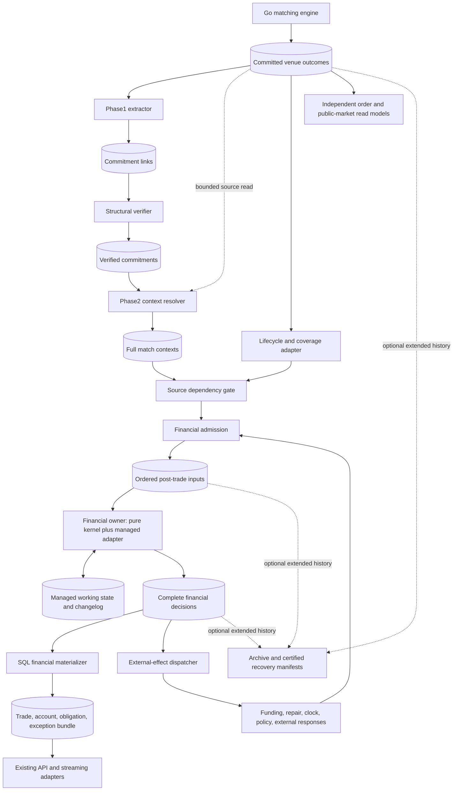
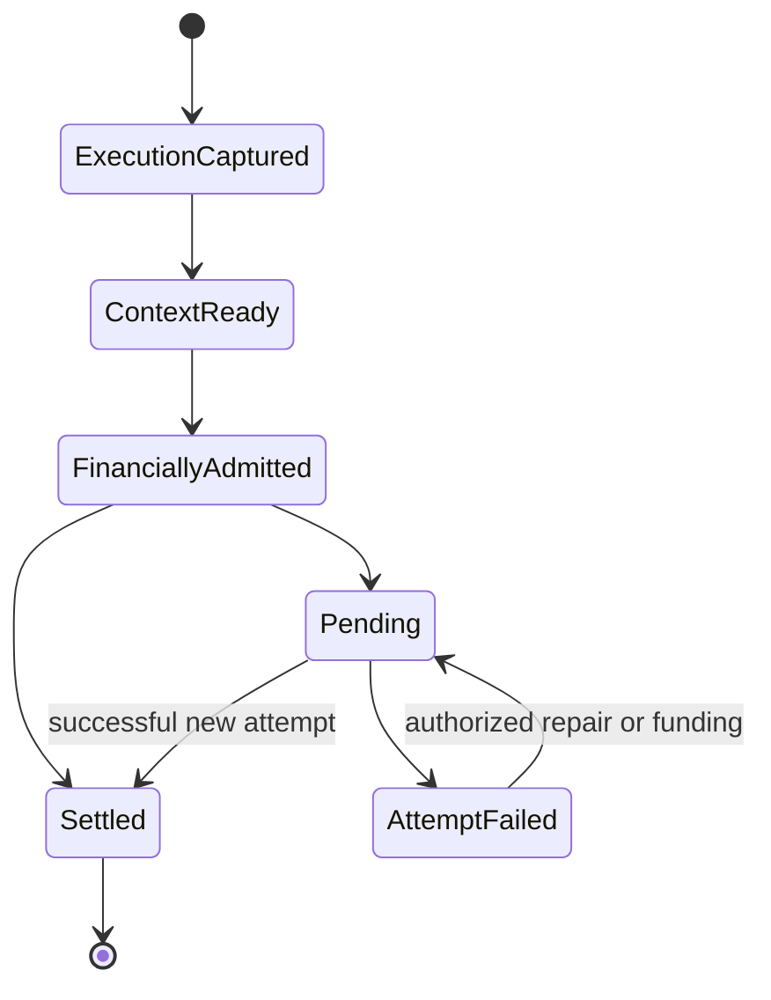

# Calcify — proposed system architecture and proof plan

Date: October 2, 2026. Status: **proposed, awaiting proofs and owner decisions**.
Source baseline: `16e15340919bc9330afbbfec0f9b089115f3e57f` (master after #461).
No runtime implementation or accepted ADR change accompanies this RFC.

Companions: [research / review reconciliation](../research/CALCIFY_SYSTEM_ARCHITECTURE_RESEARCH_2026-10-02.md),
[supplied proposals](../research/calcify-system-architecture-inputs/README.md),
[current Phase1/2 wiring](../CALCIFY_PHASES_OVERVIEW.md),
[accepted decisions](../DECISIONS.md), [throughput evidence](../THROUGHPUT_BASELINES.md).

## 1. Decision and scope

**Recommended candidate:** preserve source capture/resolution; build one small,
deterministic financial kernel per closed financial domain; use managed Kafka
Streams state/transactions and complete financial result records; project SQL
independently. Prove it before expanding workflows. Compare a Postgres-authoritative
adapter if the candidate fails or its projection/operational cost exceeds its value.

This proposal covers execution capture through workflow, obligations, settlement,
account bookkeeping, reads, effects and recovery. Matching algorithms stay in Go;
financial orchestration stays in Kotlin. Source identity, lifecycle coverage and
ingress health are explicit interfaces with matching and simulation.

Adoption would amend D-009 / technical design's relational authority boundary.
Until owner selects that boundary, existing PostgreSQL authority is unchanged.
Prototype results do not permit two financial authorities or a legacy cutover.

Target from supplied RFC: 10,000 **trades**/s for600s and7,500/s for900s with declared
replay contract. Reconfirm workload and latency/freshness/recovery limits before
qualification; proposed p95 values in older RFC are not accepted SLOs. Trade capture
rate, decisions/s, postings/s, settlement rate and commands/s remain distinct.

## 2. Flow: short physical path, explicit business steps



New boxes are responsibilities, not mandatory services/topics per business step.
Initial source gate and admission can share one role. Financial kernel modules
share a serialized owner. SQL projector/effect dispatcher run independently.
Reuse platform-runtime packaging, API auth/entitlements and existing Go load paths.
No deployment per allocation, affirmation, clearing or settlement stage.

| Piece | Owns | Does not establish |
| --- | --- | --- |
| Matching / venue history | Immutable executed/accepted/rejected/amended/cancelled outcomes | Account settlement |
| Phase1 | Durable trade locator; structural verification policy | Trade eligibility or financial finality |
| Phase2 | Assembled immutable source context and provenance | Mutable balances, net obligations or clearing |
| Lifecycle / coverage adapter | Non-trade source facts and explicit membership | Financial effects by itself |
| Gate / admission | Dependencies, routing, business input identity and durable order | Successful business outcome |
| Financial owner | Workflow/obligation/reservation/journal/attempt decisions | External legal finality |
| SQL materializer | Relational business bundle plus progress | New financial decisions |
| Effect dispatcher | Delivery/reconciliation of committed intent | Exactly-once external effects without provider protocol |
| Archive | Availability/integrity of promised history | A new editable authority |

## 3. Authority, identity and completion

### 3.1 Authority contract

Candidate authority is committed `PostTradeCommitV1` plus published immutable
policy/reference versions. Managed state is its efficient working representation.
`evolve` must reconstruct **all** future-decision-relevant state. SQL may mirror it;
SQL operators cannot alter balances/workflow behind the kernel. Repair, funding,
policy activation and account changes enter ordered input.

The alternative is explicit DB authority: one Postgres transaction owns financial
state, journal, dedup, domain sequence and outbox; broker results are published
copies. Never call both authorities primary. [Research comparison](../research/CALCIFY_SYSTEM_ARCHITECTURE_RESEARCH_2026-10-02.md#3-compare-credible-financial-authorities).

### 3.2 Identities

| Identity | Scope / lifetime |
| --- | --- |
| Source locator | Generation + topic UUID + partition + offset + ordinal; exact physical provenance |
| Internal order | Run + order ID, immutable for entire run in first Calcify-enabled slice; lane/generation validate provenance |
| Execution | Authoritative matcher business execution ID plus run/session/instrument scope; independent of transport batch cuts |
| Business action | Domain + command/action ID + normalized payload identity; retry returns original disposition |
| Attempt | Obligation/instruction + attempt ordinal; retry same attempt is dedup, authorized repair starts new attempt |
| Decision | Domain + monotonic decision sequence; links input/action and prior domain sequence |
| Journal / effect | Decision + stable local ordinal; retries never allocate a new financial movement/effect identity |

PR #461 already supplies authoritative run to resolver lookups. Remaining first
slice recommendation: prohibit internal order reuse during run, enforce upstream
before engine acceptance, and test restore/terminal eviction. If owner needs same-
run reuse, introduce explicit acceptance incarnation in authoritative outcomes and
trade references, with temporal/sequential resolution. No guessing from latest row.

Audit current matcher execution ID construction before promising batch-invariant
seed reconstruction. Include delimiter collisions: current concatenation of buy
and sell IDs permits `("a-b","c")` and `("a","b-c")` to collide at equal ordinal.
Test repeated fills/modify outcomes and restore too. Require unambiguous framing
and authoritative logical execution identity, independent of publication grouping.
Existing locator stays provenance;
financial action dedup must not be derived only from a Kafka offset or random UUID.

Do not use Protobuf bytes as a cross-version canonical business digest. Specify
field order, exact units, normalized enums, absent/default rules and sorted repeated
sets; exclude transport timestamps/locators. Keep exact-byte checksums separately.
[Protobuf guidance](https://protobuf.dev/programming-guides/serialization-not-canonical/).

### 3.3 Completion vocabulary



Capture/verification failure is a separate technical disposition. Valid execution
always persists as execution plus pending/exception/obligation. Unsupported routing
or insufficient resources cannot erase it. `RESOLVED` means exception closure;
`SETTLED` requires financial proof. SQL visibility is another progress dimension.

Broker checkpoint can mean staged input, not completed work. Track staged inputs,
completed coverage and archived coverage separately. Frontier is a verified prefix
or manifest, never simply highest seen offset. Kafka offsets may legitimately skip
integers; use explicit application membership.

## 4. Ownership and scale

First financial domain: **one isolated simulation run**, all its accounts/assets,
reservations, obligations and policies. No resources shared between those domains.
Preflight declares membership. Admission checks every referenced resource against
that registry; cross-domain execution remains durably pending/unsupported, with no
partial account change. Do not silently create/merge domains after execution.

Domain must be transitively closed over operations requiring atomic financial
change. A↔B and B↔C trades can connect all three accounts. Shared settlement/cash
accounts or clearing resources can connect instruments. Instrument/account sharding
does not preserve invariants merely because Kafka can atomically write records to
multiple partitions. One broad market may remain one hot owner.

Map domain to fixed partition in registered input/result namespace. Domain
sequence is managed state, committed with results. One approved Streams
application ID and exclusive write permissions fence owners through managed task
assignment; an unrelated application ID must not gain writer access. Takeover
uses framework fencing plus registration/version checks. No manual process races.

Partition count, routing version and namespace cannot change under active domains.
Reshard later via quiesced certified cut and explicit epoch activation. Test stale
worker expiry/resume; registry epoch alone is not Kafka producer fencing.

Logical domain, broker partition, Streams task, thread and process differ. Threads
can couple latency/fault recovery across tasks. First version may stop whole source
lane on unknown corruption. Offer stronger isolation only after known-domain routing
and recovery tests. Dedicated process/task for a hot domain is an operational option.

Scale independent domains horizontally. For shared market, measure maximum hot-
domain workload/state age first. Failure triggers runtime/authority comparison, not
unplanned cross-account distributed transactions. Candidate SQL alternative can
serialize resources transactionally; single process owner is not a universal rule.

## 5. Source dependencies and admission

### 5.1 Source extension

Phase1/2 remain source-only foundation. Add versioned lifecycle envelope for relevant
acceptance, amendment, cancellation and source progress, and versioned coverage
manifest for resolved trade contexts. Reservations based on order lifecycle require
these facts even for zero-trade batches. Preserve original facts and links; full
context carries common immutable facts once so financial kernel needs no per-trade
broker seek or SQL join.

Manifest identifies exact source-slice members, logical outcome sequence, trade
ordinals, order identities, run/domain, required revisions and terminal technical
dispositions. Coverage closes only when each declared member has its disposition.
Policy-defined dependency scope includes prior fills/reservation changes for same
order and applicable revisions; do not rely solely on shared batch membership.

Existing verified-led source reader can remain for trade resolution initially.
Non-trade/coverage capture is new explicit responsibility, not an assumption that
existing resolver emits every lifecycle fact. Optimize source prefetch or extractor
micro-batches separately only when measured; preserve output/checkpoint atomicity.

### 5.2 Bounded gate with a closure path

Gate persists pending dependency state and admits only complete eligible actions.
For known valid routing, domain B may advance while A waits if B's own dependencies
and arbitration hold. Unknown coverage/routing corruption blocks whole lane in V1.

Proposed liveness mechanism:

1. Slice headers travel on a bounded new-work channel. Completion/dependency records
   for admitted windows travel on an independently serviced channel; they must not
   sit exclusively behind paused new headers. Channels can be co-partitioned inputs
   of one gate topology, not separate deployments.
2. Before opening window, validated header declares bounded member count/bytes and
   reserves pending plus completion capacity. Bound maximum source fanout, context
   bytes, active windows and already-fetched poll suffix. Limits are preflight
   workload contract; a violated executed workload is retained and stops safely.
3. At high watermark, pause opening new windows; keep servicing completions for
   already admitted windows. Progress/closure records have reserved capacity and
   cannot depend on reading another new-work header first.
4. Persist every staged member and window frontier transactionally. Crash/restore
   must retain incomplete windows and exact input resume positions.

First candidate uses **durable window credits**: gate grants completion adapters
permission for exact opened window/membership/byte budget. Grant shares gate's
state transaction, carries namespace/epoch/window ID, and is read committed;
duplicates do not grant extra capacity. Adapters keep uncredited work in retained
upstream history and emit only granted members, with reserved seal/control bytes.
Every admitted window's full completion budget remains available until closure.
Existing context output can remain upstream; credit-aware adapter belongs to source
gateway role and need not copy full facts into another persistent payload.

No valid unopened-window burst may consume admitted completion capacity. Credit
protocol must also cover already-fetched suffix and dependencies needed for closure;
opening a window whose required dependency cannot be serviced is forbidden. Restore
reissues same outstanding grants from certified state, not fresh capacity. Alternative
FIFO/bounded-lookahead implementation requires equivalent proof before substitution.
Deliberate credit violation takes controlled integrity-fault path preserving source
executions; it does not carry a healthy-lane progress promise.

This is a candidate algorithm with mandatory adversarial liveness proof, not a
ready-made Streams property. If upstream cannot identify/bound completion traffic
without reading paused headers, redesign the gate before live implementation.

Consumer pause alone does not throttle intake. Export lag/headroom health with
hysteresis and a measured reaction budget; front door stops new durable admission
when backlog approaches retained-capacity bounds. Reserve room/drain path for
already accepted/matched work. Never drop an execution to reduce lag.

### 5.3 Durable input and arbitration

`PostTradeInputV1` carries domain, business action ID/digest, immutable payload or
durable content reference, source causation/dependencies, policy/control identity
and logical tick where relevant. Financial input log is the one canonical order
per domain. Its actual committed ordering is authority in live interactive mode.
All state-changing inputs pass this boundary, including funding/repair/clock and
external responses. Durable acceptance acknowledgement precedes HTTP202.

Live admission merges ready source actions and authorized controls; later unseen
source facts are not assumed to have won arbitration. Controls targeting a trade
declare its execution dependency. A live funding race is resolved by recorded
admission order, not by reconstructing wall-clock arrival after the fact.

Deterministic simulation mode instead uses declared tick closure and stable producer
membership, then a versioned tuple order (tick, phase, producer ordinal, logical
source/action sequence). Missing participant/source coverage stalls that tick.
Bot observation barrier includes declared read-model progress; a seed alone is
insufficient if strategies see arbitrary SQL projection states. Do not claim this
mode implemented by introducing a deterministic reducer alone.

No total order across unrelated domains required. Multi-source delivery to gate can
vary; legal interleavings must yield same admission sequence in deterministic mode.

## 6. Financial kernel and managed adapter

### 6.1 Pure decision and reconstruction

```text
decision = decide(state, orderedInput, immutablePolicy)
validate(decision, state, policy)
encodedDecision = encodeBounded(decision)
nextState = evolve(state, decision)
commit(managed nextState, decision output, staged input position)
```

Kernel performs no network/SQL calls, system-clock reads or uncontrolled random
draws. Use exact integer asset units, checked wide intermediate multiplication,
explicit price/quantity scales and versioned rounding/fee rules. Cash balances
and security quantities never share a ledger unit. State access is indexed by
known IDs; due work uses `(logicalDueTick, priority, stableWorkId)` index, not a
full obligation scan every tick.

`PostTradeCommitV1` has:

- Domain/sequence, prior sequence, input/action identity and source causation.
- Kernel/schema/policy/reference versions, logical time and input disposition.
- Complete semantic workflow, obligation/instruction/attempt and exception changes.
- Exact journal groups/legs and reservation acquire/release/consume changes.
- Due-work enqueue/dequeue and continuation phase/cursor changes.
- Account/entity version transitions, dedup result and external intent/status changes.
- Defined normalized semantic digest; original-byte checksum where stored.

Events/deltas must let `evolve` reconstruct balances, reservations, outstanding
obligations, workflow waits, attempts, policy activation, logical clock, due queue,
dedup/effect state and staged-but-unfinished input. Do not duplicate opaque RocksDB
bytes in every result or repeat full source history. If semantic deltas are not
sufficient, fix the contract before calling results reconstructible authority.

Keep accepted source facts in source/context area; financial state references
execution/context identities and stores only mutable economics it owns. Account
images for SQL may be derived from same decision; any optional acceleration images
must be validated against `evolve`, never an independent mutable truth.

### 6.2 Small first business model

Proof uses constrained run, published opening resources, one cash currency and
one security asset per trade, gross simulated DvP, no credit/fees/netting/external
finality. Seed funding is journaled against an explicit opening-resource account;
conservation checked per asset and journal group. No implicit infinite funding.

Example: buyer cash100, seller shares10; trade5 shares at10 cash/share. Decision
records execution/workflow, obligation and instruction, attempt, cash buyer−50 /
seller+50, shares seller−5 / buyer+5, and settlement. Both resource checks pass
before any mutation. Insufficient cash **or** shares produces pending obligation
and failed attempt, no one-leg debit, then an authorized funding/repair action can
start a distinct attempt. A duplicate execution/action repeats no effects.

Instant profile may emit several semantic stages in one committed decision. Same
kernel later supports delayed/realistic profiles through policy and durable waits.
Allocation/affirmation/clearing semantics are not claimed complete by naming events.
Gross journal proof precedes netting. [FIX](https://www.fixtrading.org/online-specification/),
[exchange-of-value principle](https://www.bis.org/committees/cpmi/pfmi/overview).

### 6.3 Business atomicity and transaction failures

Validate complete decision before managed mutations/forwarding: resource sufficiency,
per-asset conservation, balanced posting groups, legal transitions, identities,
versions, amounts/overflow, policy and envelope limits. Expected failure is typed
decision with only allowed changes (e.g. pending obligation/attempt).

Unexpected mutation/storage/serde/forward failure propagates to runtime, aborts
entire uncommitted transaction and stops/reinitializes affected processing. Never
catch it into a completed fault record after partial financial changes. Rebuild
in-memory caches after rollback; cache cannot remain source of truth for aborted
state. Test several decisions in one transaction, since all must replay after abort.

Commit interval bounds visibility/cost, not business action identity. Independent
read-committed observer checks state effects and complete result agreement.
Broker atomicity is limited to its resources/failure model.
[Kafka EOS](https://kafka.apache.org/43/streams/core-concepts/).

### 6.4 Logical time and continuations

`ClockAdvanced` opens a logical work phase. Process due items in fixed tuple order;
complete that phase before later state-changing input takes effect. Wall-clock
punctuation can request CPU work, never choose financial order. Yield records durable
phase/cursor and stages subsequent inputs in bounded managed queue. A large phase
can span transactions; each continuation is a complete decision with stable ID.

Whenever transaction advances input checkpoint past unfinished input, emit complete
nonterminal `InputStaged` authority delta in same transaction. It records envelope
or retained content reference/digest, canonical queue position, dependencies and
phase context. `evolve` restores that queue from results. Staged action dedup means
pending, not completed: later `InputDequeued` plus business decision atomically
removes queue item and records terminal disposition/effects. Identical retry cannot
queue twice or suppress eventual execution. Decision sequence identifies each
history record; action identity identifies one eventual business effect. Ordinary
immediate inputs need no separate staging record.

For clock→two settlements→funding, funding cannot overtake second settlement because
CPU budget changed. Zero-delay self-rescheduling must terminate or move to later
declared phase/tick; policy validation rejects unbounded recurrence. Bound due work
per tick/pending admissions in preflight. Capacity exhaustion suspends new staging
while draining due work; it cannot prevent the phase's own continuation from running.

Keep pending input staging replayable and covered by restore cut. If phase completion
cannot fit required liveness/latency bound, candidate/profile fails proof; do not
quietly change order to gain rate. Future API commands can declare cancellation or
repair at an explicit phase boundary rather than bypass ordering.

## 7. SQL reads, APIs, public data and external effects

Financial SQL materializer consumes committed decisions. In one PostgreSQL
transaction: validate projection owner epoch, insert unique journal/decision rows,
apply expected entity versions, update trade/account/obligation/exception bundle,
and persist exact input checkpoint. SQL checkpoint governs restart; broker group
position is delivery hint. Crash after SQL commit before broker acknowledgement
replays idempotently. Conflicting existing identity/digest fails; no silent overwrite.

Use bounded batches, prepared writes and minimal indexes. COPY/staging/coalesced
account images are candidates only with exact journal/version/checkpoint equivalence.
No broad dirty-queue rebuild, per-trade history scan or SQL lookup in financial
decision path. Partition projector work without splitting one consistent financial
bundle; measure account-row contention and WAL.

API reads one committed bundle snapshot for coupled financial view. Return progress
token `(namespace,epoch,domainDecisionSeq)`; cross-domain views return vector. A
request requiring fresher result waits bounded time or reports pending/stale status;
it never silently joins incompatible trade/account versions. Separate public
order/market-data projections can consume source history independently. Public
data cannot expose private allocation/account facts. Reuse API adapters and auth.

Effect intent is part of financial decision; dispatcher calls external provider
using stable effect ID. Response/timeout/reconciliation re-enters durable input.
Unknown acknowledgement is a state requiring query/reconcile, not a reason to make
new transfer ID. Financial runtime cannot promise atomic external cash/security
movement from local Kafka commit. Recovery replay sends no historical effects.
Real-money integrations require separate finality/DvP contract and proof.

## 8. Recovery, retention and state retirement

### 8.1 Registered history and bootstrap

Manifest records every required source, context, lifecycle/coverage, credit/control,
financial input/result and changelog namespace/topic UUID, routing
and schema/kernel versions, domain membership, application ID, genesis/restore
mode, exact start/resume positions, policy versions and required history coverage.
Registration must distinguish brand-new empty histories from partial retained
history. Missing checkpoint does not authorize starting at today's earliest offset.

No auto recreation/reset of active authoritative topics. Ordinary UUID checks
detect mismatch but do not prevent in-flight deletion; restrict administrative
permissions and coordinate stop/cut/restore. Redpanda documents different guarantees
for topic deletion and remote recovery. [Transactions](https://docs.redpanda.com/streaming/current/develop/transactions/).

| Failure | Continuation rule |
| --- | --- |
| Worker loss, histories intact | Managed fencing, promote standby or restore; resume committed positions |
| Local RocksDB loss, compatible changelog intact | Framework restore plus exact catch-up; existing result history retained |
| Changelog unavailable, certified result/snapshot coverage intact | Offline isolated reconstruction, compare authoritative decisions/state; certified cut then coordinated activation |
| Cluster/topic restoration | Coordinated cut of all required histories/state/policies; prove sequences and staged work consistent before promotion |
| Missing required source/decision/control history | Refuse continuation; surface unavailable scope, do not relabel latest available data genesis |

Reconstruction cut certifies domain decision frontier, corresponding input resume
positions, pending staged envelopes/dependencies/continuation phase, logical clock,
policy activation, reservations, due/effect/dedup state, gate windows/outstanding
credits and adapter resume positions, plus checksums. Inspect SQL
progress and rebuild/wait if incompatible. Build in isolated namespace with effects
disabled; never reset live app then re-emit old settlements to existing outputs.
Archive chunks copied at unrelated instants are not a certified consistent cut.

### 8.2 Optional archive, mandatory availability

First bounded run may use broker history only. Before starting, set maximum run
age, unresolved lifetime, replay-after-close window, outage/catch-up allowance,
time **and byte** retention plus margin. Admission must reject an unsupported
retention contract, not wait until history expires. Shared topics cover oldest
required dependency across active domains; compacted current state is not audit
history. Long-lived acceptance may outlive recent trade rate.

Beyond broker guarantee, require verified archive/other complete authority before
promising extended retention. Store original sources, inputs, results and immutable
policy/reference artifacts with range/membership/digest manifests. Optional sealed
semantic snapshots speed recovery. Provider retention/WORM settings must be verified;
S3 compatibility alone is not proof. [Object Lock](https://docs.aws.amazon.com/AmazonS3/latest/userguide/object-lock.html).

Retire working state only after run closure, completed source/financial coverage,
zero unresolved obligations/effects/continuations or explicit transferred ownership,
expired allowed retry window and sufficient recovery history. Business IDs stay
deduplicable throughout retry promise. Historical deletion is separate policy.
Do not replace per-commitment done keys with max offset until explicit membership
proves every earlier item terminal; delete acceptance rows only when dependencies
cannot reference them. Keep growth budget per run/attempt, not infinite append-only
working state.

## 9. Future capabilities within same boundaries

| Capability | Contract before implementation |
| --- | --- |
| Allocation / confirmation / affirmation | Party roles, revision identity, quantities, rejection/correction, wait state and deadline policy; distinct from capture |
| Clearing / novation | Explicit accepted obligations/party substitution; credit/default rules before calling it CCP behavior |
| Netting | Closed eligible membership, period/cutoff and key; retain gross trades, sealed manifest and exact allocation to net obligations |
| Large netting sets | Bounded chunks staged before validated seal; activation cannot expose partial economic set; consistent recovery and archive coverage |
| Deferred / partial settlement | Stable obligations/instructions/attempts, reservation priority and remaining units; each partial DvP unit conserves assets |
| Fees / calendars / rounding | Published versions and activation order; exact remainder handling, DST/calendar edge cases |
| Exceptions / repair | Authorized recorded actions, new attempts, immutable corrections/reversals; no direct DB balance editing |
| External integrations | Intent, idempotent provider protocol, reconciliation/unknown result, simulated vs external finality |
| Operations | Read progress, pending reason, repair history, lag/headroom and history coverage; promote only against certified cut |

Separate capability slices after first useful path; no requirement to complete this
table before kernel proof. Netting reduces eligible obligations, not executed-trade
history. [DTCC CNS](https://www.dtcc.com/products-and-services/clearing-settlement-services/equities-clearing/cns).

## 10. Proof plan and stop conditions

Proofs below are **unrun** for new financial kernel. Earlier resolver tests are
prerequisite evidence, not substitute. Each proof is a small reviewable delivery;
agree its fixtures/bounds before implementing, retain failed attempts, then decide
next slice. Pure kernel work can use complete fixtures while source contracts close.

| Gate | Build / measure | Acceptance / stop condition |
| --- | --- | --- |
| P0: current contracts | Recognize #461; enforce run-lifetime IDs or approved incarnation; audit execution IDs; genesis/history/routing contracts | Real source fixtures submit/modify/zero-trade, collocated runs, terminal reuse, delimiter-collision execution IDs and restore. No claimed live financial correctness until these pass. |
| P1: pure kernel | Tiny constrained gross-DvP domain; complete decisions/evolve; independent simple accounting oracle | Both insufficiencies, reservation competition, overflow, duplicate/conflicting IDs, repair/new attempt, reconstruction and clock continuation invariant. Stop on missing future state or partial effects. |
| P2: real broker adapter | Pinned production adapter/client/Redpanda, RF3 durability; managed state/input/output and read-committed observer | Inject after each store mutation, serialization/forward boundary, before/after commit and ambiguous ack; multiple decisions per transaction; stale owner, local/changelog loss paths; restore committed staging before phase completion without suppressing funding. Exact authority/state agreement and no re-emitted old results. |
| P3: first useful path | Real venue→source/lifecycle gate→admission→kernel→one SQL bundle→existing API; one funding/repair path | Gate high-water closure under future-window burst and restore, zero-trade cancel/amend dependency, offsets with gaps, projection crash after SQL commit, stale projector, finite retention preflight. Preserve every execution; exact business rows/API progress. |
| P4: capacity decision | One hot shared-account domain, then independent spread/skew domains; aged state, real payload/journal/API reads; injected failure/catch-up | Freeze objectives/topology; meet hot-domain required rate and recovery headroom. Failure triggers smallest equivalent Postgres comparison, not unreviewed sharding. |
| Qualification | Unchanged candidate, declared10k/600s and7.5k/900s workload; real upstream path and required observers | No loss/duplicate effect, all stages reconcile, no growing lag, fixed latency/freshness/drain/recovery limits. Distinguish component diagnostic from full-system pass. |

P1 proves `evolve(genesis, decisions)` equals live state and identical next-decision
behavior, including reservations/due work. Test same ordered admissions under
different commit batch sizes, CPU yield budgets and restore points. Seed-only
simulation additionally proves producer closure/observations/source behavior; defer
that promise if simulator does not meet it.

P2 recovery tests retain original result topics; compare semantic state/journal/
pending queues, not counts only. Admission/continuation states also need certified
cut proof. Same-run no-reuse is tested at upstream boundary, not only resolver fault.

Explicit staging fixture: commit clock phase, stage funding and its consumed offset,
lose local/changelog state, reconstruct from certified result cut, finish phase,
then apply funding exactly once. Explicit gate fixture: pause headers at high water,
offer unopened-window burst upstream while admitted seal is due, restore gate and
adapters mid-grant, and prove bounded seal progress without duplicate capacity.
Also bypass credits to verify controlled fault preserves all executed-source facts.

P4 reports offered trades, durably admitted trades, captured/decided/settled/pending
counts, journal legs, broker bytes, SQL rows/WAL, CPU/heap/native RSS/disk, source and
projection lag, business latency and recovery time. Measure one hot domain separately
from aggregate. After outage backlog B, catch-up time is at least `B/(mu-lambda)`
when service rate mu exceeds arrival lambda; no catch-up promise when mu<=lambda.
Choose required headroom from outage/SLO, not arbitrary linear partition scaling.

Use existing throughput ledger and harnesses where possible. Source-injected tests
can isolate financial bottleneck; paired orders need roughly20k commands/s for10k
trades/s but actual fanout varies. A producer that misses target duration does not
qualify by draining later. Historical10.16k resolver run failed frozen gate; no new
financial rate measured. [Research baseline](../research/CALCIFY_SYSTEM_ARCHITECTURE_RESEARCH_2026-10-02.md#4-honest-capacity-baseline).

If P4 fails, compare same P1 semantics/ordered inputs with Postgres transaction
holding account locks in stable order and committing financial state/dedup/journal/
outbox/checkpoint. Retain WAL, contention and API cost. TigerBeetle is conditional
next comparison if ledger assurance/performance warrants bridge proof. Aeron/Flink/
Temporal require a measured fit gap; none is automatic next dependency.

## 11. Rollout, observability and decisions

Keep Calcify opt-in, isolated namespaces/run membership and accounts. Legacy remains
active for its own assigned runs; no shared writable balances. Shadow path compares
decisions without effects. Before cutover: approved authority ADR, required proofs,
declared API compatibility, certified start cut and one authorized writer. Route new
runs first; live-run migration needs separate procedure. After financial commits,
rollback cannot mean silently send same accounts to old writer—stop/admission fence
and restore compatible owner from certified cut. Legacy deletion follows explicit
capability parity and cutover, not first proof.

Metrics: staged/completed/archived frontiers; pending dependencies/age; oldest history
required; due phase/cursor; owner epoch; decision/attempt dispositions; resource
limits; source/admission/SQL lag and freshness; state/output bytes per trade; broker
transaction abort/fence; projection retries/conflicts; unknown external effects.
Integrity faults latch readiness for affected declared scope. Expected insufficiency
is business pending state, not infrastructure poison. Healthy scope claims reflect
actual partition/thread/process coupling.

Five owner choices before adoption, with proposed defaults:

1. **Financial authority:** log + managed state candidate after proofs; preserve
   existing relational authority until accepted ADR amendment.
2. **Resources/domain:** isolated run, no shared accounts; no cross-domain DvP in
   first slice; full-run unique internal order IDs.
3. **Replay promise:** exact existing-history recovery plus same-admission recompute;
   seed-only simulation requires separate closed-loop proof.
4. **Availability:** bounded run/retry/replay/outage windows, archive opt-in beyond
   broker coverage; missing history refuses continuation. Numeric values need owner.
5. **Capacity envelope:** keep10k trades/s600s and7.5k900s direction; freeze hot-domain
   share, hardware, state age, latency/freshness/drain/RTO and observation method
   before qualification. No invented accepted SLO.

This RFC provides architecture review target and finite experiments. It does not
authorize full-system implementation or convert future capability contracts into
Phase1/2 merge requirements.
